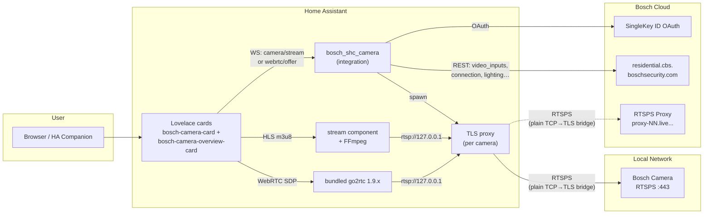

# Bosch Smart Home Camera — Home Assistant Integration

Adds your Bosch Smart Home cameras (Eyes Außenkamera, 360 Innenkamera) as fully featured entities in Home Assistant. Includes a custom **Lovelace card** with live streaming, controls, and event info.

**Supported models:** Eyes Außenkamera (Gen1), Eyes Außenkamera II (Gen2), 360 Innenkamera (Gen1), Eyes Innenkamera II (Gen2) — model-specific timing and configuration is automatic.

> **No official API.** This integration uses the reverse-engineered Bosch Cloud API, discovered via mitmproxy traffic analysis of the official Bosch Smart Camera app.

[![GitHub Release][releases-shield]][releases]
[![GitHub Activity][commits-shield]][commits]
[![License][license-shield]](LICENSE)

[![hacs][hacsbadge]][hacs]
[![Project Maintenance][maintenance-shield]][user_profile]
[![BuyMeCoffee][buymecoffeebadge]][buymecoffee]

[![Community Forum][forum-shield]][forum]

[releases-shield]: https://img.shields.io/github/release/mosandlt/Bosch-Smart-Home-Camera-Tool-HomeAssistant.svg?style=for-the-badge
[releases]: https://github.com/mosandlt/Bosch-Smart-Home-Camera-Tool-HomeAssistant/releases
[commits-shield]: https://img.shields.io/github/commit-activity/y/mosandlt/Bosch-Smart-Home-Camera-Tool-HomeAssistant.svg?style=for-the-badge
[commits]: https://github.com/mosandlt/Bosch-Smart-Home-Camera-Tool-HomeAssistant/commits/main
[license-shield]: https://img.shields.io/github/license/mosandlt/Bosch-Smart-Home-Camera-Tool-HomeAssistant.svg?style=for-the-badge
[hacsbadge]: https://img.shields.io/badge/HACS-Default-orange.svg?style=for-the-badge
[hacs]: https://hacs.xyz
[maintenance-shield]: https://img.shields.io/badge/maintainer-%40mosandlt-blue.svg?style=for-the-badge
[user_profile]: https://github.com/mosandlt
[buymecoffeebadge]: https://img.shields.io/badge/buy%20me%20a%20coffee-donate-yellow.svg?style=for-the-badge
[buymecoffee]: https://buymeacoffee.com/mosandlts
[forum-shield]: https://img.shields.io/badge/community-forum-brightgreen.svg?style=for-the-badge
[forum]: https://community.home-assistant.io/

---

## Supported Cameras

All four current Bosch Smart Home cameras are supported. Click any camera name for the official product page.

| Camera | Generation | Type | Codec / FW seen | Highlights |
|---|---|---|---|---|
| [**360° Innenkamera**](https://www.bosch-smarthome.com/de/de/produkte/sicherheitsprodukte/360-grad-innenkamera/) | Gen1 | Indoor | H.264 + AAC · FW 7.91.x | Pan/tilt motor, autofollow, IR night vision, mechanical privacy shutter |
| [**Eyes Innenkamera II**](https://www.bosch-smarthome.com/de/de/produkte/sicherheitsprodukte/eyes-innenkamera-2/) | Gen2 | Indoor | H.264 + AAC · FW 9.40.x | Built-in 75 dB siren, Audio+ glass-break / smoke / CO, ZONES detection mode, RGB LEDs, retractable head (Privacy hardware button) |
| [**Eyes Außenkamera**](https://www.bosch-smarthome.com/de/de/produkte/sicherheitsprodukte/eyes-aussenkamera/) | Gen1 | Outdoor (IP66) | H.264 + AAC · FW 7.91.x | Front spotlight, motion-triggered light, ambient-light sensor, schedule-driven illumination |
| [**Eyes Außenkamera II**](https://www.bosch-smarthome.com/de/de/produkte/sicherheitsprodukte/eyes-aussenkamera-2/) | Gen2 | Outdoor (IP66) | H.264 + AAC · FW 9.40.x | Front + Top + Bottom RGB LED groups, DualRadar (motion + intrusion), wallwasher mode, mounting-elevation parameter |

> Camera images: see the linked product pages above.

Model-specific timing (pre-warm, heartbeat, retries) is configured automatically — see [Model-Specific Configuration](#model-specific-configuration) for the exact values per generation.

---

## Disclaimer

**This project is an independent, community-developed integration. It is not affiliated with, endorsed by, or connected to Robert Bosch GmbH. "Bosch" and "Bosch Smart Home" are registered trademarks of Robert Bosch GmbH.**

This integration communicates with a reverse-engineered, undocumented API. Provided **"as is"**, without warranty. Use at your own risk. The API may change or be shut down by Bosch at any time. Reverse engineering was performed solely for interoperability under **§ 69e UrhG** and **EU Directive 2009/24/EC**.

---

## Prerequisites — Setting Up a New Camera

Before adding a camera to this integration, it **must** be fully set up in the official **Bosch Smart Camera** app first.

### Step-by-step

1. **Unbox and power on** the camera
2. **Open the Bosch Smart Camera app** and follow the pairing wizard to add the camera to your account
3. **Wait for the firmware update** — new cameras typically receive a Zero-Day update during first setup. This can take **up to 1 hour**. The camera's LED blinks yellow/green during the update.
   - **Do not unplug or restart** the camera during the update
   - If the LED blink pattern doesn't change after 1 hour, leave the camera alone for up to 24 hours ([Bosch Support](https://www.bosch-smarthome.com/de/de/support/hilfe/hilfe-zum-produkt/hilfe-zur-eyes-aussenkamera-2/))
   - The app shows the update status — wait until it reports the camera as ready
4. **Verify the camera works** in the Bosch app — check live stream, settings, and notifications
5. **Then add it to Home Assistant** using this integration (see Installation below)

> **Tip:** If you're replacing an existing camera (e.g. upgrading from Gen1 to Gen2), rename the new camera in the Bosch app to match the old name before setting up the integration. This way Home Assistant creates entities with the expected names.

For more help with camera setup, see:
- [Eyes Außenkamera II — Bosch Support](https://www.bosch-smarthome.com/de/de/support/hilfe/hilfe-zum-produkt/hilfe-zur-eyes-aussenkamera-2/)
- [Eyes Innenkamera II — Bosch Support](https://www.bosch-smarthome.com/de/de/support/hilfe/hilfe-zum-produkt/hilfe-zur-eyes-innenkamera-2/)
- [Firmware Update dauert lange — Bosch Community](https://community.bosch-smarthome.com/t5/technische-probleme/wie-lange-dauert-das-update-der-software-bei-mir-l%C3%A4uft-es-seit-%C3%BCber-20-minuten/td-p/71764)

---

## Installation

### HACS (Recommended)

[](https://my.home-assistant.io/redirect/hacs_repository/?owner=mosandlt&repository=Bosch-Smart-Home-Camera-Tool-HomeAssistant&category=integration)

1. Click the button above, or in HACS: **Integrations → + Explore → search "Bosch Smart Home Camera"**
2. Download the integration
3. Restart Home Assistant
4. Continue with **Setup** below

### Manual Installation

1. Copy `custom_components/bosch_shc_camera/` to your HA config directory:
   ```
   /config/custom_components/bosch_shc_camera/
   ```
2. Copy `bosch-camera-card.js` to `/config/www/bosch-camera-card.js`
3. Restart Home Assistant
4. Continue with **Setup** below

---

## Setup

### Step 1 — Add the Integration

1. Go to **Settings → Integrations → + Add Integration**
2. Search for **"Bosch Smart Home Camera"**
3. Your browser opens the **Bosch SingleKey ID** login page automatically
4. Log in with your Bosch account (same credentials as the Bosch Smart Camera app)
5. After login, the browser redirects back to Home Assistant automatically — **no manual URL copying needed**
6. The integration discovers all your cameras automatically

> **Token renewal is automatic.** The integration uses a refresh token to silently renew the Bearer token in the background — no manual action needed after initial setup.
>
> **Note:** The automatic redirect uses [my.home-assistant.io](https://my.home-assistant.io). If your HA instance URL is not configured there, you'll be prompted to set it up on first use.

### Step 2 — Configure Settings

Go to **Settings → Integrations → Bosch Smart Home Camera → Configure**

All settings have descriptions in the UI. Key options:

| Setting | Description | Default |
|---|---|---|
| **FCM Push** | Near-instant (~2s) event detection via Firebase Cloud Messaging | OFF |
| **FCM Push Mode** | `Auto` (iOS → Android → polling), `iOS`, `Android`, or `Polling` | Auto |
| **Alert services (default)** | Fallback notify services; per-step overrides available (text/screenshot/video/system) | empty (disabled) |
| **Save alert snapshots** | Keep event images/videos locally in `/media/bosch_alerts/` | OFF |
| **Event check interval** | How often to poll for events (FCM Push makes this a fallback only) | 300s (5 min) |
| **SMB Upload** | Upload event snapshots + video clips to SMB/CIFS share | OFF |
| **SMB Server** | IP/hostname of SMB share (e.g. `192.168.1.1`) | empty |
| **SMB Share** | Share name (e.g. `cameras`) | empty |
| **SMB Username** | SMB authentication username | empty |
| **SMB Password** | SMB authentication password | empty |
| **SMB Base Path** | Base path on the share (e.g. `bosch_cameras`) | empty |
| **SMB Folder Pattern** | Subfolder pattern: `{year}/{month}` | `{year}/{month}` |
| **SMB File Pattern** | File naming: `{camera}_{date}_{time}_{type}_{id}` | `{camera}_{date}_{time}_{type}_{id}` |
| **Audio default ON** | Audio switch starts ON (stream with sound) or OFF (muted) | ON |
| **Binary sensors** | Motion / Audio alarm binary sensors (ON for 30s after event) | ON |

### Step 3 — Add the Lovelace Card

Since **v10.3.19** the card is auto-registered — no manual Lovelace resource entry needed. Just add it to a dashboard:

1. Edit dashboard → **+ Add card → Custom: Bosch Camera Card**

```yaml
type: custom:bosch-camera-card
camera_entity: camera.bosch_garten
title: Garten
```

> **Upgrading from pre-v10.3.19?** The integration auto-removes any old `/local/bosch-camera-card.js` resource entry from Lovelace, but the physical file in `/config/www/` is intentionally left in place (an integration should not modify user files in `/config/www/`). You can delete it manually if you want: `rm /config/www/bosch-camera-card.js` (SSH addon) — it's harmless either way, the integration loads its own bundled copy.

---

## Architecture

### Components



Since **v10.3.24** the same Python TLS proxy carries both LOCAL and REMOTE — FFmpeg and go2rtc always connect to `rtsp://127.0.0.1:N`, the proxy decides whether to terminate TLS to the camera (LOCAL) or to the Bosch cloud proxy (REMOTE). Symmetric path means there's no scheme-switching trick (`rtspx://` etc.) on the consumer side, and the cert/hostname mismatch on `proxy-NN.live.cbs.boschsecurity.com` is handled in one place.

### REMOTE / Cloud differences

* **`/connection {type:"REMOTE"}`** returns `rtsps://proxy-NN.live.cbs.boschsecurity.com:42090/<hash>` — the Bosch cloud proxy serves the camera over the public internet.
* **TLS proxy is symmetric** (since v10.3.24): the same Python TLS proxy that handles LOCAL also terminates TLS to the cloud proxy for REMOTE. FFmpeg (HLS) and go2rtc (WebRTC) always connect to `rtsp://127.0.0.1:N` — no scheme tricks (`rtspx://`), no per-consumer special-cases. The cert/hostname mismatch on `proxy-NN.live.cbs.boschsecurity.com` (cert SAN only covers `*.residential.connect.boschsecurity.com`) is handled in one place (`verify_mode=CERT_NONE, check_hostname=False`).
* **Snapshots** (`/snap.jpg`) use the cloud-proxy URL directly with HTTP — no TLS proxy needed since they're single-shot HTTP requests, not long-lived RTSP streams.
* **bufferingTime hint** from `PUT /connection` is `1000 ms` for REMOTE (vs `500 ms` for LOCAL) — Bosch's server-side hint about expected latency.

---

## Features

### Entities

| Feature | Entity type | Default |
|---------|-------------|---------|
| Camera snapshot (latest event JPEG) | `camera` | enabled |
| Camera status (ONLINE/OFFLINE) | `sensor` | enabled |
| Last event timestamp | `sensor` | enabled |
| Events today count | `sensor` | enabled |
| WiFi signal strength (%) | `sensor` | enabled |
| Firmware version | `sensor` | enabled |
| Ambient light level (%) | `sensor` | enabled |
| LED dimmer (%) | `sensor` | enabled (cameras with LED) |
| Motion sensitivity | `sensor` | diagnostic |
| Audio alarm state | `sensor` | diagnostic |
| Last event type | `sensor` | enabled |
| Movement events today | `sensor` | enabled |
| Audio events today | `sensor` | enabled |
| Event detection method | `sensor` | diagnostic — `fcm_push` / `polling` / `disabled` |
| Refresh Snapshot | `button` | enabled |
| Live Stream (ON/OFF) | `switch` | enabled |
| Audio (mute/unmute stream) | `switch` | enabled |
| Camera LED light | `switch` | enabled (cameras with LED) |
| Privacy mode | `switch` | enabled |
| Notifications | `switch` | enabled |
| Motion detection | `switch` | disabled by default |
| Record sound | `switch` | disabled by default |
| Auto-follow (360 camera) | `switch` | disabled by default |
| Intercom (two-way audio) | `switch` | disabled by default |
| Pan position (360 camera) | `number` | enabled (±120°) |
| Audio alarm threshold | `number` | disabled by default |
| Speaker level (intercom volume) | `number` | disabled by default (0–100) |
| Stream quality | `select` | Auto / Hoch 30 Mbps / Niedrig 1.9 Mbps (persists across restarts) |
| Stream mode | `select` | Auto (Lokal → Cloud) / Nur Lokal / Nur Cloud |
| Motion sensitivity | `select` | SUPER_HIGH / HIGH / MEDIUM_HIGH / MEDIUM_LOW / LOW / OFF |
| FCM Push mode | `select` | Auto / iOS / Android / Polling |
| Motion detected | `binary_sensor` | disabled by default |
| Audio alarm detected | `binary_sensor` | disabled by default |
| Person detected | `binary_sensor` | disabled by default |
| Unread events count | `sensor` | disabled by default |
| Privacy sound (360 only) | `switch` | enabled (config category) |
| Commissioned status | `sensor` | diagnostic, disabled by default |
| Acoustic alarm (siren, 360 only) | `button` | disabled by default |
| Live stream (30fps H.264 + AAC) | `camera` | via Live Stream switch |
| Timestamp overlay (clock on video) | `switch` | disabled by default |
| Movement notifications | `switch` | disabled by default |
| Person notifications | `switch` | disabled by default |
| Audio notifications | `switch` | disabled by default |
| Trouble notifications | `switch` | disabled by default |
| Camera alarm notifications | `switch` | disabled by default |
| Firmware update status | `update` | enabled — native HA update card |
| Schedule rules count | `sensor` | diagnostic, disabled by default |
| **Alarm Catalog** (RCP 0x0c38) | `sensor` | diagnostic — all alarm types supported by camera firmware (virtual, flame, smoke, glass break, audio, motion, storage) |
| **Motion Zones** (RCP 0x0c00/0x0c0a) | `sensor` | diagnostic — motion detection zone coordinates (normalized x/y for overlay) |
| **TLS Certificate** (RCP 0x0b91) | `sensor` | diagnostic — camera cert expiry date, issuer, key size |
| **Network Services** (RCP 0x0c62) | `sensor` | diagnostic — active services (HTTP, HTTPS, RTSP, SNMP, UPnP, NTP, ONVIF) |
| **IVA Analytics** (RCP 0x0b60) | `sensor` | diagnostic — analytics module inventory (detectors, versions, active state) |
| Front light with color temperature | `light` | Gen2 only |
| Top LED light with RGB color picker | `light` | Gen2 only |
| Bottom LED light with RGB color picker | `light` | Gen2 only |
| Status LED on/off | `switch` | Gen2 only |
| Motion-triggered lighting on/off | `switch` | Gen2 only |
| Ambient/permanent lighting on/off | `switch` | Gen2 only |
| DualRadar intrusion detection on/off | `switch` | Gen2 only |
| Mounting height (meters) | `number` | Gen2 only |
| Microphone recording level (0–100%) | `number` | Gen2 only |
| Front light color temperature | `number` | Gen2 only |
| Top LED brightness (0–100%) | `number` | Gen2 only |
| Bottom LED brightness (0–100%) | `number` | Gen2 only |
| Motion light sensitivity (1–5) | `number` | Gen2 only |

> **RCP diagnostic sensors** are disabled by default. Enable them in entity settings to inspect camera firmware capabilities. Gen2 cameras will automatically expose new alarm types and analytics modules.

> **SHC local API is not needed.** All features work with just the Bosch cloud API.

### Built-in 3-Step Alert System

No automations needed — the integration sends alerts directly:

1. **Instant text:** `📷 Kamera: Bewegung (10:31:56)` — sent immediately
2. **Snapshot image:** `📸 Kamera Snapshot` + JPEG — sent ~5s later
3. **Video clip:** `🎬 Kamera Video (245 KB)` + MP4 — sent ~30-90s later (polls until Bosch uploads the clip)

**Per-step routing** (v6.5.0+): each step can go to different services, multiple recipients at once. Supports Signal, Telegram, iOS/Android Companion App, or any HA notify service.

| Setting | Description | Example |
|---|---|---|
| `Alert services — default fallback` | Used for all steps unless overridden below | `notify.signal_messenger` |
| `System alerts` | Token expiry, disk warnings | `notify.signal_messenger` |
| `Step 1 — text notification` | Instant text on event | `notify.signal_messenger, notify.mobile_app_xxx, notify.mobile_app_pixel9` |
| `Step 2 — snapshot image` | JPEG inline in notification | `notify.signal_messenger, notify.mobile_app_xxx` |
| `Step 3 — video clip` | MP4 attachment | `notify.signal_messenger` |
| `Save alert snapshots` | Keep files locally or delete after sending | OFF |
| `Delete after send` | Cleanup local files after notification sent | ON |

**iOS + Android Companion App** (`mobile_app_*`): snapshot appears directly inside the push notification as an inline image. Files are saved to `/media/bosch_alerts/` and auto-deleted within seconds after sending. Signal and others receive a file path attachment instead.

**Notification switch guard (v7.9.1+):** Alerts respect the notification switches — if `switch.bosch_{name}_notifications` (master) is OFF, no alerts are sent. Type-specific switches (`movement_notifications`, `person_notifications`, `audio_notifications`) are also checked. The FCM push is still received (for event tracking), but the HA notification is suppressed.

### Mark-as-Read & Last Event Fast-Path

Events are automatically **marked as read** after alert processing or download. This uses `PUT /v11/events/bulk` for batch updates and `PUT /v11/events` (with `{"id": ..., "isRead": true}`) for individual events, keeping the unread count in sync with the Bosch Smart Camera app.

On **startup**, the integration marks all currently unread events as read — clearing any backlog that accumulated while HA was offline.

The integration uses `GET /v11/video_inputs/{id}/last_event` as a **fast-path** to check for new events before fetching the full event list. This reduces unnecessary API calls — the full event list is only fetched when the last event has actually changed.

### FCM Push vs Polling

| | FCM Push (recommended) | Polling (default) |
|---|---|---|
| **Event latency** | ~2-3 seconds | 5 minutes (configurable) |
| **How it works** | Firebase Cloud Messaging push from Bosch cloud | Periodic API polling |
| **Fallback** | Automatic — if FCM goes down, polling continues | Always active |
| **Status sensor** | `sensor.bosch_camera_event_detection` = `fcm_push` | `polling` |

Enable FCM Push in **Settings → Configure → FCM Push**. You can also select the push mode (`Auto`, `iOS`, `Android`, or `Polling`) — `Auto` tries iOS first, then Android, then falls back to polling. The mode can also be changed at runtime via the **FCM Push Mode** select entity.

### SMB/NAS Upload

Upload event snapshots and video clips directly to a SMB/CIFS network share (FRITZ!Box NAS, Synology, any Windows share, etc.). Disabled by default.

**How it works:**
- When an event is detected (via FCM push or polling), the integration downloads the snapshot and video clip
- Files are uploaded to the configured SMB share using the folder and file naming patterns
- Supports any SMB-compatible NAS or router with USB storage (FRITZ!Box, Synology, QNAP, Windows shares)

**Configuration:** Go to **Settings → Integrations → Bosch Smart Home Camera → Configure** and enable **SMB Upload**. Then fill in the server, share, and credentials.

**Folder pattern variables:** `{year}`, `{month}`, `{day}`
**File pattern variables:** `{camera}`, `{date}`, `{time}`, `{type}`, `{id}`

Example file path on NAS:
```
\\192.168.1.1\FRITZ.NAS\Bosch-Kameras\2026\03\Garten_2026-03-25_14-32-05_MOVEMENT_abc123.jpg
\\192.168.1.1\FRITZ.NAS\Bosch-Kameras\2026\03\Garten_2026-03-25_14-32-05_MOVEMENT_abc123.mp4
```

> Requires the `smbprotocol` Python package, which is auto-installed via `manifest.json`.

#### FRITZ!Box NAS Setup

To use your FRITZ!Box as a NAS for camera event storage:

1. **Enable NAS on FRITZ!Box:**
   - Open `http://fritz.box` → **Heimnetz → USB / Speicher → USB-Speicher**
   - Enable **Speicher (NAS) aktiv**
   - Note the share name (default: `FRITZ.NAS`)

2. **Create a FRITZ!Box user with NAS access:**
   - **System → FRITZ!Box-Benutzer → Benutzer hinzufügen**
   - Give the user a username and password
   - Under **Berechtigungen**, enable **Zugang zu NAS-Inhalten**

3. **Configure in Home Assistant:**
   - Go to **Settings → Integrations → Bosch Smart Home Camera → Configure**
   - Enable **SMB Upload**
   - Fill in:

   | Field | Value | Example |
   |-------|-------|---------|
   | SMB Server | FRITZ!Box IP | `192.168.1.1` |
   | SMB Share | NAS share name | `FRITZ.NAS` |
   | SMB Username | FRITZ!Box NAS user | `nas_user` |
   | SMB Password | User password | `your_password` |
   | SMB Base Path | Folder on NAS | `Bosch-Kameras` |
   | SMB Folder Pattern | Subfolder structure | `{year}/{month}` |
   | SMB File Pattern | File naming | `{camera}_{date}_{time}_{type}_{id}` |
   | Retention (days) | Delete files older than N days | `180` (6 months) |
   | Low disk warning (MB) | Alert below this free space | `5120` (5 GB) |

4. **Verify:** After the next camera event, check your NAS at `FRITZ.NAS/Bosch-Kameras/` — snapshots (.jpg) and video clips (.mp4) should appear automatically.

> **Tip:** Works with any SMB-compatible device. For Synology, use the share name from **Control Panel → Shared Folder**. For Windows, use the shared folder name (e.g. `\\PC-NAME\SharedFolder`).

#### Automatic Cleanup (Retention)

Set **Retention period (days)** to automatically delete old files from the NAS. Default: **180 days (6 months)**. Set to `0` to keep files forever.

- Cleanup runs **once per day** in the background
- Deletes `.jpg` and `.mp4` files older than the configured retention period
- Only runs when SMB upload is enabled and configured

#### Low Disk Space Warning

Set **Low disk warning threshold (MB)** to receive an alert when the NAS runs low on storage. Default: **500 MB**.

- Checked **once per hour**
- If free space drops below the threshold, an alert is sent via:
  1. The configured **notify service** (e.g. Signal, mobile app) if set
  2. **HA persistent notification** as fallback (always shown in the sidebar)

### HA Events

The integration fires events for custom automations:
- `bosch_shc_camera_motion` — movement detected
- `bosch_shc_camera_audio_alarm` — audio alarm triggered
- `bosch_shc_camera_person` — person detected

Event data: `camera_name`, `timestamp`, `image_url`, `event_id`, `source` (`fcm_push` / `polling`)

### Developer Tools — Services

All services are available in **Developer Tools → Services** (or via automations/scripts):

| Service | Description | Fields |
|---------|-------------|--------|
| `bosch_shc_camera.trigger_snapshot` | Force immediate snapshot refresh for all cameras | — |
| `bosch_shc_camera.open_live_connection` | Open live stream for a specific camera | `camera_id` |
| `bosch_shc_camera.rename_camera` | Rename a camera (appears in Bosch app + HA) | `camera_id`, `new_name` |
| `bosch_shc_camera.invite_friend` | Send camera sharing invitation by email | `email` |
| `bosch_shc_camera.list_friends` | List all friends and camera shares (persistent notification) | — |
| `bosch_shc_camera.remove_friend` | Remove a friend and revoke all camera shares | `friend_id` |
| `bosch_shc_camera.get_lighting_schedule` | Read full lighting schedule (persistent notification) | `camera_id` |
| `bosch_shc_camera.delete_motion_zone` | Delete a single motion zone by index | `camera_id`, `zone_index` |
| `bosch_shc_camera.get_privacy_masks` | Read privacy mask zones (persistent notification) | `camera_id` |
| `bosch_shc_camera.set_privacy_masks` | Set/clear privacy mask zones (0.0–1.0 coordinates) | `camera_id`, `masks` |
| `bosch_shc_camera.create_rule` | Create a cloud-side schedule rule | `camera_id`, `name`, `start_time`, `end_time`, `weekdays`, `is_active` |
| `bosch_shc_camera.update_rule` | Update a schedule rule (change name, times, activate/deactivate) | `camera_id`, `rule_id`, `name`?, `start_time`?, `end_time`?, `weekdays`?, `is_active`? |
| `bosch_shc_camera.delete_rule` | Delete a schedule rule | `camera_id`, `rule_id` |
| `bosch_shc_camera.set_motion_zones` | Set motion detection zones (normalized 0.0–1.0 coordinates) | `camera_id`, `zones` |
| `bosch_shc_camera.get_motion_zones` | Read motion zones from cloud API (persistent notification) | `camera_id` |
| `bosch_shc_camera.share_camera` | Share cameras with a friend (time-limited) | `friend_id`, `camera_ids`, `days`? |

**Examples:**

```yaml
# Rename a camera
service: bosch_shc_camera.rename_camera
data:
  camera_id: "xxxxxxxx-xxxx-xxxx-xxxx-xxxxxxxxxxxx"
  new_name: "Garten Kamera"

# Invite a friend to share cameras
service: bosch_shc_camera.invite_friend
data:
  email: "friend@example.com"

# List all camera shares
service: bosch_shc_camera.list_friends

# Remove a friend (get friend_id from list_friends)
service: bosch_shc_camera.remove_friend
data:
  friend_id: "xxxxxxxx-xxxx-xxxx-xxxx-xxxxxxxxxxxx"

# Create a schedule rule (notifications active 8am-8pm weekdays)
service: bosch_shc_camera.create_rule
data:
  camera_id: "xxxxxxxx-xxxx-xxxx-xxxx-xxxxxxxxxxxx"
  name: "Weekday Schedule"
  start_time: "08:00:00"
  end_time: "20:00:00"
  weekdays: [1, 2, 3, 4, 5]
  is_active: true

# Update a rule (deactivate it)
service: bosch_shc_camera.update_rule
data:
  camera_id: "xxxxxxxx-xxxx-xxxx-xxxx-xxxxxxxxxxxx"
  rule_id: "yyyyyyyy-yyyy-yyyy-yyyy-yyyyyyyyyyyy"
  is_active: false

# Set motion detection zones (list of normalized rectangles)
service: bosch_shc_camera.set_motion_zones
data:
  camera_id: "xxxxxxxx-xxxx-xxxx-xxxx-xxxxxxxxxxxx"
  zones:
    - { x: 0.0, y: 0.3, w: 0.67, h: 0.7 }
    - { x: 0.63, y: 0.42, w: 0.28, h: 0.58 }

# Share cameras with a friend for 30 days
service: bosch_shc_camera.share_camera
data:
  friend_id: "xxxxxxxx-xxxx-xxxx-xxxx-xxxxxxxxxxxx"
  camera_ids:
    - "cam-id-1"
    - "cam-id-2"
  days: 30
```

> **Tip:** Find the `camera_id` in the camera entity's attributes (Developer Tools → States → `camera.bosch_*` → `camera_id` attribute).

### Ready-to-Use Automations

- [`examples/automation_ios_push_alert.yaml`](examples/automation_ios_push_alert.yaml) — iPhone push (time-sensitive)
- [`examples/automation_signal_alert.yaml`](examples/automation_signal_alert.yaml) — Signal text message
- [`blueprints/bosch_camera_signal_alert.yaml`](blueprints/bosch_camera_signal_alert.yaml) — configurable blueprint

---

## Lovelace Cards

The integration ships **two custom cards**, both auto-registered (since v10.3.19 — no manual Lovelace resource entry needed). They share the same code bundle (`bosch-camera-card.js`) and version, so a single resource URL serves both.

| Card | Use case | Versioning |
|---|---|---|
| `custom:bosch-camera-card` | **One Bosch camera per card.** The full feature surface — live HLS / WebRTC video, snapshot, stream/audio/light/privacy/notifications switches, pan controls (360 only), notification-type accordion, motion-zone overlay, schedule editor, alarm controls (Gen2 Indoor II only). | Card v2.10.12 |
| `custom:bosch-camera-overview-card` | **All Bosch cameras at once.** Auto-discovers every camera via `attributes.brand === "Bosch"` and renders a responsive tile grid. Sort order is **Live → Privat → Offline** with colored outlines per tier (green / orange / grey), or by Bosch-app `priority` if `use_bosch_sort: true`. Each tile is a full `bosch-camera-card` underneath, so per-camera overrides work the same way. | Overview v1.1.0 |

> **Card version: v2.10.12** — Bosch-app sort option, hls.js buffer profiles, hardware-privacy auto-teardown, Gen2 polygon overlays, privacy mask overlay, simplified offline view

The detailed reference for each card follows below — start with `bosch-camera-card` (the building block) and jump to [`bosch-camera-overview-card`](#bosch-camera-overview-card-multi-camera-grid) at the bottom.

---

### `bosch-camera-card` — single camera


#### What the card shows

```
┌──────────────────────────────────┐
│ ● Garten              [streaming]│
│  ┌────────────────────────────┐  │
│  │   Live video / snapshot    │  │
│  │ Last: 2026-03-19 09:32     │  │
│  └────────────────────────────┘  │
│  [ 📸 Snapshot ] [ 📹 Stream ] [ ⛶ ] │
│  [ 🔊 ton / video ] [ 💡 Licht ] [ 🔒 Privat ] │
│  [ 🔔 Benachrichtigungen ]            │
│  [ 🎙 Gegensprechanlage ]             │
│  [ ◀ ] [     ■     ] [ ▶ ]  ← pan    │
│  Qualität: [Auto ▼]                   │
│  ▼ Benachrichtigungs-Typen            │
│  ▼ Erweitert                          │
│  ▼ Diagnose                           │
│  ▼ Zeitpläne & Zonen                  │
└──────────────────────────────────┘
```

#### Card modes

| Mode | Description |
|------|-------------|
| **Stream OFF** | Snapshot image, auto-refreshed every **60 s** (visible) / **30 min** (background tab). Immediate refresh on tab focus. |
| **Stream ON** | Live **HLS video** (30fps H.264 + AAC-LC). Uses go2rtc and HA's camera stream WS. Audio toggle controls mute/unmute. Loading overlay with status updates during connection. Auto-recovers from stream disconnects. **Audio quality is higher than the official Bosch app** — the Bosch mobile app downsamples audio for cellular bandwidth, while this integration delivers the unmodified AAC-LC stream straight from the camera. |

#### Controls

| Button | Function |
|--------|----------|
| 📸 Snapshot | Force-fetch a fresh image immediately |
| 📹 Live Stream | Toggle stream ON/OFF |
| 🔊 Ton | Toggle audio mute/unmute during live stream |
| 💡 Licht | Toggle camera LED light (outdoor camera) |
| 🔒 Privat | Toggle privacy mode (covers lens) |
| 🔔 Benachrichtigungen | Toggle push notifications |
| 🎙 Gegensprechanlage | Toggle intercom / two-way audio |
| ◀ ▶ Pan | Pan left/right (CAMERA_360 only) |

**Collapsible accordion sections** (auto-hidden when entities not available):
- **Benachrichtigungs-Typen** — per-type notification toggles: movement, person, audio, trouble, camera alarm
- **Erweitert** — timestamp overlay, auto-follow, motion detection, record sound, privacy sound
- **Diagnose** — WiFi signal %, firmware version, ambient light %, movement/audio events today
- **Zeitpläne & Zonen** — schedule rules list with AN/AUS toggle per rule + delete button, motion zone overlay toggle, motion zone count (RCP)

#### Reliability

- **Consistent snapshot refresh** — backend frame interval is shorter than the card's poll interval, so every card request always returns a fresh frame (no jitter).
- **HLS auto-recovery** — hls.js soft errors recover automatically; fatal errors trigger a full reconnect after 2 s. Buffer-stall detection seeks to the live edge on the first two stalls and does a full reconnect on the third (`bosch-camera-card: 3 buffer stalls, reconnecting HLS`).
- **hls.js CDN load hardening** — the card loads hls.js from jsdelivr with a pinned version + subresource-integrity hash (`hls.js@1.6.16` + matching `sha384`). The previous floating `@1` range broke silently whenever jsdelivr shipped a new patch release; updates now require an explicit version + hash bump.
- **Cred-rotation refresh** — Bosch rotates the per-session digest creds on every `PUT /connection LOCAL`. The heartbeat parses each response, caches the new `user`/`password`, rebuilds the cached `rtspsUrl`, and calls `Stream.update_source()` so the next reconnect uses fresh creds. A reactive 401 rescue (max 1 per 5 min per cam) covers the rare cases where the proactive refresh missed a tick. Together they keep AUTO-mode streams on LAN even after long idle gaps (HLS consumer disconnect → reconnect would otherwise hit HTTP 401).
- **Session renewal** — REMOTE proxy hashes expire after ~60 s; the backend opens a new connection before expiry and hands the card a fresh URL via `Stream.update_source()`. LOCAL streams survive the Gen2 Outdoor firmware's ~65 s RTSP TCP reset via a transparent FFmpeg reconnect on the same TLS proxy port with the same Digest credentials (~2 s gap, HLS output continues).
- **TLS-proxy circuit breaker** — when the camera goes physically offline (privacy hardware button, power cut, Wi-Fi drop), the proxy stops retrying after 5 consecutive connect failures within 30 s instead of looping forever. The coordinator decides whether to rebuild via `try_live_connection()` once the camera is reachable again.
- **Hardware-privacy auto-teardown** — when the camera's physical privacy button is pressed (or the Bosch app toggles privacy), the coordinator detects the OFF→ON transition and tears down the live session, the same path as a user-toggle. No more stuck `state: streaming` or endless reconnect loop.
- **"Connecting" badge** — amber badge with fast pulse while HLS is negotiating. Clears to blue "streaming" once video plays. Safety timeout hides the overlay after 120 s if the video never produces a frame, keeping the snapshot visible underneath.
- **Stream uptime counter** — badge shows `00:47` / `1:23` while streaming, updating every 2 s. Proves session renewal keeps the stream alive past 60 s.
- **Frame Δt in debug line** — shows actual ms between frames (`Δ2003ms`) — live verification that 2 s intervals are consistent.
- **Snap error retry** — a failed snap.jpg during streaming triggers one immediate 500 ms retry instead of waiting for the next 2 s timer tick.
- **Connection type badge** — shows "LAN" (green) or "Cloud" (gray) in the header while streaming.

#### Stream Connection Types

The integration supports three connection modes, configurable in **Settings → Configure → Stream connection type** or at runtime via the **Stream Modus** select entity:

| Mode | Description |
|------|-------------|
| **Auto** (recommended) | Try local LAN first, automatically fall back to Bosch cloud proxy on failure. |
| **Local** | Direct LAN only — no internet required. Uses a TLS proxy (TCP→TLS + RTSP transport rewrite) since FFmpeg can't handle RTSPS + Digest auth + self-signed cert natively. TCP keep-alive on all proxy sockets. |
| **Remote** | Always via Bosch cloud proxy. Faster snapshots (~0.4–1.9 s). Sessions run for up to 60 minutes. |

#### Stream Startup Timing

The card badge progresses `idle` → `warming_up` / `connecting` (yellow) → `streaming` (blue) when you flip the live-stream switch on. How long that first transition takes depends on the connection mode and the camera model — the LOCAL path has a deliberate pre-warm to wake the camera's H.264 encoder before exposing the RTSP URL to FFmpeg, while REMOTE is just a cloud-proxy handshake.

| Camera / mode | Typical time to first frame | Why |
|---|---|---|
| Any camera · **Remote (Cloud)** | **~5–10 s** | `PUT /connection REMOTE` → cloud proxy URL exposed immediately → FFmpeg opens `rtsps://proxy-NN.live.cbs.boschsecurity.com:443/...` → first HLS segment in 3–5 s. No pre-warm. |
| **Gen1 360 Innenkamera** · Local | ~30–35 s | `min_total_wait = 25 s` from `PUT /connection LOCAL` before the RTSP URL is exposed (`models.py` `INDOOR`), then ~5–10 s for FFmpeg pre-buffer. |
| **Gen2 Eyes Innenkamera II** · Local | ~30–35 s | Same indoor timing profile (`HOME_Eyes_Indoor`, `min_total_wait = 25 s`). |
| **Gen1 Eyes Außenkamera** · Local | ~40–45 s | Outdoor encoder is slower; `min_total_wait = 35 s` + `pre_warm_retries = 8 × 5 s` retry window (`models.py` `OUTDOOR`) + ~5–10 s FFmpeg buffer. |
| **Gen2 Eyes Außenkamera II** · Local | ~40–45 s | Same outdoor profile (`HOME_Eyes_Outdoor`). |
| Any camera · **Auto** with working LAN | same as Local | Auto picks LOCAL when LAN is reachable. |
| Any camera · **Auto**, LAN **un**reachable | **~100 s outdoor**, **~40 s indoor**, then + ~5 s for REMOTE | `pre_warm_rtsp()` tries each retry with a ~10 s TLS-handshake timeout plus `pre_warm_retry_wait` between attempts, so the worst case is `pre_warm_retries × (~10 s TLS timeout + pre_warm_retry_wait)`: outdoor `8 × (10 + 5) = ~120 s`, indoor `3 × (10 + 3) = ~39 s`. On exhaustion `_try_live_connection_inner` tears LOCAL down, sets `_stream_fell_back[cam_id]`, and `continue`s to REMOTE (v10.3.2+). Measured end-to-end on a live HA 2026.4.3: patched Gen2 Outdoor target IP to `192.0.2.1` (RFC 5737 TEST-NET) → user-visible fallback after 101 s with `WARNING: LOCAL pre-warm failed … Falling back to REMOTE.`. |
| Any camera · Any mode, **after 2 failed 60-s watchdog ticks** | ~2 min recovery | If FFmpeg opens LOCAL cleanly but the stream goes half-dead later, `_stream_health_watchdog` saturates the error counter on the second failing tick and forces the next `try_live_connection` to REMOTE. Worst-case end-to-end recovery ~2 min (v10.3.2+). |

Renewals after the initial startup take **roughly 2/3** of the `min_total_wait` (camera encoder already warm), so ~17 s indoor, ~23 s outdoor. The TLS proxy can service a re-opened session during that window without user-visible interruption (`Stream.update_source()` hot-swap).

Values are configurable per model in `custom_components/bosch_shc_camera/models.py` if you need to tune them for a slower network or a specific firmware; the defaults above are empirically measured and known-good.

#### WebRTC / go2rtc

When [go2rtc](https://github.com/AlexxIT/go2rtc) is available, the card uses **WebRTC** (~2 s latency) instead of HLS (~12 s latency).

**Setup (HA 2024.11+):**
Since Home Assistant 2024.11, go2rtc is **built-in** — no separate add-on or installation needed. Just make sure `go2rtc:` is in your `configuration.yaml` (added by `default_config`). **Do NOT install go2rtc as a separate add-on** — this can cause conflicts.

On stream start, the integration automatically registers the RTSP URL with go2rtc. The card detects WebRTC support and uses it. If WebRTC fails, it falls back to HLS automatically.

**How it works:**
- On stream start, the integration registers the RTSP URL with go2rtc's API (port 1984 inside HA container)
- The card checks `camera/capabilities` — if `web_rtc` is available, it creates an `RTCPeerConnection`
- Full ICE candidate exchange via HA's `camera/webrtc/offer` websocket
- On stream stop, the registration is removed from go2rtc
- If WebRTC fails (go2rtc not running, network issue), falls back to HLS automatically

#### Stream Watchdog

A separate JavaScript resource (`bosch-camera-autoplay-fix.js`) monitors all camera cards and auto-recovers from common issues:

| Issue | Detection | Recovery |
|-------|-----------|----------|
| Chrome autoplay block | Video paused with readyState ≥ 2 | Play muted |
| Dead HLS stream | readyState = 0 for 20 s | Request new HLS URL via `camera/stream` WS |
| Hidden video element | display:none while stream ON | Show video, start HLS |
| Buffer stall | 3 consecutive `bufferStalledError` | Full HLS reconnect |
| Video freeze | `currentTime` unchanged for 15 s | Seek to live edge or restart |

The watchdog gets entity IDs directly from HA states, so it works even when the card's JavaScript is cached.

#### Privacy Guard

The **Live Stream switch cannot be turned ON while Privacy Mode is active** (camera shutter is closed). Since v10.4.6 this is enforced at four levels so there's no bypass path:
- `BoschLiveStreamSwitch.available` returns `False` while privacy is on → the entity greys out in the UI.
- An attempted service call raises a `ServiceValidationError` → HA shows a clean toast in the UI, no persistent notification clutter.
- `BoschAudioSwitch._apply_audio_change` and `coordinator.try_live_connection()` both early-exit with a logged warning if privacy is active.
- When privacy gets enabled while a stream is already running — including via the camera's hardware privacy button or the Bosch app — the coordinator detects the OFF→ON transition and tears down the live session automatically (v10.4.10).

#### Fast Startup

The first coordinator tick after HA restart **skips events and slow-tier API calls** (WiFi, ambient light, RCP, motion, etc.). This reduces startup from ~2 minutes to ~15 seconds. Full data loads on the second tick (60 s later).

#### Model-Specific Configuration

Camera timing and behavior is configured per model via `CameraModelConfig`. Indoor cams keep an active 30 s heartbeat (the cred-refresh path doubles as a session keepalive), while Gen1/Gen2 outdoor cams have heartbeat disabled (`= renewal_interval`) because the Outdoor firmware rotates digest creds on every PUT and would invalidate the running RTSP session.

| Parameter | 360 Innenkamera (Gen1) | Eyes Innenkamera II (Gen2) | Eyes Außenkamera (Gen1) | Eyes Außenkamera II (Gen2) | Purpose |
|---|---|---|---|---|---|
| Heartbeat interval | 30 s | 30 s | 3600 s (≈ off) | 3600 s (≈ off) | PUT /connection keepalive + cred refresh |
| Pre-warm delay | 1 s | 1 s | 2 s | 2 s | Wait before first RTSP DESCRIBE |
| Pre-warm retries | 3 | 3 | 8 | 8 | Max DESCRIBE attempts |
| Min total wait | 25 s | 25 s | 35 s | 35 s | Minimum time before exposing RTSP URL |
| Renewal interval | 3500 s | 3500 s | 3600 s | 3600 s | Proactive session renewal (safety net) |
| Max session duration | 3600 s | 3600 s | 3600 s | 3600 s | Sent in RTSP URL `maxSessionDuration=` (Bosch default hint is 60 s but cams accept 3600) |

#### HLS Buffer Tuning

The card's HLS.js configuration is tuned to prevent HA's stream component from killing FFmpeg, and since v10.4.7 it's selectable via the **HLS player buffer profile** (`live_buffer_mode`) option in the integration settings:

| Profile | `liveSync` / `maxLatency` / `maxBuffer` / `maxMaxBuffer` / `lowLatencyMode` | Lag | Trade-off |
|---|---|---|---|
| **Latency** | `3 / 6 / 10 / 20 / true` | ~4–6 s | Lowest delay, may stutter on flaky Wi-Fi |
| **Balanced** *(default)* | `4 / 8 / 14 / 22 / false` | ~8–10 s | Robust against typical Wi-Fi hiccups |
| **Stable** | `6 / 12 / 22 / 30 / false` | ~12–15 s | Smooth even on weak links |

- **`maxBufferLength` cap** — All three modes stay below HA's `OUTPUT_IDLE_TIMEOUT` (30 s). If hls.js buffered ≥ 30 s it would stop requesting segments → HA thinks nobody's watching → kills FFmpeg → freeze.
- **HLS keepalive timer (20 s)** — Periodically calls `hls.startLoad()` as a safety net.
- **SRI integrity hash** — hls.js is loaded from jsdelivr with a pinned `hls.js@1.6.16` + matching `sha384`. Any drift (jsdelivr patch release) blocks the load instead of running an unverified bundle.

The player buffer profile is independent of the **Reaktion** info field on the card, which shows the Bosch-API server-side `bufferingTime` hint (~500 ms LOCAL, ~1000 ms REMOTE) and is unrelated to the client-side hls.js buffer.

#### Card YAML

```yaml
# Minimal config — everything else defaults from camera_entity
type: custom:bosch-camera-card
camera_entity: camera.bosch_garten

# With optional title
type: custom:bosch-camera-card
camera_entity: camera.bosch_garten
title: Garten

# Compact "minimal layout" — hides all advanced controls behind the ⋮ button.
# Visible: image + info row (Status / Verbindung / Reaktion) + primary buttons
# (Snapshot, Live Stream, ⋮ Overflow, Fullscreen) + Privacy toggle.
# Tap ⋮ to progressively reveal audio/light/notifications/accordions/pan/etc.
type: custom:bosch-camera-card
camera_entity: camera.bosch_garten
title: Garten
minimal: true
```

All entity IDs are auto-derived from `camera_entity`. Buttons and sections are hidden automatically when entities don't exist. The **Reaktion** slot in the info row reads the `buffering_time_ms` attribute exposed by the camera entity (Bosch cloud-issued, ~500 ms on LOCAL and ~1000 ms on REMOTE); it stays `—` while the stream is idle. The **Verbindung** slot reads `connection_type` and shows `LAN`, `Cloud`, or `—`.

#### Two-camera dashboard

```yaml
type: grid
columns: 2
cards:
  - type: custom:bosch-camera-card
    camera_entity: camera.bosch_garten
    title: Garten
  - type: custom:bosch-camera-card
    camera_entity: camera.bosch_kamera
    title: Kamera
```

---

### `bosch-camera-overview-card` — multi-camera grid

Since **v10.3.0** there is a second card type — `bosch-camera-overview-card` — that discovers every Bosch camera on the HA instance (`attributes.brand === "Bosch"`) and renders one tile per camera in a responsive grid. Sort order is **Live → Privat → Offline** (privacy state is read from `switch.<cam>_privacy_mode`), and each tile gets a colored outline (green / orange / grey) marking its tier.

Since **v10.4.10** the overview card can also follow the Bosch-app camera order. Set `use_bosch_sort: true` and inside each tier the cards are arranged by the float `priority` returned from `GET /v11/video_inputs` — the same order you see when re-sorting cameras in the Bosch app (which calls `PUT /v11/video_inputs/order`). Every Bosch camera entity exposes the value as `bosch_priority` in its attributes, so you can also use it from templates / sensors. Default is `false`, which keeps the prior alphabetic ordering.

```yaml
# Minimal — auto-discovers all Bosch cameras, responsive grid
type: custom:bosch-camera-overview-card

# With options
type: custom:bosch-camera-overview-card
title: Kameras
online_offline_view: true     # false = hide offline tier
columns: 2                    # "auto" | 1 | 2 | 3 | 4   (default "auto")
min_width: 380px              # cell min-width for "auto" mode (default 360px)
use_bosch_sort: true          # follow Bosch-app priority inside each tier
                              # (default false → alphabetic)
# Per-camera overrides — merged into each child card's setConfig
overrides:
  camera.bosch_terrasse:
    automations:
      - automation.alarmanlage
  camera.bosch_garten:
    refresh_interval_streaming: 3
    title: Eingang (Gen1)
# exclude: [camera.bosch_test]          # skip these
# include: [camera.bosch_terrasse, ...] # override auto-discovery with explicit list
```

On viewports ≤ 640 px the grid always falls back to a single column, regardless of `columns`, so the cards stay legible on phones. For a full-width dashboard without sections-view clamping, place the card in a `panel: true` view.

---

## Requirements

- Home Assistant 2024.1+
- Python packages: `requests`, `firebase-messaging`, `smbprotocol` (auto-installed via manifest)
- For live video: go2rtc (built into HA) or ffplay/mpv

---

## Alarmanlage / Automation Setup

The Eyes Innenkamera II (Gen2) adds a built-in alarm system with integrated 75 dB siren. Here's how to wire it into a typical HA alarm automation alongside your existing cameras:

### Entities for the alarm system (v9.1.10+, Gen2 Indoor II only)

| Entity | Purpose |
|---|---|
| `switch.bosch_{name}_alarmanlage` | Arm / disarm the built-in intrusion system (`PUT /intrusionSystem/arming`). Derived state from `alarmStatus.intrusionSystem` (INACTIVE / ACTIVE). |
| `switch.bosch_{name}_sirene` | Main 75 dB siren on/off (`alarm_settings.alarmMode`). Disabling this lets you use the other alarm features without actually firing the siren. |
| `switch.bosch_{name}_pre_alarm` | Pre-alarm red-LED warning before the siren fires (`alarm_settings.preAlarmMode`). |
| `switch.bosch_{name}_audio_plus` | Sound-level event detection (ambient-noise threshold — "Geräusche" toggle in the iOS app). Free tier — this is NOT the paid Audio+ premium (glass-break / smoke / CO). |
| `sensor.bosch_{name}_alarm_status` | `INACTIVE` / `ACTIVE` / `UNKNOWN` — state machine for the alarm. Attributes include `alarm_type` (`NONE` when idle), `siren_duration_s`, `activation_delay_s`, `pre_alarm_duration_s`. |
| `number.bosch_{name}_sirenen_dauer` | Siren duration in seconds (`alarm_settings.alarmDelayInSeconds`, 10–300). |
| `number.bosch_{name}_alarm_verzogerung` | Activation delay in seconds (`alarmActivationDelaySeconds`, 0–600). |
| `number.bosch_{name}_pre_alarm_dauer` | Pre-alarm LED-warning duration (`preAlarmDelayInSeconds`, 0–300). |
| `number.bosch_{name}_power_led` | White Power-LED brightness 0–4 (*not* 0–100% — the iOS slider is misleading, the API only accepts 5 discrete steps). |

### Privacy mode — important!

Several settings only work when the camera is **actively recording** (privacy OFF):
- `switch.bosch_{name}_einbrucherkennung` (intrusion detection)
- `select.bosch_{name}_erkennungsmodus` (detection mode: `ALL_MOTIONS` / `ONLY_HUMANS` / `ZONES`)
- `number.bosch_{name}_microphone_level`

When privacy is ON, the Bosch cloud API returns HTTP 443 `"sh:camera.in.privacy.mode"` on reads/writes to these endpoints, so the entities show as `unavailable`. The integration caches the **last-known-good** values — so if you've ever had privacy OFF since HA started, the cached settings remain visible. If the camera has been in privacy mode since the HA restart, the entities stay unavailable until you turn off privacy once.

**Note on event clips:** Bosch records clips only when the camera is actively monitoring. If all cameras are in privacy mode, `videoClipUploadStatus=Unavailable` is returned for every event — you'll get the text + snapshot alert but no video attachment. This is not a bug in the integration.

### Example: Integrate the Gen2 Indoor II into an existing Alarmanlage automation

If you already have an alarm automation that toggles `privacy_mode` on your other cameras based on presence / schedule / garage door, just add the new camera's privacy switch alongside:

```yaml
- alias: "Alle weg → Alarmanlage aktivieren + Kameras freigeben"
  sequence:
    - action: switch.turn_off
      target:
        entity_id:
          - switch.bosch_terrasse_privacy_mode      # Gen2 Outdoor
          - switch.bosch_innenbereich_privacy_mode  # Gen2 Indoor II  (new in v9.1.10)
          - switch.bosch_kamera_privacy_mode        # Gen1 360
    - action: switch.turn_on
      target:
        entity_id: switch.bosch_innenbereich_alarmanlage  # arm the built-in siren
```

### Example: Intrusion event → notify + optional siren

```yaml
- alias: "Innenkamera → Person erkannt"
  triggers:
    - platform: state
      entity_id: binary_sensor.bosch_innen_person
      to: "on"
  conditions:
    - condition: state
      entity_id: switch.bosch_innen_alarmanlage
      state: "on"   # only when armed
  actions:
    - action: notify.mobile_app_xxx   # replace with your notify service
      data:
        message: "🚨 Person im Innenbereich erkannt"
    # Optional: fire the siren (remove this line to silent-alarm)
    # - action: switch.turn_on
    #   target:
    #     entity_id: switch.bosch_innen_sirene
```

### Lovelace card setup

The custom Lovelace card automatically shows the new alarm rows (Alarmanlage, Sirene, Pre-Alarm, Geräusch-Erkennung, Power-LED) when the alarm entities exist and the alarm system is gated behind the presence of `switch.{base}_alarmanlage`. No card config changes needed:

```yaml
type: custom:bosch-camera-card
camera_entity: camera.bosch_innenbereich
title: "Eyes Innenkamera II"
```

Everything renders automatically when the integration detects a Gen2 Indoor II.

## Version History

| Version | Changes |
|---------|---------|
| **v10.4.10** | **Three resilience fixes for stream stability + WAN-outage handling.** **(1) Stream stays on LAN after idle reconnect (Bosch session-cred rotation).** Symptom: AUTO mode pre-warms LOCAL successfully and runs cleanly for ~14 min, then — when the HLS consumer disconnects (browser tab closed) and HA's stream-worker later reconnects — the camera answers HTTP 401 on the same TLS proxy (Bosch silently rotated the per-session digest creds during the RTSP idle gap). After 3 consecutive `Error from stream worker: 401 Unauthorized` errors, AUTO fell back to REMOTE even though the LAN was perfectly reachable. **Reactive 401 rescue:** when `_handle_stream_worker_error` sees a 401 / "Unauthorized" / "authorization failed" message on a LOCAL session, issue one fresh `PUT /connection LOCAL` to obtain new creds before falling through to the REMOTE path. Gated by a per-camera `_local_rescue_attempts` counter (max 1 per failure burst) with a 5-minute time-decay so the counter doesn't stick at 1 after the first rescue: `record_stream_success` never fires when no HLS consumer is connected, so without time decay the next legitimate 401 burst (typically 8–14 min later) would skip straight to REMOTE. **Proactive cred refresh in heartbeat:** capture analysis (see `captures/api-findings.md` §1) showed the Bosch iOS app fires `PUT /connection LOCAL` at ~5 Hz during live view and consumes the fresh digest user/password from each response; the active RTSP connection is unaffected because Bosch only invalidates the rotated creds for *new* connects. Our heartbeat now mirrors this behaviour: each successful heartbeat parses the response, caches `user`/`password` into `_live_connections[cam_id]`, rebuilds the cached `rtspsUrl` with fresh creds, and calls `Stream.update_source()`. The running stream-worker is not disturbed (HA's `update_source` only changes the source for the next worker restart) — but when the worker eventually restarts after an idle gap, it picks up fresh creds and avoids the 401 in the first place. **(2) FCM noise filter for WAN outages.** Real-world finding 2026-04-28: when the home router rebooted, `firebase_messaging.fcmpushclient._listen` re-entered itself recursively on every retry, and each ERROR log line carried a ~3000-frame stack trace. With the 30 s reconnect cadence that produced ~200 log lines/s, ~12 500 lines/min, and the HA MainThread became wedged in stack-trace formatting and disk I/O — CPU rose from 30 % to 85 %, the bosch-shc-camera coordinator stopped firing entirely (no "Finished fetching" line for 4 min), and other integrations slowed too. New `_FCMNoiseFilter` (in `fcm.py`) attaches once to the `firebase_messaging.fcmpushclient` logger when FCM is set up: it strips `exc_info`/`exc_text` from "Unexpected exception during read" records (the recursive trace adds zero diagnostic value — we already know FCM disconnected) and rate-limits to one pass-through per 60 s. Reconnect behaviour is unchanged; the library still retries normally and recovers when WAN comes back, but the log volume drops from ~200 lines/s to ~1 line/min and the MainThread stays free. Library issue [sdb9696/firebase-messaging#33](https://github.com/sdb9696/firebase-messaging/issues/33) covers the abort-on-error angle but not the recursive trace itself, so a client-side filter is the right place. **(3) Same-camera stream-source race protection** (carried over from earlier work in this version): `try_live_connection: already in progress for X — skipping` is now the warning we see when two parallel start attempts collide; the first one always wins, the second exits cleanly without leaving a half-built TLS proxy or stale cache entry. **(4) Hardware-privacy auto-teardown.** When the camera's physical privacy button is pressed (or someone toggles privacy in the Bosch app), the cloud reports `privacyMode=ON` but our `BoschPrivacyModeSwitch.async_turn_on` — the only path that calls `_tear_down_live_stream` — never runs. Result before this fix: stuck `state: streaming`, the live-stream switch frozen on `on`, and the TLS proxy entering an endless reconnect loop against the now-gone camera (Errno 113 `Host unreachable`, observed in production at 06:25 on 2026-04-28 when a household member pressed the indoor cam's privacy button). New code path: in `_async_update_data`, when the privacy cache transitions OFF→ON outside the user-write lock and a live session is active, schedule the same teardown as the user-toggle path. **(5) TLS-proxy connect-failure circuit breaker.** When the camera goes physically offline (privacy button, power cut, Wi-Fi drop), HA's stream worker keeps opening new client connections every few seconds, and each one triggered a 10 s connect-timeout against the gone camera — burning CPU on a hopeless loop. After 5 consecutive connect failures within 30 s the proxy now closes its server socket; the coordinator (privacy-aware) decides whether to rebuild the session or stay torn-down. **(6) `does not support play stream service` log filter.** During the ~25 s LOCAL pre-warm window (PUT /connection → TLS proxy → encoder warm-up → rtspsUrl set) any consumer that calls the `camera/stream` WS API gets `stream_source()==None` and HA's camera component logs an ERROR. Real captures show 9 such lines in 15 s for a single stream start (multiple Lovelace tabs + Companion app + the card's own HLS-fallback path all polling around the same time). New `_StreamSupportNoiseFilter` keeps one ERROR per 30 s per `bosch_*` entity so a real "stream truly broken" issue still surfaces, but the pre-warm-window burst is collapsed to a single line. Other camera integrations are not touched. **(7) Overview card `use_bosch_sort` option.** New per-card opt-in flag for `custom:bosch-camera-overview-card` (Card v2.10.12 / Overview v1.1.0): when set, sorts cameras inside each tier (live → privacy → offline) by the Bosch-app priority instead of alphabetically. The priority is read from the new `bosch_priority` attribute on each Bosch camera entity, which mirrors the float `priority` field returned by `GET /v11/video_inputs` (settable via `PUT /v11/video_inputs/order` from the Bosch app). Default `false` preserves the old alphabetic ordering. YAML: `use_bosch_sort: true`. |
| **v10.4.9** | **Revert of v10.4.8 part 2 — privacy-mode RCP override was based on a wrong byte mapping.** A/B testing 2026-04-27 showed that RCP `0x0d00` byte[1] stays `1` regardless of the user-facing privacy-mode toggle (verified by toggling privacy ON↔OFF in HA and reading 0x0d00 before and after — no change). That byte therefore does **not** represent the privacy mode; rcp_findings.txt's "PRIVACY MASK state" label refers to a separate static configuration. The Bosch cloud `/v11/video_inputs.privacyMode` field was never the lie I claimed in v10.4.8 — it was the correct source of truth all along. **Removed:** the override block in `_async_update_data`, the mismatch override in `_refresh_rcp_state`, the `async_update_listeners()` trigger, the camera-entity attributes `rcp_privacy_mode` / `rcp_led_dimmer` / `rcp_state_age` / `rcp_state_source` (since the underlying cache is no longer populated for those keys), and the helper functions `parse_privacy_state` / `parse_led_dimmer_percent` from `local_rcp.py`. **Kept:** the generic `rcp_read_local_sync` / `rcp_read_remote_sync` helpers (correct), the `_rcp_state_cache` dict scaffolding, and the post-stream-start `_refresh_rcp_state` hook (now a marker, ready for future verified RCP+ reads). The lesson: never ship a feature that overrides authoritative state from one source with another, without first confirming via a controlled toggle that the new source actually reflects the toggled value. |
| **v10.4.8** | **Local RCP+ READ via the ad-hoc `cbs-…`-user from `PUT /connection`** + **Bosch Cloud `privacyMode` correction.** Two parts: **(1) RCP+ reads.** New module `local_rcp.py` issues HTTP Digest reads against `https://<cam>:443/rcp.xml` (LOCAL session) and HTTP Basic-empty against `https://proxy-XX:42090/{hash}/rcp.xml` (REMOTE session — Cloud-Proxy fallback when HA is not on the LAN). Verified on Gen2 Outdoor FW 9.40.25: 10 reads/10 s did not rotate creds or kill the running stream — only `PUT /connection` rotates, normal RCP reads are safe. Two fields pulled opportunistically after each successful stream start: `rcp_privacy_mode` (from `0x0d00` P_OCTET, byte[1]==1 means ON) and `rcp_led_dimmer` (from `0x0c22` T_WORD, 0–100 %). Exposed as camera entity diagnostic attributes plus `rcp_state_age` (seconds since last read) and `rcp_state_source` (`local` / `remote`). **(2) Privacy-mode correction.** Diagnosed live 2026-04-27: Bosch Cloud `/v11/video_inputs.privacyMode` returned `'OFF'` for the Terrasse (Gen2 Outdoor, ONLINE, physically in privacy) while every offline camera and the camera's own RCP read correctly returned `ON`. The HA `switch.bosch_<cam>_privacy_mode` entity, the `BoschLiveStreamSwitch.available` gate, the snapshot-fetch short-circuit, and `try_live_connection`'s privacy guard all read `_shc_state_cache.privacy_mode` — so the cloud lie propagated everywhere. **Fix:** RCP+ now refines the SHC cache aggressively when (a) SHC is None (unconfigured, was already the v10.4.8-part-1 behavior), or (b) SHC and RCP disagree and no user-write lock is active — RCP wins because it reads camera hardware directly. Two override sites: `_refresh_rcp_state` corrects on each stream start, and the Cloud-Coordinator-Tick re-checks the RCP cache (≤120 s old) and re-corrects after every cloud refresh, so the cloud lie cannot resurface. `async_update_listeners()` is fired on each correction so the privacy switch flips immediately, without waiting for the next 60 s tick. The local `/rcp.xml` endpoint returns XML (not the binary TLV the Cloud-Proxy uses on the same path), so the parser is XML-based. Read-only — writes still need the `service`-account credentials Bosch will release with the Sommer 2026 local-user feature. |
| **v10.4.7** | **New option: HLS player buffer profile (`live_buffer_mode`).** Adds an integration-options dropdown to choose how aggressively the Lovelace card pre-buffers video before showing it. Three modes: **Latency** (~4-6 s lag, may stutter on flaky Wi-Fi), **Balanced** (~8-10 s lag, default — robust against typical Wi-Fi hiccups), **Stable** (~12-15 s lag, smooth even on weak links). Mapping is hardcoded client-side in the card: each mode sets `liveSyncDurationCount`, `liveMaxLatencyDurationCount`, `maxBufferLength`, `maxMaxBufferLength`, and `lowLatencyMode` on the hls.js instance. The previous values (`3 / 6 / 10 / 20 / true`) corresponded roughly to "Latency"; the new default is "Balanced" (`4 / 8 / 14 / 22 / false`), which is why existing users may see slightly more lag (~2 s) but fewer stutters out of the box. The `maxBufferLength` cap stays well below HA's 30 s `OUTPUT_IDLE_TIMEOUT` for all three modes, so FFmpeg is never killed by the idle watchdog. Audio quality is higher than the official Bosch app — the mobile app downsamples audio for cellular bandwidth, while this integration delivers the unmodified AAC-LC stream. **Also fixed a UX confusion:** the card's "Reaktion" info field now has a tooltip clarifying that the `500 ms` / `1000 ms` value shown is the Bosch-API response hint (`bufferingTime` from `PUT /connection`), not the player buffer — the latter is now controlled by the new `live_buffer_mode` option in integration settings. |
| **v10.4.6** | **Three hardening changes. (1) Privacy enforcement — stream cannot be started when Privacy Mode is ON.** Four bypass paths existed: `BoschLiveStreamSwitch.available` returned `True` while privacy was active (entity appeared clickable); `async_turn_on` used a fragile string comparison (`str(…).upper() in ("ON", "TRUE", "1")`) and issued a `persistent_notification` on the old code path; `BoschAudioSwitch._apply_audio_change` called `try_live_connection` without checking privacy; and `coordinator.try_live_connection()` had no guard at all. Fixes: `available` now gates on `bool(_shc_state_cache.get(cam_id, {}).get("privacy_mode"))` (entity greys out); `async_turn_on` raises `ServiceValidationError` (HA toast in UI, clean exception — no more persistent notification); `_apply_audio_change` logs a warning and returns early; `try_live_connection` has an early-exit guard (fail-open when cache not yet populated at boot). **(2) Icon — no changes needed.** Legal assessment confirmed the current SVG does not reproduce the Bosch trademark (uses Bosch red as a color only, not the circular wordmark). **(3) Translation fixes (EN + DE).** DE: standardised formality to informal "du" throughout (`user.description` heading); added missing `debug_logging` label (was in EN, absent in DE); corrected `alert_save_snapshots` path `/www/bosch_alerts/` → `/media/bosch_alerts/`. EN: already consistent, no changes. |
| **v10.4.5** | **Two fixes. (1) Fix: LOCAL snapshot was 6–10 s; now matches REMOTE speed (~1 s).** The `imageUrlScheme` field from `PUT /connection LOCAL` response defaults to `https://{url}/snap.jpg` with no resolution parameter. Without a `?JpegSize=` parameter, the camera triggers a full-resolution on-demand capture from the sensor — slow (~8 s when idle). The REMOTE path already hardcodes `?JpegSize=1206`. Fix: append `?JpegSize=1206` to the LOCAL `proxyUrl` when no `JpegSize=` is already present. One-line change in `__init__.py`. Probe-confirmed: adding any `JpegSize` parameter on the LAN path cuts snapshot latency from 8 s to ~1.4 s (7×) when the camera is idle; with an active stream the latency was already <100 ms regardless. **(2) Fix: TROUBLE_CONNECT / TROUBLE_DISCONNECT alerts now route to `alert_notify_system` instead of the information path.** Previously, camera connectivity events (camera going offline or back online) were dispatched via `"information"` — same path as motion/person events — so they landed on the video clip service (or the fallback service) instead of the configured system notification service. Fix in `fcm.py`: detect TROUBLE events at dispatch time and route the text notification through `_notify_type("system", …)`. Steps 2 (snapshot) and 3 (clip) are skipped entirely since connectivity events carry no media. Also fixes an edge case where the early-return guard blocked TROUBLE events when no `alert_notify_information` service was configured. |
| **v10.4.4** | **Hotfix for v10.4.3:** the privacy short-circuit accessed `self._camera_status_extra` directly — but that dict isn't allocated until the first successful coordinator tick. During the boot/integration-load window (and on any HA restart), `async_camera_image` raised `AttributeError: 'BoschCameraCoordinator' object has no attribute '_camera_status_extra'`, which the v10.4.2 wrapper caught and served the placeholder JPEG — but every snapshot-refresh background task also failed with the same error in `_async_trigger_image_refresh`, so cameras showed only the placeholder until the cache had warmed up. Fix: `getattr(self, "_camera_status_extra", {}).get(cam_id, {})` — falls through to normal fetch when the cache isn't ready yet, identical pre-v10.4.3 behavior. v10.4.3 was live ~10 minutes before this regression was caught in the post-deploy log scan; rolled forward rather than reverted because v10.4.4 keeps the network-call optimization once the cache is warm. |
| **v10.4.3** | **Optimization: skip snapshot fetches when Privacy Mode is ON.** Both `async_fetch_live_snapshot` (REMOTE Cloud-proxy path) and `async_fetch_live_snapshot_local` (LAN HTTPDigest path) now short-circuit and return `None` immediately when the cached `privacy_mode` flag is `True` for the camera. Before: every coordinator tick (~1/min) would issue a `PUT /connection` REMOTE → snap.jpg request, get HTTP 200 with 0 bytes (Bosch backend behavior when the privacy shutter is closed), and log a debug line "empty response (privacy mode ON?)". With 4 cameras and one in privacy, that's ~4-8 wasted PUT/connection cycles per minute plus the same number of debug log lines, even though we already know the answer from the cached `privacyMode` field in the same `/v11/video_inputs` response we'd just fetched. The privacy state is read from `_camera_status_extra[cam_id]["privacy_mode"]` (populated at coordinator init line 1386), so no extra request needed for the check. The camera entity `async_camera_image()` falls through to its placeholder/cached path on `None`, identical to what happened before the short-circuit. No user-visible behavior change — pure log-noise + network-call reduction. |
| **v10.4.2** | **Two robustness fixes — Gen1 cameras only.** Diagnosed live 2026-04-27 with Innenbereich + Terrasse + Kamera (Gen1 360 Indoor) + Eingang/Garten (Gen1 Eyes Outdoor) all toggled simultaneously. **Fix 1 — `async_camera_image` no longer 500s on transient pre-warm state.** During the pre-warm window for Gen1 cams, an unhandled exception path produced HTTP 500 from HA's camera proxy. The Lovelace `` element rendered the literal "500: Internal Server Error" 26-byte text body as a brown error frame on every Gen1 card — looking like cross-camera bleed even though the underlying streams were correct. Wrapped `async_camera_image` in a top-level try/except that always returns at least the placeholder 1×1 black JPEG (renamed the existing implementation to `_async_camera_image_impl`); `CancelledError` still propagates cleanly. Net effect: any future regression in the snapshot path becomes a debug log entry instead of a visible error frame. **Fix 2 — `is_stream_warming` clears stuck flags more aggressively.** Observed during the same 4-camera test: Gen1 cams stayed at `stream_status="warming_up"` with `live_rtsps=null` for >7 minutes while keepalive was already running (gen=2, 480s into session) — the existing auto-clear (added 2026-04-11) only handled the case where `_live_connections[cam_id]` was missing entirely, but not the case where the entry exists with `_connection_type` and `_bufferingTime` but no `rtspsUrl` (race in `_try_live_connection_inner` where the warming flag wasn't discarded on some exit path). Added two more clear-conditions: (a) flag set but `rtspsUrl` already populated → race, clear; (b) flag set for >300 s → hard timeout, clear. New `_stream_warming_started: dict[str, float]` tracks per-camera start time. Also unblocks privacy toggles on stuck cameras (which were previously gated on `is_stream_warming` returning False). |
| **v10.4.1** | **Fix: stream cross-talk between two cameras streaming simultaneously.** Reproduced live 2026-04-27 with Innenbereich (Gen2 Indoor) and Terrasse (Gen2 Outdoor) both active: the dashboard would render the *same* video on both camera cards — whichever camera was toggled most recently became the source for both. The HLS playlists at HA's `/api/hls/<token>/master_playlist.m3u8` returned different tokens per camera and the `image()` snapshot endpoint returned the correct distinct frame for each — but the live HLS playback served the same content. Root cause: `_try_live_connection_inner` only invalidated the existing `cam_entity.stream` object on `is_renewal=True` (added in v10.3.10 for credential rotation). On a fresh user-toggle, a stale Stream object from a prior session could survive — `update_source(new_url)` then re-pointed it but HA's internal stream worker cache could still serve buffered segments tagged with the *previous* camera's source URL, producing the cross-camera bleed. Fix in `__init__.py`: always stop+null `cam_entity.stream` before pre-warm, regardless of `is_renewal`. Adds one cold FFmpeg start per stream-on (negligible — the pre-warm already dominates the 25–35 s activation window). User credit: hypothesis ("alte Streams nicht beendet → bei Stream-Start fixen Stream zuordnen") came directly from the live observation. |
| **v10.4.0** | **Fix: stream health watchdog no longer triggers REMOTE fallback when no HLS consumer is connected.** Diagnosed live 2026-04-27 on Innenbereich (HOME_Eyes_Indoor, FW 9.40.25): user enabled Live Stream switch via dashboard but the Lovelace card was not actively rendering the video element (e.g. tab in background or Picture card not yet mounted), so HA's `Stream` object was never instantiated by the frontend. The v10.3.x watchdog read `cam_entity.stream` as `None` and treated that as "stream unhealthy" — it tore the LOCAL session down, restarted, hit `None` again on the next 60 s tick, and after 2 consecutive failures escalated to REMOTE. Net effect: cameras silently demoted to Cloud streaming whenever the user toggled the switch from a non-rendering context, even though LAN was perfectly reachable and the LOCAL session was up. **Root cause:** `_is_stream_healthy()` collapsed three distinct states ("no consumer yet", "healthy", "FFmpeg crashed") into a single boolean, so the absence of a consumer was indistinguishable from a real failure. **Fix in `switch.py`:** replaced with `_stream_health_state()` returning `"no_consumer" / "healthy" / "unhealthy"`. The watchdog now exits cleanly when no consumer is connected — leaves the LOCAL session up so a future browser tab gets the stream instantly. Restart-and-fallback path only triggers when a Stream object exists but isn't producing output (real FFmpeg failure). Also adds a debug log line so future false-positive cases are diagnosable. No behavior change when an HLS client is actively reading. **Knowledge base added:** `knowledge-base/` folder with `ha-stream-component.md` (HA Core Stream lifecycle + `.available` semantics), `go2rtc-races.md` (Lazy-Registration race + producer-drop), and `local-stream-failure-modes.md` (3 prioritised hypotheses for the broader class of "RTSP-OK, no frames" failures with verification tests). |
| **v10.3.29** | **Fix: snapshot occasionally missing from motion alerts (Step 2 silently skipped).** Diagnosed live 2026-04-26 from a back-to-back pair of Innenbereich movement events: 05:13:49 received Step 1 (text) but no snapshot/clip notification, while 05:20:16 (~6 min later) sent the full text + snapshot + 4.7 MB clip sequence. Root cause in `fcm.py:614-635`: the FCM push sometimes arrives before the Bosch cloud has populated `imageUrl` on the corresponding `/v11/events` row — eventually consistent backend. The single re-fetch attempt at +5s gave up immediately when `imageUrl` was still empty, dropping Step 2 with no warning (the JPG eventually appeared ~90s later via the SMB upload path, but the Signal screenshot notification was already lost). v10.3.29 replaces the single attempt with a 3-attempt retry loop at cumulative +3 / +10 / +25 s — covers warm-cloud (succeeds on attempt 1) and slow-cloud cases (attempt 2 or 3) without delaying the common path. Adds an explicit "still empty after 3 retries" debug line so future skips are diagnosable. No behavior change when `imageUrl` was already in the FCM payload. |
| **v10.3.28** | **Card v2.10.10 — quiet expected WebRTC race-window rejects.** Follow-up to v10.3.27. The card spammed `console.warn` on every WebRTC offer reject during the ~3 s race-window between stream-feature-flip and HA's `async_refresh_providers` wiring up the WebRTC provider. The retry loop succeeds within seconds and the user gets WebRTC anyway — but the visible warn-level noise during that window looked alarming ("Text und Logs sind komisch"). Fix: classify the rejection. The `Camera does not support WebRTC, frontend_stream_types={HLS}` message is the expected race-window response — logged at `console.debug` only. Real WebRTC failures (timeout, ICE failure, transport error) still log at `console.warn` so they're visible during diagnosis. Net effect: clean console during normal stream activation; noisy console only when something actually breaks. |
| **v10.3.27** | **Fix: WebRTC race condition (caps stale at stream-start) + always-attempt-WebRTC card path.** Even with v10.3.24's watchdog, the card's `camera/capabilities` query at stream-start would race against HA's `async_refresh_providers` (which itself awaits `stream_source()` and runs out-of-band ~4s after `supported_features` flips to STREAM). Result: caps returned `['hls']` at the moment the card asked → card cached HLS for the whole session even though `web_rtc` would appear in caps a few seconds later. **Two-part fix:** (1) Coordinator `_ensure_go2rtc_schemes_fresh()` now does a *direct* refresh — re-fetches `_supported_schemes` on the existing `WebRTCProvider` instance via `provider._rest_client.schemes.list()` and pushes `await cam.async_refresh_providers()` to all streaming cameras. Cheaper and more reliable than a full config-entry reload, and bypasses the timing where reload happens but cam's cached `_webrtc_provider = None` from earlier doesn't get re-evaluated. Called pre-flight in `try_live_connection()` and from the post-stream watchdog as first-line recovery before falling back to the heavier reload. (2) Card v2.10.9 — drop the `frontend_stream_types.includes('web_rtc')` gate in `_startLiveVideo`. Always send the WebRTC offer; if HA's `require_webrtc_support` decorator rejects (caps haven't propagated yet, or genuine HLS-only camera), the offer fails fast in <100 ms and the existing HLS fallback kicks in unaffected. Also adds explicit pc-cleanup on WebRTC failure (was leaking a stuck-in-`have-local-offer` peer connection that confused diagnostic snippets). End-to-end verified live 2026-04-25 on Innenbereich Cloud: card v2.10.9 + `_webrtcPc.connectionState='connected'`, no HLS fallback engaged. |
| **v10.3.26** | **Card v2.10.8 — fix: loading-overlay flicker during stream startup.** User report: "Loading erscheint 2-3 mal" — the overlay text would change rapidly between progressive messages ("Verbindung wird aufgebaut…" → "Stream wird gestartet…" → "Encoder wird aufgewärmt…" → "HLS wird geladen…") because three independent code paths (`_toggleStream` 9-message timeline, `_update()` periodic re-render, `_waitForStreamReady` polling) all called `_setLoadingOverlay()` independently — and a snapshot-load completing mid-startup would *hide* the overlay via `_onImageLoaded` only for it to reappear on the next stream-state poll, producing a visible spinner-on-off-on flicker. Fix in `_setLoadingOverlay()`: when any of `_streamConnecting` / `_waitingForStream` / `_startingLiveVideo` is active, refuse to hide the overlay (snapshot-load callbacks no longer interfere with stream-start UX), and refuse to overwrite a connecting-timeline message with the default `"Bild wird geladen…"`. Net effect: one continuous spinner with progressive text from the moment the user taps Stream until the video plays — no bounces, no message flickering. |
| **v10.3.25** | **Fix: Bug B — Cloud (REMOTE) WebRTC cert-mismatch.** The Bosch Cloud RTSPS proxy serves session URLs on hosts like `proxy-NN.live.cbs.boschsecurity.com:443` but the TLS cert SAN list only covers `*.residential.connect.boschsecurity.com`. go2rtc's Go RTSP client (used at WebRTC offer time) refuses the mismatch with `tls: failed to verify certificate`, leaving the card stuck on HLS (~20 s Cloud delay). Until v10.3.24 the integration worked around this with a `rtspx://` rewrite at go2rtc-pre-registration time, but HA's `homeassistant/components/go2rtc:_update_stream_source` overwrites that URL with whatever `stream_source()` returns at offer time — re-introducing the cert error. v10.3.25 ports the existing LOCAL TLS-proxy approach to REMOTE: the integration starts a per-camera in-process Python TLS terminator (`verify_mode=CERT_NONE, check_hostname=False`), the cloud RTSPS bytes get unwrapped on `127.0.0.1`, and `stream_source()` returns plain `rtsp://127.0.0.1:N/<HASH>/rtsp_tunnel?...` for both LOCAL and REMOTE. Both FFmpeg (HLS path) and go2rtc (WebRTC path) consume without scheme tricks. The `rtspx://` rewrite from v10.3.21–v10.3.24 stays as fallback for the case where TLS-proxy startup fails (graceful degradation back to v10.3.24 behavior). Sub-millisecond latency penalty (in-process socket forwarding on the same host); no extra bandwidth cost (TLS tunnel terminates locally). Verified live 2026-04-25 on Innenbereich (Gen2 Indoor, REMOTE mode): WebRTC offer now returns session_id + answer + ICE candidates without cert error. |
| **v10.3.24** | **Fix: WebRTC capability auto-recover from HA Core's stale-schemes bug.** HA's bundled go2rtc integration runs `WebRTCProvider.initialize()` exactly once at config-entry-setup, caching `_supported_schemes` from the go2rtc REST API. The bundled go2rtc binary is occasionally respawned by HA's own watchdog (`go2rtc/server.py`) when its API stops responding — the Python provider instance keeps running, but if the initial `initialize()` call ever raced and returned an empty set, the cached schemes stay empty forever. Symptom: `frontend_stream_types: ['hls']` only, no WebRTC, even though the go2rtc binary is healthy and reports rtsp/rtsps/rtspx in `/api/schemes`. Manifests as silently degraded performance — the card falls back to HLS (~8-10 s LAN, ~20 s Cloud) instead of using WebRTC (~2-3 s). Reproduced live 2026-04-25 on Innenbereich (Gen2): `attempt 1: ['hls']` → reload go2rtc entry → `attempt 2: ['web_rtc', 'hls']`. Recovery: 4 s after every successful stream activation, the integration probes `camera_capabilities.frontend_stream_types`. If `STREAM` is in `supported_features` but `WEB_RTC` is missing, the bundled go2rtc config entry is reloaded — which re-runs `provider.initialize()` and refreshes the schemes set. Throttled to one reload per hour per integration entry to avoid loops if go2rtc is actually broken. No effect on already-working installations (the check returns early when WebRTC is already advertised). Upstream HA Core issue not yet filed; reload-after-empty-init is undocumented behavior we're depending on but it works. |
| **v10.3.23** | Three changes. **1) Fix: Gen1 Outdoor independent front-light / wallwasher control.** The Bosch Cloud `lighting_override` endpoint rejects any request that includes `frontIlluminatorIntensity` while `frontLightOn` is `false`, with HTTP 400 `frontIlluminatorIntensity must not be set if frontLightOn is false`. Our integration always sent the intensity field, so toggling **front-light off** while **wallwasher on** was silently rejected — UI showed `front=on` indefinitely until the user also turned off the wallwasher. Diagnosed live on Gen1 Outdoor (Eyes Außenkamera) on 2026-04-25 by capturing the API response body. Fix: omit `frontLightIntensity` from the PUT body when `frontLightOn` is `false`. Both directions now work independently — front-on/wall-off, front-off/wall-on, both-on, both-off all pass. Verified via 30 s observation: `after front OFF: front=off wall=on` (was `front=on wall=on` before). No behavior change on Gen2 (different endpoint structure). **2) `experimental_go2rtc_rtspx` flag removed — rtspx:// is now the unconditional default for Bosch Cloud RTSPS routing through go2rtc.** The flag was Beta in v10.3.21, default ON in v10.3.22, and after a week of testing on Gen2 Outdoor II + Gen1 Outdoor with no regressions, it graduates to permanent behavior. The option no longer appears in the integration UI. The rewrite (`rtsps://…boschsecurity.com/…` → `rtspx://…`) is required to skip TLS verification for the Bosch cert/hostname mismatch — without it go2rtc rejects the producer with `tls: failed to verify certificate`. Existing config entries with the option set are silently ignored on load. **3) README cleanup: stale OAuth migration banner removed (now ~17 months old since v8.0.5; users on the legacy client see the auto-Reconfigure flow), added an `Architecture` section with two Mermaid diagrams (component overview + LOCAL stream activation sequence + REMOTE differences) so new users can grasp the LOCAL/REMOTE/HLS/WebRTC/TLS-proxy/go2rtc topology without reading the source.** |
| **v10.3.22** | Four bundled changes. **1) FCM push listener hardening** — the `firebase-messaging` library defaults to shutting its listener down after 3 sequential connection errors (e.g. a brief WAN blip) and does not self-restart, leaving the integration silently in "subscribed but no pushes arriving" state until the next HA restart. v10.3.22 passes `FcmPushClientConfig(abort_on_sequential_error_count=None)` so the library keeps reconnecting, and adds a watchdog in the coordinator tick that calls `FcmPushClient.is_started()` — if the listener terminates for any reason, `sensor.bosch_camera_event_detection` flips from `fcm_push` to `polling`, making silent death visible on the dashboard. Guarded by `ImportError` for older `firebase-messaging` installs. Ref: [sdb9696/firebase-messaging#33](https://github.com/sdb9696/firebase-messaging/issues/33). **2) `experimental_go2rtc_rtspx` now ON by default** (was Beta-OFF in v10.3.21). After a week of testing on Gen2 Eyes Outdoor II with no regressions, the Cloud-RTSPS → go2rtc rtspx:// path becomes the new default. Option stays available as an opt-out escape hatch; label + description updated to drop Beta wording. **3) Card v2.10.7 — loading overlay sub-hint.** The card now shows a secondary hint line under the progressive status message during stream startup: "Cloud-Stream — ca. 30–45 s bis erstes Bild, danach stabil" for REMOTE, "LAN-Stream — ca. 25–35 s bis erstes Bild" for LOCAL. Addresses user feedback that the ~30–45 s HLS initial-buffer-fill phase on Cloud streams feels broken without context — the hint sets realistic expectations. The actual stream startup time is unchanged (physics of HLS segment generation + Bosch cloud proxy first-frame latency). **4) README:** Step 3 rewritten to reflect that the Lovelace resource is auto-registered since v10.3.19 — no manual "Add resource" step needed. Added a one-line note that the old `www/bosch-camera-card.js` file in `/config/www/` is intentionally left in place on upgrade (the integration doesn't modify user files) and can be deleted manually if desired. |
| **v10.3.21** | **Beta: route Bosch Cloud streams through go2rtc via the `rtspx://` scheme.** New Options toggle *"Beta: lower cloud stream lag (go2rtc rtspx://)"* (default OFF). **Scope:** only affects WebRTC and snapshot playback paths — HA's HLS path continues via FFmpeg-direct and is unaffected. Root cause: the Bosch cloud RTSPS proxy serves session URLs on hosts like `proxy-NN.live.cbs.boschsecurity.com` but its certificate only covers `*.residential.connect.boschsecurity.com`. When the integration registers the stream in go2rtc with `rtsps://`, go2rtc's Go RTSP client rejects the cert mismatch (`tls: failed to verify certificate`) — the registration succeeds but any WebRTC/snapshot consumer request 500s and HA silently falls back to built-in behavior. With this flag ON, the integration registers with `rtspx://` (go2rtc's documented scheme for skipping TLS verification, originally added for Ubiquiti UniFi), and the stream name is aligned with `camera.entity_id` so HA's bundled go2rtc provider (`homeassistant/components/go2rtc/`) picks up our pre-registration on WebRTC/snapshot requests. LOCAL (LAN) streams are unaffected — they go through the integration's own TLS proxy and use plain `rtsp://127.0.0.1:…`. Additional fix in the same release: `_register_go2rtc_stream` now accepts HTTP 400 with a `yaml:` body as soft-success (bundled go2rtc returns that when its in-memory stream registration succeeds but YAML persistence to `/config/go2rtc.yaml` fails — verified via `GET /api/streams?src=<name>`). Sources: [go2rtc `rtspx://` — RTSP README](https://github.com/AlexxIT/go2rtc/blob/master/internal/rtsp/README.md), [go2rtc `pkg/tcp/dial.go` — `InsecureSkipVerify` for `rtspx`](https://github.com/AlexxIT/go2rtc/blob/master/pkg/tcp/dial.go), [go2rtc #343 — insecure HTTPS client request](https://github.com/AlexxIT/go2rtc/issues/343), [go2rtc #1386 — 400 on successful POST /api/streams](https://github.com/AlexxIT/go2rtc/issues/1386). |
| **v10.3.20** | **CI compliance:** Add `.github/workflows/validate.yml` (HACS action + Hassfest) running on push/PR/daily. `manifest.json` cleanup — drop invalid `homeassistant` key (belongs in `hacs.json`), add `http` to `dependencies` (used but undeclared), sort keys per Hassfest rule (domain, name, then alphabetical). Remove bare URLs from `data_description` fields in `strings.json` + `translations/en.json` (Hassfest disallows URLs there). No user-visible changes. |
| **earlier** | For v10.3.19 and below see [GitHub Releases](https://github.com/mosandlt/Bosch-Smart-Home-Camera-Tool-HomeAssistant/releases). |

---

## Related Projects

- [Bosch Smart Home Camera — Python CLI Tool](https://github.com/mosandlt/Bosch-Smart-Home-Camera-Tool-Python) — standalone CLI with full API access, live stream, RCP protocol, FCM push
- [Bosch Smart Home Camera — Python Frontend (concept)](https://github.com/mosandlt/Bosch-Smart-Home-Camera-Tool-Python-frontend) — planned NiceGUI web dashboard — community interest welcome

---

## License

MIT — see source files.
