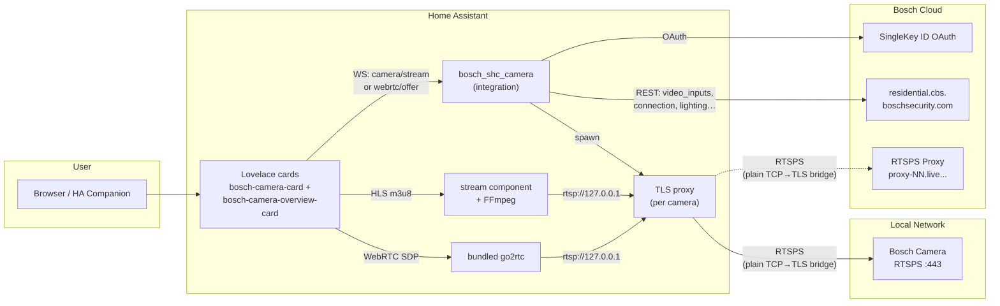

# Bosch Smart Home Camera — Home Assistant Integration

Adds your Bosch Smart Home cameras (Eyes Außenkamera, 360 Innenkamera) as fully featured entities in Home Assistant. Ships with two custom **Lovelace cards** — one detailed view per camera and a multi-camera grid — plus live streaming, controls, snapshot retrieval, and event-driven notifications.

**Supported models:** Eyes Außenkamera (Gen1), Eyes Außenkamera II (Gen2), 360 Innenkamera (Gen1), Eyes Innenkamera II (Gen2) — model-specific timing and configuration is automatic.

> **No official API.** This integration uses the reverse-engineered Bosch Cloud API, discovered via mitmproxy traffic analysis of the official Bosch Smart Camera app.

[![GitHub Release][releases-shield]][releases]
[![GitHub Activity][commits-shield]][commits]
[![License][license-shield]](LICENSE)

[![hacs][hacsbadge]][hacs]
[![Project Maintenance][maintenance-shield]][user_profile]
[![BuyMeCoffee][buymecoffeebadge]][buymecoffee]

[![Community Forum][forum-shield]][forum]

[releases-shield]: https://img.shields.io/github/release/mosandlt/Bosch-Smart-Home-Camera-Tool-HomeAssistant.svg?style=for-the-badge
[releases]: https://github.com/mosandlt/Bosch-Smart-Home-Camera-Tool-HomeAssistant/releases
[commits-shield]: https://img.shields.io/github/commit-activity/y/mosandlt/Bosch-Smart-Home-Camera-Tool-HomeAssistant.svg?style=for-the-badge
[commits]: https://github.com/mosandlt/Bosch-Smart-Home-Camera-Tool-HomeAssistant/commits/main
[license-shield]: https://img.shields.io/github/license/mosandlt/Bosch-Smart-Home-Camera-Tool-HomeAssistant.svg?style=for-the-badge
[hacsbadge]: https://img.shields.io/badge/HACS-Custom-blue.svg?style=for-the-badge
[hacs]: https://hacs.xyz
[maintenance-shield]: https://img.shields.io/badge/maintainer-%40mosandlt-blue.svg?style=for-the-badge
[user_profile]: https://github.com/mosandlt
[buymecoffeebadge]: https://img.shields.io/badge/buy%20me%20a%20coffee-donate-yellow.svg?style=for-the-badge
[buymecoffee]: https://buymeacoffee.com/mosandlts
[forum-shield]: https://img.shields.io/badge/community-forum-brightgreen.svg?style=for-the-badge
[forum]: https://community.home-assistant.io/

---

## Contents

- [Supported Cameras](#supported-cameras)
- [Disclaimer](#disclaimer)
- [Prerequisites — Setting Up a New Camera](#prerequisites--setting-up-a-new-camera)
- [Installation](#installation)
- [Setup](#setup)
- [Architecture](#architecture)
- [Features](#features)
  - [Entities](#entities)
  - [Built-in 3-Step Alert System](#built-in-3-step-alert-system)
  - [FCM Push vs Polling](#fcm-push-vs-polling)
  - [SMB/NAS Upload](#smbnas-upload)
  - [Developer Tools — Services](#developer-tools--services)
- [Lovelace Cards](#lovelace-cards)
  - [`bosch-camera-card` — single camera](#bosch-camera-card--single-camera)
  - [`bosch-camera-overview-card` — multi-camera grid](#bosch-camera-overview-card--multi-camera-grid)
- [Requirements](#requirements)
- [Alarmanlage / Automation Setup](#alarmanlage--automation-setup)
- [Releases](#releases) · [Full changelog](CHANGELOG.md) · [GitHub Releases](https://github.com/mosandlt/Bosch-Smart-Home-Camera-Tool-HomeAssistant/releases)
- [Related Projects](#related-projects)
- [License](#license)

---

## Supported Cameras

All four current Bosch Smart Home cameras are supported. Click any camera name for the official product page.

| Camera | Generation | Type | Codec / FW seen | Highlights |
|---|---|---|---|---|
| [**360° Innenkamera**](https://www.bosch-smarthome.com/de/de/produkte/sicherheitsprodukte/360-grad-innenkamera/) | Gen1 | Indoor | H.264 + AAC · FW 7.91.x | Pan/tilt motor, autofollow, IR night vision, mechanical privacy shutter |
| [**Eyes Innenkamera II**](https://www.bosch-smarthome.com/de/de/produkte/sicherheitsprodukte/eyes-innenkamera-2/) | Gen2 | Indoor | H.264 + AAC · FW 9.40.x | Built-in 75 dB siren, Audio+ glass-break / smoke / CO, ZONES detection mode, RGB LEDs, retractable head (Privacy hardware button) |
| [**Eyes Außenkamera**](https://www.bosch-smarthome.com/de/de/produkte/sicherheitsprodukte/eyes-aussenkamera/) | Gen1 | Outdoor (IP66) | H.264 + AAC · FW 7.91.x | Front spotlight, motion-triggered light, ambient-light sensor, schedule-driven illumination |
| [**Eyes Außenkamera II**](https://www.bosch-smarthome.com/de/de/produkte/sicherheitsprodukte/eyes-aussenkamera-2/) | Gen2 | Outdoor (IP66) | H.264 + AAC · FW 9.40.x | Front + Top + Bottom RGB LED groups, DualRadar (motion + intrusion), wallwasher mode, mounting-elevation parameter |

> Camera images: see the linked product pages above.

Model-specific timing (pre-warm, heartbeat, retries) is configured automatically — see [Model-Specific Configuration](#model-specific-configuration) for the exact values per generation.

---

## Disclaimer

**This project is an independent, community-developed integration. It is not affiliated with, endorsed by, or connected to Robert Bosch GmbH. "Bosch" and "Bosch Smart Home" are registered trademarks of Robert Bosch GmbH.**

This integration communicates with a reverse-engineered, undocumented API. Provided **"as is"**, without warranty. Use at your own risk. The API may change or be shut down by Bosch at any time. Reverse engineering was performed solely for interoperability under **§ 69e UrhG** and **EU Directive 2009/24/EC**.

---

## Prerequisites — Setting Up a New Camera

Before adding a camera to this integration, it **must** be fully set up in the official **Bosch Smart Camera** app first.

### Step-by-step

1. **Unbox and power on** the camera
2. **Open the Bosch Smart Camera app** and follow the pairing wizard to add the camera to your account
3. **Wait for the firmware update** — new cameras typically receive a Zero-Day update during first setup. This can take **up to 1 hour**. The camera's LED blinks yellow/green during the update.
   - **Do not unplug or restart** the camera during the update
   - If the LED blink pattern doesn't change after 1 hour, leave the camera alone for up to 24 hours ([Bosch Support](https://www.bosch-smarthome.com/de/de/support/hilfe/hilfe-zum-produkt/hilfe-zur-eyes-aussenkamera-2/))
   - The app shows the update status — wait until it reports the camera as ready
4. **Verify the camera works** in the Bosch app — check live stream, settings, and notifications
5. **Then add it to Home Assistant** using this integration (see Installation below)

> **Tip:** If you're replacing an existing camera (e.g. upgrading from Gen1 to Gen2), rename the new camera in the Bosch app to match the old name before setting up the integration. This way Home Assistant creates entities with the expected names.

For more help with camera setup, see:
- [Eyes Außenkamera II — Bosch Support](https://www.bosch-smarthome.com/de/de/support/hilfe/hilfe-zum-produkt/hilfe-zur-eyes-aussenkamera-2/)
- [Eyes Innenkamera II — Bosch Support](https://www.bosch-smarthome.com/de/de/support/hilfe/hilfe-zum-produkt/hilfe-zur-eyes-innenkamera-2/)
- [Firmware Update dauert lange — Bosch Community](https://community.bosch-smarthome.com/t5/technische-probleme/wie-lange-dauert-das-update-der-software-bei-mir-l%C3%A4uft-es-seit-%C3%BCber-20-minuten/td-p/71764)

---

## Installation

### HACS (Recommended)

[](https://my.home-assistant.io/redirect/hacs_repository/?owner=mosandlt&repository=Bosch-Smart-Home-Camera-Tool-HomeAssistant&category=integration)

1. Click the button above (it opens HACS pre-filled with this repo), or in HACS go to **Integrations → ⋮ → Custom repositories** and add `mosandlt/Bosch-Smart-Home-Camera-Tool-HomeAssistant` as type `Integration`.
2. Click **Download** on the Bosch Smart Home Camera entry.
3. Restart Home Assistant.
4. Continue with [Setup](#setup) below.

> **HACS Default listing.** A PR adding this integration to the HACS Default index is pending ([`hacs/default#7247`](https://github.com/hacs/default/pull/7247)). Once merged, the "Custom repositories" step disappears — the integration appears directly under HACS → Integrations → + Explore.

### Manual Installation

If you don't use HACS, copy the integration folder into your HA config:

1. Download the latest release tarball from [Releases](https://github.com/mosandlt/Bosch-Smart-Home-Camera-Tool-HomeAssistant/releases/latest) (or `git clone` this repo).
2. Copy `custom_components/bosch_shc_camera/` into your HA config directory so the final path is:
   ```
   /config/custom_components/bosch_shc_camera/
   ```
3. Restart Home Assistant.
4. Continue with [Setup](#setup) below.

> **Lovelace card** is auto-registered since **v10.3.19** — the integration serves it from its own bundled `www/` folder. No need to copy `bosch-camera-card.js` to `/config/www/` separately. If you have an old copy from a pre-v10.3.19 install, you can leave it (harmless) or delete it manually: `rm /config/www/bosch-camera-card.js`.

---

## Setup

### Step 1 — Add the Integration

1. Go to **Settings → Integrations → + Add Integration**
2. Search for **"Bosch Smart Home Camera"**
3. Your browser opens the **Bosch SingleKey ID** login page automatically
4. Log in with your Bosch account (same credentials as the Bosch Smart Camera app)
5. After login, the browser redirects back to Home Assistant automatically — **no manual URL copying needed**
6. The integration discovers all your cameras automatically

> **Token renewal is automatic.** The integration uses a refresh token to silently renew the Bearer token in the background — no manual action needed after initial setup.
>
> **Note:** The automatic redirect uses [my.home-assistant.io](https://my.home-assistant.io). If your HA instance URL is not configured there, you'll be prompted to set it up on first use.

### Step 2 — Configure Settings

Go to **Settings → Integrations → Bosch Smart Home Camera → Configure**. Every setting has a description in the UI; the table below groups them by topic so you can decide which sections to fill in.

#### Event detection

| Setting | Description | Default |
|---|---|---|
| **FCM Push** | Near-instant (~2 s) event detection via Firebase Cloud Messaging. With FCM enabled the polling interval is automatically tightened to 60 s as a backup. | OFF |
| **FCM Push Mode** | `Auto` (iOS → Android → polling), `iOS`, `Android`, or `Polling`. `Auto` falls back automatically if iOS registration fails. | Auto |
| **Event check interval** | Polling fallback interval (seconds). Used only when FCM Push is OFF or as a backup. | 300 (5 min) |

#### Alerts (per-step routing)

| Setting | Description | Default |
|---|---|---|
| **Alert services — default fallback** | Notify services used when a per-step service isn't set. Comma-separated list (e.g. `notify.signal_messenger, notify.mobile_app_xxx`). | empty (alerts disabled) |
| **Step 1 — text notification** | Notify services for the instant text alert. Falls back to default. | (default) |
| **Step 2 — snapshot image** | Notify services for the JPG attachment ~3-5 s after the event. | (default) |
| **Step 3 — video clip** | Notify services for the MP4 attachment 30-90 s after the event. | (default) |
| **System alerts** | Notify services for token-expiry / disk-warning system messages. | (default) |
| **Save alert snapshots** | Keep downloaded event images / videos in `/media/bosch_alerts/` after sending. If OFF, files are deleted within seconds. | OFF |

#### SMB / NAS upload

| Setting | Description | Default |
|---|---|---|
| **SMB Upload** | Upload event snapshots + video clips to a SMB/CIFS share (FRITZ!Box NAS, Synology, …). | OFF |
| **SMB Server** | IP or hostname of the share (e.g. `192.168.1.1`). | empty |
| **SMB Share** | Share name (e.g. `FRITZ.NAS`, `cameras`). | empty |
| **SMB Username** / **SMB Password** | SMB authentication credentials. | empty |
| **SMB Base Path** | Base folder on the share (e.g. `Bosch-Kameras`). | empty |
| **SMB Folder Pattern** | Subfolder pattern with `{year}` / `{month}` / `{day}`. | `{year}/{month}` |
| **SMB File Pattern** | File-naming pattern with `{camera}` / `{date}` / `{time}` / `{type}` / `{id}`. | `{camera}_{date}_{time}_{type}_{id}` |
| **Retention period (days)** | Auto-delete files older than N days. `0` = keep forever. | 180 |
| **Low disk warning (MB)** | Notify when free space on the share drops below this. | 500 |

#### Stream + UI

| Setting | Description | Default |
|---|---|---|
| **Stream connection type** | `Auto` (try LOCAL → fall back to REMOTE), `Local` (LAN only), `Remote` (cloud only). Can also be changed at runtime via the per-camera **Stream Modus** select entity. | Auto |
| **HLS player buffer profile** (`live_buffer_mode`) | Three hls.js buffer presets that trade latency for smoothness: **Latency** (~4-6 s), **Balanced** (~8-10 s, default), **Stable** (~12-15 s). See [HLS Buffer Tuning](#hls-buffer-tuning). | Balanced |
| **Audio default ON** | Whether the per-camera audio switch starts ON (stream with sound) or OFF (muted). | ON |
| **Binary sensors** | Expose Motion / Audio / Person alarm binary sensors (ON for 30 s after each event). | ON |
| **Debug logging** | Enable verbose logs (TLS-proxy RTSP exchanges, pre-warm timing, FCM payloads). Off by default to keep the log file readable. | OFF |

### Step 3 — Add a Lovelace Card

Both cards are auto-registered since **v10.3.19** — no manual Lovelace resource entry needed. Pick one of the two cards based on whether you want **one camera per card** or **all cameras in a grid**:

#### One camera (`bosch-camera-card`)

1. Edit dashboard → **+ Add card → Custom: Bosch Camera Card**
2. Pick the camera entity in the visual editor, or paste:

```yaml
type: custom:bosch-camera-card
camera_entity: camera.bosch_garten
title: Garten
```

See the [single-camera card reference](#bosch-camera-card--single-camera) for all options.

#### All cameras at once (`bosch-camera-overview-card`)

1. Edit dashboard → **+ Add card → Custom: Bosch Camera Overview Card**
2. The minimal config has zero options — every Bosch camera is auto-discovered:

```yaml
type: custom:bosch-camera-overview-card
title: Kameras
use_bosch_sort: true
```

See the [overview card reference](#bosch-camera-overview-card--multi-camera-grid) for the grid layout, sort options, and per-camera overrides.

> **Upgrading from pre-v10.3.19?** The integration auto-removes any stale `/local/bosch-camera-card.js` resource entry from Lovelace storage. The physical file in `/config/www/` is intentionally left in place (an integration must not modify user files there) and is harmless either way — the integration loads its own bundled copy.

---

## Architecture

### Components



Since **v10.3.24** the same Python TLS proxy carries both LOCAL and REMOTE — FFmpeg and go2rtc always connect to `rtsp://127.0.0.1:N`, the proxy decides whether to terminate TLS to the camera (LOCAL) or to the Bosch cloud proxy (REMOTE). Symmetric path means there's no scheme-switching trick (`rtspx://` etc.) on the consumer side, and the cert/hostname mismatch on `proxy-NN.live.cbs.boschsecurity.com` is handled in one place.

### REMOTE / Cloud differences

* **`/connection {type:"REMOTE"}`** returns `rtsps://proxy-NN.live.cbs.boschsecurity.com:42090/<hash>` — the Bosch cloud proxy serves the camera over the public internet.
* **TLS proxy is symmetric** (since v10.3.24): the same Python TLS proxy that handles LOCAL also terminates TLS to the cloud proxy for REMOTE. FFmpeg (HLS) and go2rtc (WebRTC) always connect to `rtsp://127.0.0.1:N` — no scheme tricks (`rtspx://`), no per-consumer special-cases. The cert/hostname mismatch on `proxy-NN.live.cbs.boschsecurity.com` (cert SAN only covers `*.residential.connect.boschsecurity.com`) is handled in one place (`verify_mode=CERT_NONE, check_hostname=False`).
* **Snapshots** (`/snap.jpg`) use the cloud-proxy URL directly with HTTP — no TLS proxy needed since they're single-shot HTTP requests, not long-lived RTSP streams.
* **bufferingTime hint** from `PUT /connection` is `1000 ms` for REMOTE (vs `500 ms` for LOCAL) — Bosch's server-side hint about expected latency.

---

## Features

### Entities

| Feature | Entity type | Default |
|---------|-------------|---------|
| Camera snapshot (latest event JPEG) | `camera` | enabled |
| Camera status (ONLINE/OFFLINE) | `sensor` | enabled |
| Last event timestamp | `sensor` | enabled |
| Events today count | `sensor` | enabled |
| WiFi signal strength (%) | `sensor` | enabled |
| Firmware version | `sensor` | enabled |
| Ambient light level (%) | `sensor` | enabled |
| LED dimmer (%) | `sensor` | enabled (cameras with LED) |
| Motion sensitivity | `sensor` | diagnostic |
| Audio alarm state | `sensor` | diagnostic |
| Last event type | `sensor` | enabled |
| Movement events today | `sensor` | enabled |
| Audio events today | `sensor` | enabled |
| Event detection method | `sensor` | diagnostic — `fcm_push` / `polling` / `disabled` |
| Refresh Snapshot | `button` | enabled |
| Live Stream (ON/OFF) | `switch` | enabled |
| Audio (mute/unmute stream) | `switch` | enabled |
| Camera LED light | `switch` | enabled (cameras with LED) |
| Privacy mode | `switch` | enabled |
| Notifications | `switch` | enabled |
| Motion detection | `switch` | disabled by default |
| Record sound | `switch` | disabled by default |
| Auto-follow (360 camera) | `switch` | disabled by default |
| Intercom (two-way audio) | `switch` | disabled by default |
| Pan position (360 camera) | `number` | enabled (±120°) |
| Audio alarm threshold | `number` | disabled by default |
| Speaker level (intercom volume) | `number` | disabled by default (0–100) |
| Stream quality | `select` | Auto / Hoch 30 Mbps / Niedrig 1.9 Mbps (persists across restarts) |
| Stream mode | `select` | Auto (Lokal → Cloud) / Nur Lokal / Nur Cloud |
| Motion sensitivity | `select` | SUPER_HIGH / HIGH / MEDIUM_HIGH / MEDIUM_LOW / LOW / OFF |
| FCM Push mode | `select` | Auto / iOS / Android / Polling |
| Motion detected | `binary_sensor` | disabled by default |
| Audio alarm detected | `binary_sensor` | disabled by default |
| Person detected | `binary_sensor` | disabled by default |
| Unread events count | `sensor` | disabled by default |
| Privacy sound (360 only) | `switch` | enabled (config category) |
| Commissioned status | `sensor` | diagnostic, disabled by default |
| Acoustic alarm (siren) | `button` | disabled by default — added for every camera; cameras without a built-in siren return HTTP 442 (handled gracefully) |
| Live stream (30fps H.264 + AAC) | `camera` | via Live Stream switch |
| Timestamp overlay (clock on video) | `switch` | disabled by default |
| Movement notifications | `switch` | disabled by default |
| Person notifications | `switch` | disabled by default |
| Audio notifications | `switch` | disabled by default |
| Trouble notifications | `switch` | disabled by default |
| Camera alarm notifications | `switch` | disabled by default |
| Firmware update status | `update` | enabled — native HA update card |
| Schedule rules count | `sensor` | diagnostic, disabled by default |
| **Alarm Catalog** (RCP 0x0c38) | `sensor` | diagnostic — all alarm types supported by camera firmware (virtual, flame, smoke, glass break, audio, motion, storage) |
| **Motion Zones** (RCP 0x0c00/0x0c0a) | `sensor` | diagnostic — motion detection zone coordinates (normalized x/y for overlay) |
| **TLS Certificate** (RCP 0x0b91) | `sensor` | diagnostic — camera cert expiry date, issuer, key size |
| **Network Services** (RCP 0x0c62) | `sensor` | diagnostic — active services (HTTP, HTTPS, RTSP, SNMP, UPnP, NTP, ONVIF) |
| **IVA Analytics** (RCP 0x0b60) | `sensor` | diagnostic — analytics module inventory (detectors, versions, active state) |
| Front light with color temperature | `light` | Gen2 only |
| Top LED light with RGB color picker | `light` | Gen2 only |
| Bottom LED light with RGB color picker | `light` | Gen2 only |
| Status LED on/off | `switch` | Gen2 only |
| Motion-triggered lighting on/off | `switch` | Gen2 only |
| Ambient/permanent lighting on/off | `switch` | Gen2 only |
| DualRadar intrusion detection on/off | `switch` | Gen2 only |
| Mounting height (meters) | `number` | Gen2 only |
| Microphone recording level (0–100%) | `number` | Gen2 only |
| Front light color temperature | `number` | Gen2 only |
| Top LED brightness (0–100%) | `number` | Gen2 only |
| Bottom LED brightness (0–100%) | `number` | Gen2 only |
| Motion light sensitivity (1–5) | `number` | Gen2 only |

> **RCP diagnostic sensors** are disabled by default. Enable them in entity settings to inspect camera firmware capabilities. Gen2 cameras will automatically expose new alarm types and analytics modules.

> **SHC local API is not needed.** All features work with just the Bosch cloud API.

### Built-in 3-Step Alert System

No automations needed — the integration sends alerts directly:

1. **Instant text:** `📷 Kamera: Bewegung (10:31:56)` — sent immediately
2. **Snapshot image:** `📸 Kamera Snapshot` + JPEG — sent ~5s later
3. **Video clip:** `🎬 Kamera Video (245 KB)` + MP4 — sent ~30-90s later (polls until Bosch uploads the clip)

**Per-step routing** (v6.5.0+): each step can go to different services, multiple recipients at once. Supports Signal, Telegram, iOS/Android Companion App, or any HA notify service.

| Setting | Description | Example |
|---|---|---|
| `Alert services — default fallback` | Used for all steps unless overridden below | `notify.signal_messenger` |
| `System alerts` | Token expiry, disk warnings | `notify.signal_messenger` |
| `Step 1 — text notification` | Instant text on event | `notify.signal_messenger, notify.mobile_app_xxx, notify.mobile_app_pixel9` |
| `Step 2 — snapshot image` | JPEG inline in notification | `notify.signal_messenger, notify.mobile_app_xxx` |
| `Step 3 — video clip` | MP4 attachment | `notify.signal_messenger` |
| `Save alert snapshots` | Keep files locally or delete after sending | OFF |
| `Delete after send` | Cleanup local files after notification sent | ON |

**iOS + Android Companion App** (`mobile_app_*`): snapshot appears directly inside the push notification as an inline image. Files are saved to `/media/bosch_alerts/` and auto-deleted within seconds after sending. Signal and others receive a file path attachment instead.

**Notification switch guard (v7.9.1+):** Alerts respect the notification switches — if `switch.bosch_{name}_notifications` (master) is OFF, no alerts are sent. Type-specific switches (`movement_notifications`, `person_notifications`, `audio_notifications`) are also checked. The FCM push is still received (for event tracking), but the HA notification is suppressed.

### Mark-as-Read & Last Event Fast-Path

Events are automatically **marked as read** after alert processing or download. This uses `PUT /v11/events/bulk` for batch updates and `PUT /v11/events` (with `{"id": ..., "isRead": true}`) for individual events, keeping the unread count in sync with the Bosch Smart Camera app.

On **startup**, the integration marks all currently unread events as read — clearing any backlog that accumulated while HA was offline.

The integration uses `GET /v11/video_inputs/{id}/last_event` as a **fast-path** to check for new events before fetching the full event list. This reduces unnecessary API calls — the full event list is only fetched when the last event has actually changed.

### FCM Push vs Polling

| | FCM Push (recommended) | Polling (default) |
|---|---|---|
| **Event latency** | ~2-3 seconds | 5 minutes (configurable) |
| **How it works** | Firebase Cloud Messaging push from Bosch cloud | Periodic API polling |
| **Fallback** | Automatic — if FCM goes down, polling continues | Always active |
| **Status sensor** | `sensor.bosch_camera_event_detection` = `fcm_push` | `polling` |

Enable FCM Push in **Settings → Configure → FCM Push**. You can also select the push mode (`Auto`, `iOS`, `Android`, or `Polling`) — `Auto` tries iOS first, then Android, then falls back to polling. The mode can also be changed at runtime via the **FCM Push Mode** select entity.

### SMB/NAS Upload

Upload event snapshots and video clips directly to a SMB/CIFS network share (FRITZ!Box NAS, Synology, any Windows share, etc.). Disabled by default.

**How it works:**
- When an event is detected (via FCM push or polling), the integration downloads the snapshot and video clip
- Files are uploaded to the configured SMB share using the folder and file naming patterns
- Supports any SMB-compatible NAS or router with USB storage (FRITZ!Box, Synology, QNAP, Windows shares)

**Configuration:** Go to **Settings → Integrations → Bosch Smart Home Camera → Configure** and enable **SMB Upload**. Then fill in the server, share, and credentials.

**Folder pattern variables:** `{year}`, `{month}`, `{day}`
**File pattern variables:** `{camera}`, `{date}`, `{time}`, `{type}`, `{id}`

Example file path on NAS:
```
\\192.168.1.1\FRITZ.NAS\Bosch-Kameras\2026\03\Garten_2026-03-25_14-32-05_MOVEMENT_abc123.jpg
\\192.168.1.1\FRITZ.NAS\Bosch-Kameras\2026\03\Garten_2026-03-25_14-32-05_MOVEMENT_abc123.mp4
```

> Requires the `smbprotocol` Python package, which is auto-installed via `manifest.json`.

#### FRITZ!Box NAS Setup

To use your FRITZ!Box as a NAS for camera event storage:

1. **Enable NAS on FRITZ!Box:**
   - Open `http://fritz.box` → **Heimnetz → USB / Speicher → USB-Speicher**
   - Enable **Speicher (NAS) aktiv**
   - Note the share name (default: `FRITZ.NAS`)

2. **Create a FRITZ!Box user with NAS access:**
   - **System → FRITZ!Box-Benutzer → Benutzer hinzufügen**
   - Give the user a username and password
   - Under **Berechtigungen**, enable **Zugang zu NAS-Inhalten**

3. **Configure in Home Assistant:**
   - Go to **Settings → Integrations → Bosch Smart Home Camera → Configure**
   - Enable **SMB Upload**
   - Fill in:

   | Field | Value | Example |
   |-------|-------|---------|
   | SMB Server | FRITZ!Box IP | `192.168.1.1` |
   | SMB Share | NAS share name | `FRITZ.NAS` |
   | SMB Username | FRITZ!Box NAS user | `nas_user` |
   | SMB Password | User password | `your_password` |
   | SMB Base Path | Folder on NAS | `Bosch-Kameras` |
   | SMB Folder Pattern | Subfolder structure | `{year}/{month}` |
   | SMB File Pattern | File naming | `{camera}_{date}_{time}_{type}_{id}` |
   | Retention (days) | Delete files older than N days | `180` (6 months) |
   | Low disk warning (MB) | Alert below this free space | `5120` (5 GB) |

4. **Verify:** After the next camera event, check your NAS at `FRITZ.NAS/Bosch-Kameras/` — snapshots (.jpg) and video clips (.mp4) should appear automatically.

> **Tip:** Works with any SMB-compatible device. For Synology, use the share name from **Control Panel → Shared Folder**. For Windows, use the shared folder name (e.g. `\\PC-NAME\SharedFolder`).

#### Automatic Cleanup (Retention)

Set **Retention period (days)** to automatically delete old files from the NAS. Default: **180 days (6 months)**. Set to `0` to keep files forever.

- Cleanup runs **once per day** in the background
- Deletes `.jpg` and `.mp4` files older than the configured retention period
- Only runs when SMB upload is enabled and configured

#### Low Disk Space Warning

Set **Low disk warning threshold (MB)** to receive an alert when the NAS runs low on storage. Default: **500 MB**.

- Checked **once per hour**
- If free space drops below the threshold, an alert is sent via:
  1. The configured **notify service** (e.g. Signal, mobile app) if set
  2. **HA persistent notification** as fallback (always shown in the sidebar)

### HA Events

The integration fires events for custom automations:
- `bosch_shc_camera_motion` — movement detected
- `bosch_shc_camera_audio_alarm` — audio alarm triggered
- `bosch_shc_camera_person` — person detected

Event data: `camera_name`, `timestamp`, `image_url`, `event_id`, `source` (`fcm_push` / `polling`)

### Developer Tools — Services

All services are available in **Developer Tools → Services** (or via automations/scripts):

| Service | Description | Fields |
|---------|-------------|--------|
| `bosch_shc_camera.trigger_snapshot` | Force immediate snapshot refresh for all cameras | — |
| `bosch_shc_camera.open_live_connection` | Open live stream for a specific camera | `camera_id` |
| `bosch_shc_camera.rename_camera` | Rename a camera (appears in Bosch app + HA) | `camera_id`, `new_name` |
| `bosch_shc_camera.invite_friend` | Send camera sharing invitation by email | `email` |
| `bosch_shc_camera.list_friends` | List all friends and camera shares (persistent notification) | — |
| `bosch_shc_camera.remove_friend` | Remove a friend and revoke all camera shares | `friend_id` |
| `bosch_shc_camera.get_lighting_schedule` | Read full lighting schedule (persistent notification) | `camera_id` |
| `bosch_shc_camera.delete_motion_zone` | Delete a single motion zone by index | `camera_id`, `zone_index` |
| `bosch_shc_camera.get_privacy_masks` | Read privacy mask zones (persistent notification) | `camera_id` |
| `bosch_shc_camera.set_privacy_masks` | Set/clear privacy mask zones (0.0–1.0 coordinates) | `camera_id`, `masks` |
| `bosch_shc_camera.create_rule` | Create a cloud-side schedule rule | `camera_id`, `name`, `start_time`, `end_time`, `weekdays`, `is_active` |
| `bosch_shc_camera.update_rule` | Update a schedule rule (change name, times, activate/deactivate) | `camera_id`, `rule_id`, `name`?, `start_time`?, `end_time`?, `weekdays`?, `is_active`? |
| `bosch_shc_camera.delete_rule` | Delete a schedule rule | `camera_id`, `rule_id` |
| `bosch_shc_camera.set_motion_zones` | Set motion detection zones (normalized 0.0–1.0 coordinates) | `camera_id`, `zones` |
| `bosch_shc_camera.get_motion_zones` | Read motion zones from cloud API (persistent notification) | `camera_id` |
| `bosch_shc_camera.share_camera` | Share cameras with a friend (time-limited) | `friend_id`, `camera_ids`, `days`? |

**Examples:**

```yaml
# Rename a camera
service: bosch_shc_camera.rename_camera
data:
  camera_id: "xxxxxxxx-xxxx-xxxx-xxxx-xxxxxxxxxxxx"
  new_name: "Garten Kamera"

# Invite a friend to share cameras
service: bosch_shc_camera.invite_friend
data:
  email: "friend@example.com"

# List all camera shares
service: bosch_shc_camera.list_friends

# Remove a friend (get friend_id from list_friends)
service: bosch_shc_camera.remove_friend
data:
  friend_id: "xxxxxxxx-xxxx-xxxx-xxxx-xxxxxxxxxxxx"

# Create a schedule rule (notifications active 8am-8pm weekdays)
service: bosch_shc_camera.create_rule
data:
  camera_id: "xxxxxxxx-xxxx-xxxx-xxxx-xxxxxxxxxxxx"
  name: "Weekday Schedule"
  start_time: "08:00:00"
  end_time: "20:00:00"
  weekdays: [1, 2, 3, 4, 5]
  is_active: true

# Update a rule (deactivate it)
service: bosch_shc_camera.update_rule
data:
  camera_id: "xxxxxxxx-xxxx-xxxx-xxxx-xxxxxxxxxxxx"
  rule_id: "yyyyyyyy-yyyy-yyyy-yyyy-yyyyyyyyyyyy"
  is_active: false

# Set motion detection zones (list of normalized rectangles)
service: bosch_shc_camera.set_motion_zones
data:
  camera_id: "xxxxxxxx-xxxx-xxxx-xxxx-xxxxxxxxxxxx"
  zones:
    - { x: 0.0, y: 0.3, w: 0.67, h: 0.7 }
    - { x: 0.63, y: 0.42, w: 0.28, h: 0.58 }

# Share cameras with a friend for 30 days
service: bosch_shc_camera.share_camera
data:
  friend_id: "xxxxxxxx-xxxx-xxxx-xxxx-xxxxxxxxxxxx"
  camera_ids:
    - "cam-id-1"
    - "cam-id-2"
  days: 30
```

> **Tip:** Find the `camera_id` in the camera entity's attributes (Developer Tools → States → `camera.bosch_*` → `camera_id` attribute).

### Ready-to-Use Automations

- [`examples/automation_ios_push_alert.yaml`](examples/automation_ios_push_alert.yaml) — iPhone push (time-sensitive)
- [`examples/automation_signal_alert.yaml`](examples/automation_signal_alert.yaml) — Signal text message
- [`blueprints/bosch_camera_signal_alert.yaml`](blueprints/bosch_camera_signal_alert.yaml) — configurable blueprint

---

## Lovelace Cards

The integration ships **two custom cards**, both auto-registered (since v10.3.19 — no manual Lovelace resource entry needed). They share the same code bundle (`bosch-camera-card.js`) and version, so a single resource URL serves both.

| Card | Use case | Versioning |
|---|---|---|
| `custom:bosch-camera-card` | **One Bosch camera per card.** The full feature surface — live HLS / WebRTC video, snapshot, stream/audio/light/privacy/notifications switches, pan controls (360 only), notification-type accordion, motion-zone overlay, schedule editor, alarm controls (Gen2 Indoor II only). | Card v2.10.13 |
| `custom:bosch-camera-overview-card` | **All Bosch cameras at once.** Auto-discovers every camera via `attributes.brand === "Bosch"` and renders a responsive tile grid. Sort order is **Live → Privat → Offline** with colored outlines per tier (green / orange / grey), or by Bosch-app `priority` if `use_bosch_sort: true`. Each tile is a full `bosch-camera-card` underneath, so per-camera overrides work the same way. | Overview v1.1.0 |

> **Card version: v2.10.13** — Stale-state guard against accidental toggles after Companion-App backgrounding, Bosch-app sort option, hls.js buffer profiles, hardware-privacy auto-teardown, Gen2 polygon overlays, privacy mask overlay, simplified offline view

The detailed reference for each card follows below — start with `bosch-camera-card` (the building block) and jump to [`bosch-camera-overview-card`](#bosch-camera-overview-card-multi-camera-grid) at the bottom.

---

### `bosch-camera-card` — single camera


#### What the card shows

```
┌──────────────────────────────────┐
│ ● Garten              [streaming]│
│  ┌────────────────────────────┐  │
│  │   Live video / snapshot    │  │
│  │ Last: 2026-03-19 09:32     │  │
│  └────────────────────────────┘  │
│  [ 📸 Snapshot ] [ 📹 Stream ] [ ⛶ ] │
│  [ 🔊 ton / video ] [ 💡 Licht ] [ 🔒 Privat ] │
│  [ 🔔 Benachrichtigungen ]            │
│  [ 🎙 Gegensprechanlage ]             │
│  [ ◀ ] [     ■     ] [ ▶ ]  ← pan    │
│  Qualität: [Auto ▼]                   │
│  ▼ Benachrichtigungs-Typen            │
│  ▼ Erweitert                          │
│  ▼ Diagnose                           │
│  ▼ Zeitpläne & Zonen                  │
└──────────────────────────────────┘
```

#### Card modes

| Mode | Description |
|------|-------------|
| **Stream OFF** | Snapshot image, auto-refreshed every **60 s** (visible) / **30 min** (background tab). Immediate refresh on tab focus. |
| **Stream ON** | Live **HLS video** (30fps H.264 + AAC-LC). Uses go2rtc and HA's camera stream WS. Audio toggle controls mute/unmute. Loading overlay with status updates during connection. Auto-recovers from stream disconnects. **Audio quality is higher than the official Bosch app** — the Bosch mobile app downsamples audio for cellular bandwidth, while this integration delivers the unmodified AAC-LC stream straight from the camera. |

#### Controls

| Button | Function |
|--------|----------|
| 📸 Snapshot | Force-fetch a fresh image immediately |
| 📹 Live Stream | Toggle stream ON/OFF |
| 🔊 Ton | Toggle audio mute/unmute during live stream |
| 💡 Licht | Toggle camera LED light (outdoor camera) |
| 🔒 Privat | Toggle privacy mode (covers lens) |
| 🔔 Benachrichtigungen | Toggle push notifications |
| 🎙 Gegensprechanlage | Toggle intercom / two-way audio |
| ◀ ▶ Pan | Pan left/right (CAMERA_360 only) |

**Collapsible accordion sections** (auto-hidden when entities not available):
- **Benachrichtigungs-Typen** — per-type notification toggles: movement, person, audio, trouble, camera alarm
- **Erweitert** — timestamp overlay, auto-follow, motion detection, record sound, privacy sound
- **Diagnose** — WiFi signal %, firmware version, ambient light %, movement/audio events today
- **Zeitpläne & Zonen** — schedule rules list with AN/AUS toggle per rule + delete button, motion zone overlay toggle, motion zone count (RCP)

#### Reliability

- **Consistent snapshot refresh** — backend frame interval is shorter than the card's poll interval, so every card request always returns a fresh frame (no jitter).
- **HLS auto-recovery** — hls.js soft errors recover automatically; fatal errors trigger a full reconnect after 2 s. Buffer-stall detection seeks to the live edge on the first two stalls and does a full reconnect on the third (`bosch-camera-card: 3 buffer stalls, reconnecting HLS`).
- **hls.js CDN load hardening** — the card loads hls.js from jsdelivr with a pinned version + subresource-integrity hash (`hls.js@1.6.16` + matching `sha384`). The previous floating `@1` range broke silently whenever jsdelivr shipped a new patch release; updates now require an explicit version + hash bump.
- **Cred-rotation refresh** — Bosch rotates the per-session digest creds on every `PUT /connection LOCAL`. The heartbeat parses each response, caches the new `user`/`password`, rebuilds the cached `rtspsUrl`, and calls `Stream.update_source()` so the next reconnect uses fresh creds. A reactive 401 rescue (max 1 per 5 min per cam) covers the rare cases where the proactive refresh missed a tick. Together they keep AUTO-mode streams on LAN even after long idle gaps (HLS consumer disconnect → reconnect would otherwise hit HTTP 401).
- **Session renewal** — REMOTE proxy hashes expire after ~60 s; the backend opens a new connection before expiry and hands the card a fresh URL via `Stream.update_source()`. LOCAL streams survive the Gen2 Outdoor firmware's ~65 s RTSP TCP reset via a transparent FFmpeg reconnect on the same TLS proxy port with the same Digest credentials (~2 s gap, HLS output continues).
- **TLS-proxy circuit breaker** — when the camera goes physically offline (privacy hardware button, power cut, Wi-Fi drop), the proxy stops retrying after 5 consecutive connect failures within 30 s instead of looping forever. The coordinator decides whether to rebuild via `try_live_connection()` once the camera is reachable again.
- **Hardware-privacy auto-teardown** — when the camera's physical privacy button is pressed (or the Bosch app toggles privacy), the coordinator detects the OFF→ON transition and tears down the live session, the same path as a user-toggle. No more stuck `state: streaming` or endless reconnect loop.
- **"Connecting" badge** — amber badge with fast pulse while HLS is negotiating. Clears to blue "streaming" once video plays. Safety timeout hides the overlay after 120 s if the video never produces a frame, keeping the snapshot visible underneath.
- **Stream uptime counter** — badge shows `00:47` / `1:23` while streaming, updating every 2 s. Proves session renewal keeps the stream alive past 60 s.
- **Frame Δt in debug line** — shows actual ms between frames (`Δ2003ms`) — live verification that 2 s intervals are consistent.
- **Snap error retry** — a failed snap.jpg during streaming triggers one immediate 500 ms retry instead of waiting for the next 2 s timer tick.
- **Connection type badge** — shows "LAN" (green) or "Cloud" (gray) in the header while streaming.

#### Stream Connection Types

The integration supports three connection modes, configurable in **Settings → Configure → Stream connection type** or at runtime via the **Stream Modus** select entity:

| Mode | Description |
|------|-------------|
| **Auto** (recommended) | Try local LAN first, automatically fall back to Bosch cloud proxy on failure. |
| **Local** | Direct LAN only — no internet required. Uses a TLS proxy (TCP→TLS + RTSP transport rewrite) since FFmpeg can't handle RTSPS + Digest auth + self-signed cert natively. TCP keep-alive on all proxy sockets. |
| **Remote** | Always via Bosch cloud proxy. Faster snapshots (~0.4–1.9 s). Sessions run for up to 60 minutes. |

#### Stream Startup Timing

The card badge progresses `idle` → `warming_up` / `connecting` (yellow) → `streaming` (blue) when you flip the live-stream switch on. How long that first transition takes depends on the connection mode and the camera model — the LOCAL path has a deliberate pre-warm to wake the camera's H.264 encoder before exposing the RTSP URL to FFmpeg, while REMOTE is just a cloud-proxy handshake.

| Camera / mode | Typical time to first frame | Why |
|---|---|---|
| Any camera · **Remote (Cloud)** | **~5–10 s** | `PUT /connection REMOTE` → cloud proxy URL exposed immediately → FFmpeg opens `rtsps://proxy-NN.live.cbs.boschsecurity.com:443/...` → first HLS segment in 3–5 s. No pre-warm. |
| **Gen1 360 Innenkamera** · Local | ~30–35 s | `min_total_wait = 25 s` from `PUT /connection LOCAL` before the RTSP URL is exposed (`models.py` `INDOOR`), then ~5–10 s for FFmpeg pre-buffer. |
| **Gen2 Eyes Innenkamera II** · Local | ~30–35 s | Same indoor timing profile (`HOME_Eyes_Indoor`, `min_total_wait = 25 s`). |
| **Gen1 Eyes Außenkamera** · Local | ~40–45 s | Outdoor encoder is slower; `min_total_wait = 35 s` + `pre_warm_retries = 8 × 5 s` retry window (`models.py` `OUTDOOR`) + ~5–10 s FFmpeg buffer. |
| **Gen2 Eyes Außenkamera II** · Local | ~40–45 s | Same outdoor profile (`HOME_Eyes_Outdoor`). |
| Any camera · **Auto** with working LAN | same as Local | Auto picks LOCAL when LAN is reachable. |
| Any camera · **Auto**, LAN **un**reachable | **~100 s outdoor**, **~40 s indoor**, then + ~5 s for REMOTE | `pre_warm_rtsp()` tries each retry with a ~10 s TLS-handshake timeout plus `pre_warm_retry_wait` between attempts, so the worst case is `pre_warm_retries × (~10 s TLS timeout + pre_warm_retry_wait)`: outdoor `8 × (10 + 5) = ~120 s`, indoor `3 × (10 + 3) = ~39 s`. On exhaustion `_try_live_connection_inner` tears LOCAL down, sets `_stream_fell_back[cam_id]`, and `continue`s to REMOTE (v10.3.2+). Measured end-to-end on a live HA 2026.4.3: patched Gen2 Outdoor target IP to `192.0.2.1` (RFC 5737 TEST-NET) → user-visible fallback after 101 s with `WARNING: LOCAL pre-warm failed … Falling back to REMOTE.`. |
| Any camera · Any mode, **after 2 failed 60-s watchdog ticks** | ~2 min recovery | If FFmpeg opens LOCAL cleanly but the stream goes half-dead later, `_stream_health_watchdog` saturates the error counter on the second failing tick and forces the next `try_live_connection` to REMOTE. Worst-case end-to-end recovery ~2 min (v10.3.2+). |

Renewals after the initial startup take **roughly 2/3** of the `min_total_wait` (camera encoder already warm), so ~17 s indoor, ~23 s outdoor. The TLS proxy can service a re-opened session during that window without user-visible interruption (`Stream.update_source()` hot-swap).

Values are configurable per model in `custom_components/bosch_shc_camera/models.py` if you need to tune them for a slower network or a specific firmware; the defaults above are empirically measured and known-good.

#### WebRTC / go2rtc

When [go2rtc](https://github.com/AlexxIT/go2rtc) is available, the card uses **WebRTC** (~2 s latency) instead of HLS (~12 s latency).

**Setup (HA 2024.11+):**
Since Home Assistant 2024.11, go2rtc is **built-in** — no separate add-on or installation needed. Just make sure `go2rtc:` is in your `configuration.yaml` (added by `default_config`). **Do NOT install go2rtc as a separate add-on** — this can cause conflicts.

On stream start, the integration automatically registers the RTSP URL with go2rtc. The card detects WebRTC support and uses it. If WebRTC fails, it falls back to HLS automatically.

**How it works:**
- On stream start, the integration registers the RTSP URL with go2rtc's API (port 1984 inside HA container)
- The card checks `camera/capabilities` — if `web_rtc` is available, it creates an `RTCPeerConnection`
- Full ICE candidate exchange via HA's `camera/webrtc/offer` websocket
- On stream stop, the registration is removed from go2rtc
- If WebRTC fails (go2rtc not running, network issue), falls back to HLS automatically

#### Stream Watchdog

A separate JavaScript resource (`bosch-camera-autoplay-fix.js`) monitors all camera cards and auto-recovers from common issues:

| Issue | Detection | Recovery |
|-------|-----------|----------|
| Chrome autoplay block | Video paused with readyState ≥ 2 | Play muted |
| Dead HLS stream | readyState = 0 for 20 s | Request new HLS URL via `camera/stream` WS |
| Hidden video element | display:none while stream ON | Show video, start HLS |
| Buffer stall | 3 consecutive `bufferStalledError` | Full HLS reconnect |
| Video freeze | `currentTime` unchanged for 15 s | Seek to live edge or restart |

The watchdog gets entity IDs directly from HA states, so it works even when the card's JavaScript is cached.

#### Privacy Guard

The **Live Stream switch cannot be turned ON while Privacy Mode is active** (camera shutter is closed). Since v10.4.6 this is enforced at four levels so there's no bypass path:
- `BoschLiveStreamSwitch.available` returns `False` while privacy is on → the entity greys out in the UI.
- An attempted service call raises a `ServiceValidationError` → HA shows a clean toast in the UI, no persistent notification clutter.
- `BoschAudioSwitch._apply_audio_change` and `coordinator.try_live_connection()` both early-exit with a logged warning if privacy is active.
- When privacy gets enabled while a stream is already running — including via the camera's hardware privacy button or the Bosch app — the coordinator detects the OFF→ON transition and tears down the live session automatically (v10.4.10).

#### Fast Startup

The first coordinator tick after HA restart **skips events and slow-tier API calls** (WiFi, ambient light, RCP, motion, etc.). This reduces startup from ~2 minutes to ~15 seconds. Full data loads on the second tick (60 s later).

#### Model-Specific Configuration

Camera timing and behavior is configured per model via `CameraModelConfig`. Indoor cams keep an active 30 s heartbeat (the cred-refresh path doubles as a session keepalive), while Gen1/Gen2 outdoor cams have heartbeat disabled (`= renewal_interval`) because the Outdoor firmware rotates digest creds on every PUT and would invalidate the running RTSP session.

| Parameter | 360 Innenkamera (Gen1) | Eyes Innenkamera II (Gen2) | Eyes Außenkamera (Gen1) | Eyes Außenkamera II (Gen2) | Purpose |
|---|---|---|---|---|---|
| Heartbeat interval | 30 s | 30 s | 3600 s (≈ off) | 3600 s (≈ off) | PUT /connection keepalive + cred refresh |
| Pre-warm delay | 1 s | 1 s | 2 s | 2 s | Wait before first RTSP DESCRIBE |
| Pre-warm retries | 3 | 3 | 8 | 8 | Max DESCRIBE attempts |
| Min total wait | 25 s | 25 s | 35 s | 35 s | Minimum time before exposing RTSP URL |
| Renewal interval | 3500 s | 3500 s | 3600 s | 3600 s | Proactive session renewal (safety net) |
| Max session duration | 3600 s | 3600 s | 3600 s | 3600 s | Sent in RTSP URL `maxSessionDuration=` (Bosch default hint is 60 s but cams accept 3600) |

#### HLS Buffer Tuning

The card's HLS.js configuration is tuned to prevent HA's stream component from killing FFmpeg, and since v10.4.7 it's selectable via the **HLS player buffer profile** (`live_buffer_mode`) option in the integration settings:

| Profile | `liveSync` / `maxLatency` / `maxBuffer` / `maxMaxBuffer` / `lowLatencyMode` | Lag | Trade-off |
|---|---|---|---|
| **Latency** | `3 / 6 / 10 / 20 / true` | ~4–6 s | Lowest delay, may stutter on flaky Wi-Fi |
| **Balanced** *(default)* | `4 / 8 / 14 / 22 / false` | ~8–10 s | Robust against typical Wi-Fi hiccups |
| **Stable** | `6 / 12 / 22 / 30 / false` | ~12–15 s | Smooth even on weak links |

- **`maxBufferLength` cap** — All three modes stay below HA's `OUTPUT_IDLE_TIMEOUT` (30 s). If hls.js buffered ≥ 30 s it would stop requesting segments → HA thinks nobody's watching → kills FFmpeg → freeze.
- **HLS keepalive timer (20 s)** — Periodically calls `hls.startLoad()` as a safety net.
- **SRI integrity hash** — hls.js is loaded from jsdelivr with a pinned `hls.js@1.6.16` + matching `sha384`. Any drift (jsdelivr patch release) blocks the load instead of running an unverified bundle.

The player buffer profile is independent of the **Reaktion** info field on the card, which shows the Bosch-API server-side `bufferingTime` hint (~500 ms LOCAL, ~1000 ms REMOTE) and is unrelated to the client-side hls.js buffer.

#### Card YAML

```yaml
# Minimal config — everything else defaults from camera_entity
type: custom:bosch-camera-card
camera_entity: camera.bosch_garten

# With optional title
type: custom:bosch-camera-card
camera_entity: camera.bosch_garten
title: Garten

# Compact "minimal layout" — hides all advanced controls behind the ⋮ button.
# Visible: image + info row (Status / Verbindung / Reaktion) + primary buttons
# (Snapshot, Live Stream, ⋮ Overflow, Fullscreen) + Privacy toggle.
# Tap ⋮ to progressively reveal audio/light/notifications/accordions/pan/etc.
type: custom:bosch-camera-card
camera_entity: camera.bosch_garten
title: Garten
minimal: true
```

All entity IDs are auto-derived from `camera_entity`. Buttons and sections are hidden automatically when entities don't exist. The **Reaktion** slot in the info row reads the `buffering_time_ms` attribute exposed by the camera entity (Bosch cloud-issued, ~500 ms on LOCAL and ~1000 ms on REMOTE); it stays `—` while the stream is idle. The **Verbindung** slot reads `connection_type` and shows `LAN`, `Cloud`, or `—`.

#### Two-camera dashboard

```yaml
type: grid
columns: 2
cards:
  - type: custom:bosch-camera-card
    camera_entity: camera.bosch_garten
    title: Garten
  - type: custom:bosch-camera-card
    camera_entity: camera.bosch_kamera
    title: Kamera
```

---

### `bosch-camera-overview-card` — multi-camera grid

Introduced in v10.3.0. Auto-discovers every Bosch camera on the HA instance (`attributes.brand === "Bosch"`) and renders a responsive tile grid — no manual entity-list maintenance needed when you add or remove a camera. Each tile is itself a full `bosch-camera-card`, so all single-camera features (live HLS / WebRTC, snapshot, privacy/audio/light switches, etc.) work inside the grid.

#### What the overview shows

```
┌──────────────────────────────────────────────────────────────┐
│  Kameras                                                4/4  │
│  ┌─────────────────────┐  ┌─────────────────────┐            │
│  │ ● Terrasse          │  │ ● Innenbereich      │  ← green   │
│  │ [live tile]         │  │ [live tile]         │  outline   │
│  └─────────────────────┘  └─────────────────────┘            │
│  ┌─────────────────────┐  ┌─────────────────────┐            │
│  │ 🔒 Eingang          │  │ ○ Garten            │  ← orange  │
│  │ [privacy on]        │  │ [offline]           │    & grey  │
│  └─────────────────────┘  └─────────────────────┘            │
└──────────────────────────────────────────────────────────────┘
```

* **Header** — optional `title` plus a `4/4` style count showing how many cameras are visible.
* **Tile** — full single-camera card per cell. Each tile carries a colored outline based on the camera's tier:
  * **Green** — online, privacy off (live).
  * **Orange** — online, privacy on (lens covered).
  * **Grey** — offline / unreachable.

#### Tile sort order

Two-level sort: tiers come first (always live → privat → offline), then within each tier either alphabetic (default) or Bosch-app-priority (since v10.4.10).

| Mode | YAML | Behavior |
|---|---|---|
| Alphabetic *(default)* | `use_bosch_sort: false` (or omit) | Inside each tier, sort by `friendly_name` using German collation. |
| Bosch-app priority | `use_bosch_sort: true` | Inside each tier, sort by the `bosch_priority` attribute (`GET /v11/video_inputs` `priority` field — that's also what `PUT /v11/video_inputs/order` from the Bosch app sets). Cameras without a numeric priority fall back to alphabetic at the end of their tier, so foreign / non-Bosch `include:` entries don't disappear. |

The `online_offline_view: false` option hides the offline tier entirely — only online cameras (green and orange tiles) are rendered.

#### Per-camera overrides

The grid creates one `bosch-camera-card` per discovered camera using sensible defaults. To customise a specific tile (different title, attached automations, faster refresh, etc.) pass it through `overrides`:

```yaml
overrides:
  camera.bosch_terrasse:
    automations:
      - automation.alarmanlage
  camera.bosch_garten:
    refresh_interval_streaming: 3
    title: Eingang (Gen1)
    minimal: true                    # compact layout for this tile only
```

Each override is deep-merged into the child card's `setConfig()`. The wrapping `camera_entity` is always set automatically — no need to repeat it. The top-level `card_defaults` map applies the same options to every tile (e.g. `card_defaults: { minimal: true }` makes the whole grid compact).

#### Card YAML

```yaml
# Minimal — auto-discovers every Bosch camera, alphabetic order
type: custom:bosch-camera-overview-card

# Full options
type: custom:bosch-camera-overview-card
title: Kameras                  # optional header
online_offline_view: true       # default true; false = hide offline tier
columns: auto                   # "auto" | 1 | 2 | 3 | 4   (default "auto")
min_width: 360px                # cell min-width when columns: auto (default 360px)
gap: 12px                       # grid gap (default 12px)
use_bosch_sort: true            # default false; true = follow Bosch-app priority
minimal: false                  # default false; true = compact tiles for the whole grid
exclude:                        # skip these entity_ids
  - camera.bosch_test
include:                        # bypass auto-discovery and use exactly these
  - camera.bosch_terrasse
  - camera.bosch_innenbereich
overrides:                      # per-camera setConfig() overrides
  camera.bosch_terrasse:
    automations:
      - automation.alarmanlage
card_defaults:                  # base options applied to every tile (overrides win over these)
  refresh_interval_streaming: 5
```

#### Responsive behavior

* **Viewports > 640 px** — `columns: auto` packs as many cells as fit `min_width` per row; explicit `columns: 1|2|3|4` forces that count.
* **Viewports ≤ 640 px** — always one column regardless of `columns`, so cards stay legible on phones. The grid `gap` shrinks to 8 px in this mode.
* **Full-width dashboards** — to escape the sections-view max-width clamp (which limits standard dashboards to ~870 px), put the overview card in a view with `panel: true`. It then uses the full browser width.

#### Behavior notes

* **Discovery is live.** When a camera is added or removed, the overview re-discovers on the next `hass` update — no card config edit required.
* **Tier transitions are smooth.** When a camera's privacy switch flips or it goes offline, only the changed tile re-mounts; the others stay (no full grid rebuild).
* **`bosch_priority` attribute.** Exposed on every Bosch camera entity (`camera.bosch_*`). Visible in Developer Tools → States. You can also use it in templates / sensors outside the card, e. g. to drive a different layout.

---

## Requirements

- Home Assistant 2024.1+
- Python packages: `requests`, `firebase-messaging`, `smbprotocol` (auto-installed via manifest)
- For live video: go2rtc (built into HA) or ffplay/mpv

---

## Alarmanlage / Automation Setup

The Eyes Innenkamera II (Gen2) adds a built-in alarm system with integrated 75 dB siren. Here's how to wire it into a typical HA alarm automation alongside your existing cameras:

### Entities for the alarm system (v9.1.10+, Gen2 Indoor II only)

| Entity | Purpose |
|---|---|
| `switch.bosch_{name}_alarmanlage` | Arm / disarm the built-in intrusion system (`PUT /intrusionSystem/arming`). Derived state from `alarmStatus.intrusionSystem` (INACTIVE / ACTIVE). |
| `switch.bosch_{name}_sirene` | Main 75 dB siren on/off (`alarm_settings.alarmMode`). Disabling this lets you use the other alarm features without actually firing the siren. |
| `switch.bosch_{name}_pre_alarm` | Pre-alarm red-LED warning before the siren fires (`alarm_settings.preAlarmMode`). |
| `switch.bosch_{name}_audio_plus` | Sound-level event detection (ambient-noise threshold — "Geräusche" toggle in the iOS app). Free tier — this is NOT the paid Audio+ premium (glass-break / smoke / CO). |
| `sensor.bosch_{name}_alarm_status` | `INACTIVE` / `ACTIVE` / `UNKNOWN` — state machine for the alarm. Attributes include `alarm_type` (`NONE` when idle), `siren_duration_s`, `activation_delay_s`, `pre_alarm_duration_s`. |
| `number.bosch_{name}_sirenen_dauer` | Siren duration in seconds (`alarm_settings.alarmDelayInSeconds`, 10–300). |
| `number.bosch_{name}_alarm_verzogerung` | Activation delay in seconds (`alarmActivationDelaySeconds`, 0–600). |
| `number.bosch_{name}_pre_alarm_dauer` | Pre-alarm LED-warning duration (`preAlarmDelayInSeconds`, 0–300). |
| `number.bosch_{name}_power_led` | White Power-LED brightness 0–4 (*not* 0–100% — the iOS slider is misleading, the API only accepts 5 discrete steps). |

### Privacy mode — important!

Several settings only work when the camera is **actively recording** (privacy OFF):
- `switch.bosch_{name}_einbrucherkennung` (intrusion detection)
- `select.bosch_{name}_erkennungsmodus` (detection mode: `ALL_MOTIONS` / `ONLY_HUMANS` / `ZONES`)
- `number.bosch_{name}_microphone_level`

When privacy is ON, the Bosch cloud API returns HTTP 443 `"sh:camera.in.privacy.mode"` on reads/writes to these endpoints, so the entities show as `unavailable`. The integration caches the **last-known-good** values — so if you've ever had privacy OFF since HA started, the cached settings remain visible. If the camera has been in privacy mode since the HA restart, the entities stay unavailable until you turn off privacy once.

**Note on event clips:** Bosch records clips only when the camera is actively monitoring. If all cameras are in privacy mode, `videoClipUploadStatus=Unavailable` is returned for every event — you'll get the text + snapshot alert but no video attachment. This is not a bug in the integration.

### Example: Integrate the Gen2 Indoor II into an existing Alarmanlage automation

If you already have an alarm automation that toggles `privacy_mode` on your other cameras based on presence / schedule / garage door, just add the new camera's privacy switch alongside:

```yaml
- alias: "Alle weg → Alarmanlage aktivieren + Kameras freigeben"
  sequence:
    - action: switch.turn_off
      target:
        entity_id:
          - switch.bosch_terrasse_privacy_mode      # Gen2 Outdoor
          - switch.bosch_innenbereich_privacy_mode  # Gen2 Indoor II  (new in v9.1.10)
          - switch.bosch_kamera_privacy_mode        # Gen1 360
    - action: switch.turn_on
      target:
        entity_id: switch.bosch_innenbereich_alarmanlage  # arm the built-in siren
```

### Example: Intrusion event → notify + optional siren

```yaml
- alias: "Innenkamera → Person erkannt"
  triggers:
    - platform: state
      entity_id: binary_sensor.bosch_innen_person
      to: "on"
  conditions:
    - condition: state
      entity_id: switch.bosch_innen_alarmanlage
      state: "on"   # only when armed
  actions:
    - action: notify.mobile_app_xxx   # replace with your notify service
      data:
        message: "🚨 Person im Innenbereich erkannt"
    # Optional: fire the siren (remove this line to silent-alarm)
    # - action: switch.turn_on
    #   target:
    #     entity_id: switch.bosch_innen_sirene
```

### Lovelace card setup

The custom Lovelace card automatically shows the new alarm rows (Alarmanlage, Sirene, Pre-Alarm, Geräusch-Erkennung, Power-LED) when the alarm entities exist and the alarm system is gated behind the presence of `switch.{base}_alarmanlage`. No card config changes needed:

```yaml
type: custom:bosch-camera-card
camera_entity: camera.bosch_innenbereich
title: "Eyes Innenkamera II"
```

Everything renders automatically when the integration detects a Gen2 Indoor II.

## Releases

Latest stable: **v10.5.0** — see the GitHub release page for full notes:
[**v10.5.0 release notes →**](https://github.com/mosandlt/Bosch-Smart-Home-Camera-Tool-HomeAssistant/releases/tag/v10.5.0)

| | |
|---|---|
| **All releases** | [GitHub Releases page](https://github.com/mosandlt/Bosch-Smart-Home-Camera-Tool-HomeAssistant/releases) — every tagged version with notes + downloadable assets |
| **Full history** | [`CHANGELOG.md`](CHANGELOG.md) — same notes, browseable inside the repo |
| **Card version** | tracked in `src/bosch-camera-card.js` (`CARD_VERSION`) and mirrored in `custom_components/bosch_shc_camera/const.py` (`CARD_VERSION`) |
| **Integration version** | `custom_components/bosch_shc_camera/manifest.json` (`version`) |

## Related Projects

- [Bosch Smart Home Camera — Python CLI Tool](https://github.com/mosandlt/Bosch-Smart-Home-Camera-Tool-Python) — standalone CLI with full API access, live stream, RCP protocol, FCM push
- [Bosch Smart Home Camera — Python Frontend (concept)](https://github.com/mosandlt/Bosch-Smart-Home-Camera-Tool-Python-frontend) — planned NiceGUI web dashboard — community interest welcome

---

## License

MIT — see source files.
