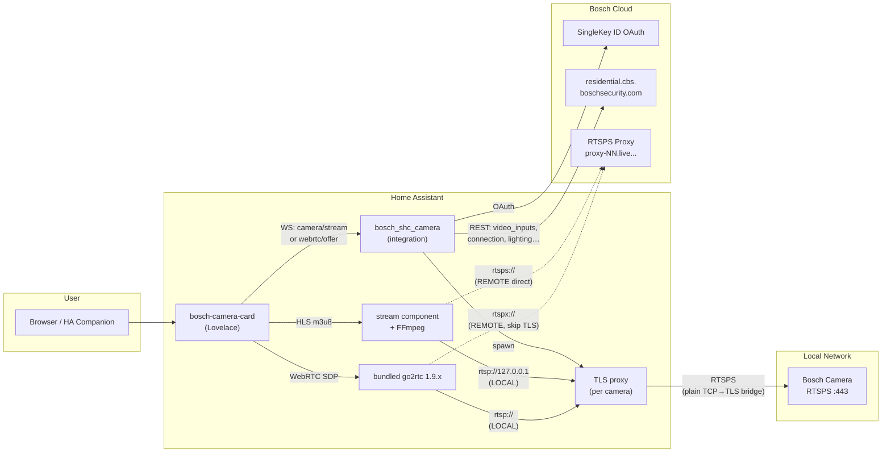
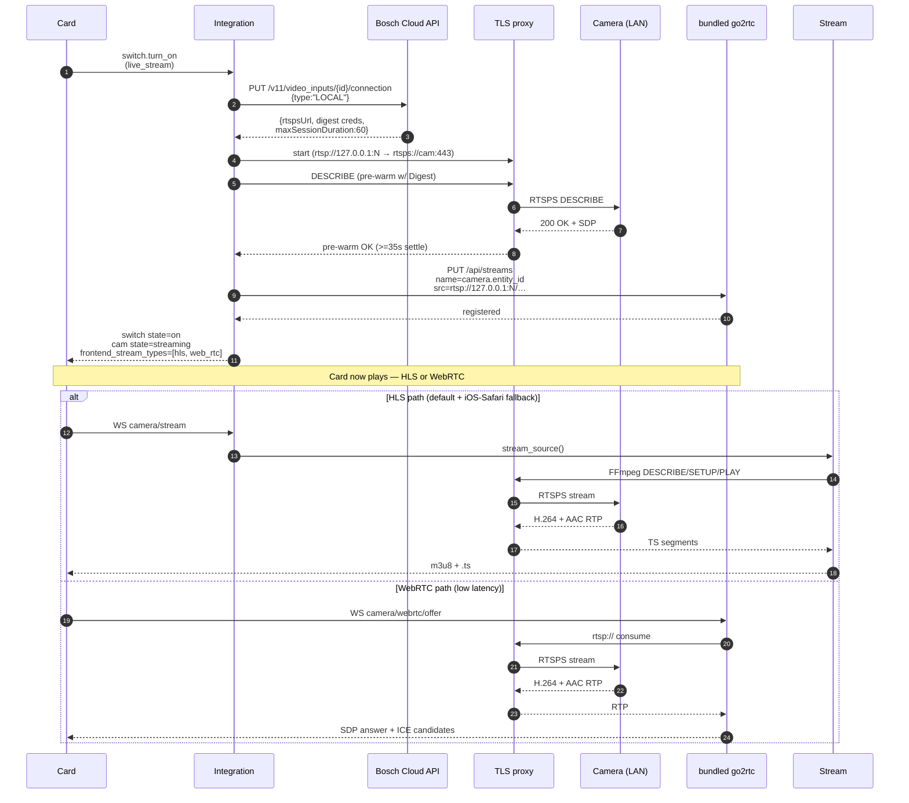
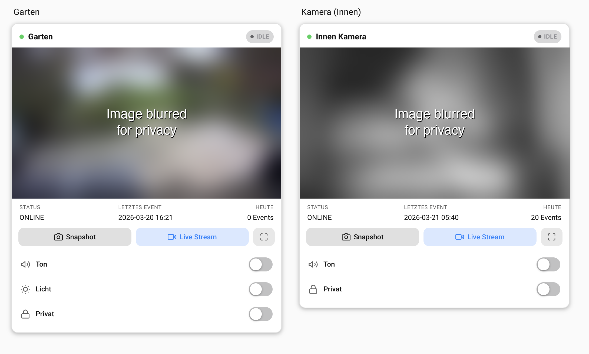

# Bosch Smart Home Camera — Home Assistant Integration

Adds your Bosch Smart Home cameras (Eyes Außenkamera, 360 Innenkamera) as fully featured entities in Home Assistant. Includes a custom **Lovelace card** with live streaming, controls, and event info.

**Supported models:** Eyes Außenkamera (Gen1), Eyes Außenkamera II (Gen2), 360 Innenkamera (Gen1), Eyes Innenkamera II (Gen2) — model-specific timing and configuration is automatic.

> **No official API.** This integration uses the reverse-engineered Bosch Cloud API, discovered via mitmproxy traffic analysis of the official Bosch Smart Camera app.

[![GitHub Release][releases-shield]][releases]
[![GitHub Activity][commits-shield]][commits]
[![License][license-shield]](LICENSE)

[![hacs][hacsbadge]][hacs]
[![Project Maintenance][maintenance-shield]][user_profile]
[![BuyMeCoffee][buymecoffeebadge]][buymecoffee]

[![Community Forum][forum-shield]][forum]

[releases-shield]: https://img.shields.io/github/release/mosandlt/Bosch-Smart-Home-Camera-Tool-HomeAssistant.svg?style=for-the-badge
[releases]: https://github.com/mosandlt/Bosch-Smart-Home-Camera-Tool-HomeAssistant/releases
[commits-shield]: https://img.shields.io/github/commit-activity/y/mosandlt/Bosch-Smart-Home-Camera-Tool-HomeAssistant.svg?style=for-the-badge
[commits]: https://github.com/mosandlt/Bosch-Smart-Home-Camera-Tool-HomeAssistant/commits/main
[license-shield]: https://img.shields.io/github/license/mosandlt/Bosch-Smart-Home-Camera-Tool-HomeAssistant.svg?style=for-the-badge
[hacsbadge]: https://img.shields.io/badge/HACS-Default-orange.svg?style=for-the-badge
[hacs]: https://hacs.xyz
[maintenance-shield]: https://img.shields.io/badge/maintainer-%40mosandlt-blue.svg?style=for-the-badge
[user_profile]: https://github.com/mosandlt
[buymecoffeebadge]: https://img.shields.io/badge/buy%20me%20a%20coffee-donate-yellow.svg?style=for-the-badge
[buymecoffee]: https://buymeacoffee.com/mosandlts
[forum-shield]: https://img.shields.io/badge/community-forum-brightgreen.svg?style=for-the-badge
[forum]: https://community.home-assistant.io/

---

## Known Issues

| Issue | Status | Workaround |
|-------|--------|------------|
| **LOCAL stream: first 25–35s show loading spinner** | By design | The camera's H.264 encoder needs 25s (360 Innenkamera) to 35s (Eyes Außenkamera) after connection setup before producing valid frames. The integration waits for the encoder, then starts the stream. Model-specific timing is automatic. |
| **Motion sensitivity changes revert after ~1s** | Firmware limitation | The camera's IVA rules engine overwrites cloud-set motion sensitivity via RCP. Not fixable via the API. ([#1](https://github.com/mosandlt/Bosch-Smart-Home-Camera-Tool-HomeAssistant/issues/1)) |
| **Pan position unavailable during Privacy Mode** | By design | The 360 Innenkamera blocks pan commands when Privacy Mode is ON (shutter closed). Disable Privacy Mode first, then pan. |
| **Motion zones are per-camera** | By design | Each camera has its own independent motion detection zones. Configure them separately per camera via the Cloud API or the Bosch Smart Camera app. |

---

## Disclaimer

**This project is an independent, community-developed integration. It is not affiliated with, endorsed by, or connected to Robert Bosch GmbH. "Bosch" and "Bosch Smart Home" are registered trademarks of Robert Bosch GmbH.**

This integration communicates with a reverse-engineered, undocumented API. Provided **"as is"**, without warranty. Use at your own risk. The API may change or be shut down by Bosch at any time. Reverse engineering was performed solely for interoperability under **§ 69e UrhG** and **EU Directive 2009/24/EC**.

---

## Prerequisites — Setting Up a New Camera

Before adding a camera to this integration, it **must** be fully set up in the official **Bosch Smart Camera** app first.

### Step-by-step

1. **Unbox and power on** the camera
2. **Open the Bosch Smart Camera app** and follow the pairing wizard to add the camera to your account
3. **Wait for the firmware update** — new cameras typically receive a Zero-Day update during first setup. This can take **up to 1 hour**. The camera's LED blinks yellow/green during the update.
   - **Do not unplug or restart** the camera during the update
   - If the LED blink pattern doesn't change after 1 hour, leave the camera alone for up to 24 hours ([Bosch Support](https://www.bosch-smarthome.com/de/de/support/hilfe/hilfe-zum-produkt/hilfe-zur-eyes-aussenkamera-2/))
   - The app shows the update status — wait until it reports the camera as ready
4. **Verify the camera works** in the Bosch app — check live stream, settings, and notifications
5. **Then add it to Home Assistant** using this integration (see Installation below)

> **Tip:** If you're replacing an existing camera (e.g. upgrading from Gen1 to Gen2), rename the new camera in the Bosch app to match the old name before setting up the integration. This way Home Assistant creates entities with the expected names.

For more help with camera setup, see:
- [Eyes Außenkamera II — Bosch Support](https://www.bosch-smarthome.com/de/de/support/hilfe/hilfe-zum-produkt/hilfe-zur-eyes-aussenkamera-2/)
- [Eyes Innenkamera II — Bosch Support](https://www.bosch-smarthome.com/de/de/support/hilfe/hilfe-zum-produkt/hilfe-zur-eyes-innenkamera-2/)
- [Firmware Update dauert lange — Bosch Community](https://community.bosch-smarthome.com/t5/technische-probleme/wie-lange-dauert-das-update-der-software-bei-mir-l%C3%A4uft-es-seit-%C3%BCber-20-minuten/td-p/71764)

---

## Installation

### HACS (Recommended)

[](https://my.home-assistant.io/redirect/hacs_repository/?owner=mosandlt&repository=Bosch-Smart-Home-Camera-Tool-HomeAssistant&category=integration)

1. Click the button above, or in HACS: **Integrations → + Explore → search "Bosch Smart Home Camera"**
2. Download the integration
3. Restart Home Assistant
4. Continue with **Setup** below

### Manual Installation

1. Copy `custom_components/bosch_shc_camera/` to your HA config directory:
   ```
   /config/custom_components/bosch_shc_camera/
   ```
2. Copy `bosch-camera-card.js` to `/config/www/bosch-camera-card.js`
3. Restart Home Assistant
4. Continue with **Setup** below

---

## Setup

### Step 1 — Add the Integration

1. Go to **Settings → Integrations → + Add Integration**
2. Search for **"Bosch Smart Home Camera"**
3. Your browser opens the **Bosch SingleKey ID** login page automatically
4. Log in with your Bosch account (same credentials as the Bosch Smart Camera app)
5. After login, the browser redirects back to Home Assistant automatically — **no manual URL copying needed**
6. The integration discovers all your cameras automatically

> **Token renewal is automatic.** The integration uses a refresh token to silently renew the Bearer token in the background — no manual action needed after initial setup.
>
> **Note:** The automatic redirect uses [my.home-assistant.io](https://my.home-assistant.io). If your HA instance URL is not configured there, you'll be prompted to set it up on first use.

### Step 2 — Configure Settings

Go to **Settings → Integrations → Bosch Smart Home Camera → Configure**

All settings have descriptions in the UI. Key options:

| Setting | Description | Default |
|---|---|---|
| **FCM Push** | Near-instant (~2s) event detection via Firebase Cloud Messaging | OFF |
| **FCM Push Mode** | `Auto` (iOS → Android → polling), `iOS`, `Android`, or `Polling` | Auto |
| **Alert services (default)** | Fallback notify services; per-step overrides available (text/screenshot/video/system) | empty (disabled) |
| **Save alert snapshots** | Keep event images/videos locally in `/www/bosch_alerts/` | OFF |
| **Event check interval** | How often to poll for events (FCM Push makes this a fallback only) | 300s (5 min) |
| **SMB Upload** | Upload event snapshots + video clips to SMB/CIFS share | OFF |
| **SMB Server** | IP/hostname of SMB share (e.g. `192.168.1.1`) | empty |
| **SMB Share** | Share name (e.g. `cameras`) | empty |
| **SMB Username** | SMB authentication username | empty |
| **SMB Password** | SMB authentication password | empty |
| **SMB Base Path** | Base path on the share (e.g. `bosch_cameras`) | empty |
| **SMB Folder Pattern** | Subfolder pattern: `{year}/{month}` | `{year}/{month}` |
| **SMB File Pattern** | File naming: `{camera}_{date}_{time}_{type}_{id}` | `{camera}_{date}_{time}_{type}_{id}` |
| **Audio default ON** | Audio switch starts ON (stream with sound) or OFF (muted) | ON |
| **Binary sensors** | Motion / Audio alarm binary sensors (ON for 30s after event) | ON |

### Step 3 — Add the Lovelace Card

Since **v10.3.19** the card is auto-registered — no manual Lovelace resource entry needed. Just add it to a dashboard:

1. Edit dashboard → **+ Add card → Custom: Bosch Camera Card**

```yaml
type: custom:bosch-camera-card
camera_entity: camera.bosch_garten
title: Garten
```

> **Upgrading from pre-v10.3.19?** The integration auto-removes any old `/local/bosch-camera-card.js` resource entry from Lovelace, but the physical file in `/config/www/` is intentionally left in place (an integration should not modify user files in `/config/www/`). You can delete it manually if you want: `rm /config/www/bosch-camera-card.js` (SSH addon) — it's harmless either way, the integration loads its own bundled copy.

---

## Architecture

### Components



### Live stream activation (LOCAL — primary path)



### REMOTE / Cloud differences

* **`/connection {type:"REMOTE"}`** returns `rtsps://proxy-NN.live.cbs.boschsecurity.com:42090/<hash>` — the Bosch cloud proxy serves the camera over the public internet. No local TLS proxy is involved.
* **HLS** uses `rtsps://` directly — FFmpeg connects to the cloud proxy, accepts the cert chain (FFmpeg trusts the system root, the hostname mismatch on `proxy-NN…` doesn't matter for FFmpeg).
* **WebRTC** can't use `rtsps://` because go2rtc's Go RTSP client refuses the cert/hostname mismatch (`tls: failed to verify certificate`). The integration rewrites to `rtspx://` (go2rtc's documented "skip TLS verify" scheme) for the go2rtc producer registration only — HLS path keeps `rtsps://`.

---

## Features

### Entities

| Feature | Entity type | Default |
|---------|-------------|---------|
| Camera snapshot (latest event JPEG) | `camera` | enabled |
| Camera status (ONLINE/OFFLINE) | `sensor` | enabled |
| Last event timestamp | `sensor` | enabled |
| Events today count | `sensor` | enabled |
| WiFi signal strength (%) | `sensor` | enabled |
| Firmware version | `sensor` | enabled |
| Ambient light level (%) | `sensor` | enabled |
| LED dimmer (%) | `sensor` | enabled (cameras with LED) |
| Motion sensitivity | `sensor` | diagnostic |
| Audio alarm state | `sensor` | diagnostic |
| Last event type | `sensor` | enabled |
| Movement events today | `sensor` | enabled |
| Audio events today | `sensor` | enabled |
| Event detection method | `sensor` | diagnostic — `fcm_push` / `polling` / `disabled` |
| Refresh Snapshot | `button` | enabled |
| Live Stream (ON/OFF) | `switch` | enabled |
| Audio (mute/unmute stream) | `switch` | enabled |
| Camera LED light | `switch` | enabled (cameras with LED) |
| Privacy mode | `switch` | enabled |
| Notifications | `switch` | enabled |
| Motion detection | `switch` | disabled by default |
| Record sound | `switch` | disabled by default |
| Auto-follow (360 camera) | `switch` | disabled by default |
| Intercom (two-way audio) | `switch` | disabled by default |
| Pan position (360 camera) | `number` | enabled (±120°) |
| Audio alarm threshold | `number` | disabled by default |
| Speaker level (intercom volume) | `number` | disabled by default (0–100) |
| Stream quality | `select` | Auto / Hoch 30 Mbps / Niedrig 1.9 Mbps (persists across restarts) |
| Stream mode | `select` | Auto (Lokal → Cloud) / Nur Lokal / Nur Cloud |
| Motion sensitivity | `select` | SUPER_HIGH / HIGH / MEDIUM_HIGH / MEDIUM_LOW / LOW / OFF |
| FCM Push mode | `select` | Auto / iOS / Android / Polling |
| Motion detected | `binary_sensor` | disabled by default |
| Audio alarm detected | `binary_sensor` | disabled by default |
| Person detected | `binary_sensor` | disabled by default |
| Unread events count | `sensor` | disabled by default |
| Privacy sound (360 only) | `switch` | enabled (config category) |
| Commissioned status | `sensor` | diagnostic, disabled by default |
| Acoustic alarm (siren, 360 only) | `button` | disabled by default |
| Live stream (30fps H.264 + AAC) | `camera` | via Live Stream switch |
| Timestamp overlay (clock on video) | `switch` | disabled by default |
| Movement notifications | `switch` | disabled by default |
| Person notifications | `switch` | disabled by default |
| Audio notifications | `switch` | disabled by default |
| Trouble notifications | `switch` | disabled by default |
| Camera alarm notifications | `switch` | disabled by default |
| Firmware update status | `update` | enabled — native HA update card |
| Schedule rules count | `sensor` | diagnostic, disabled by default |
| **Alarm Catalog** (RCP 0x0c38) | `sensor` | diagnostic — all alarm types supported by camera firmware (virtual, flame, smoke, glass break, audio, motion, storage) |
| **Motion Zones** (RCP 0x0c00/0x0c0a) | `sensor` | diagnostic — motion detection zone coordinates (normalized x/y for overlay) |
| **TLS Certificate** (RCP 0x0b91) | `sensor` | diagnostic — camera cert expiry date, issuer, key size |
| **Network Services** (RCP 0x0c62) | `sensor` | diagnostic — active services (HTTP, HTTPS, RTSP, SNMP, UPnP, NTP, ONVIF) |
| **IVA Analytics** (RCP 0x0b60) | `sensor` | diagnostic — analytics module inventory (detectors, versions, active state) |
| Front light with color temperature | `light` | Gen2 only |
| Top LED light with RGB color picker | `light` | Gen2 only |
| Bottom LED light with RGB color picker | `light` | Gen2 only |
| Status LED on/off | `switch` | Gen2 only |
| Motion-triggered lighting on/off | `switch` | Gen2 only |
| Ambient/permanent lighting on/off | `switch` | Gen2 only |
| DualRadar intrusion detection on/off | `switch` | Gen2 only |
| Mounting height (meters) | `number` | Gen2 only |
| Microphone recording level (0–100%) | `number` | Gen2 only |
| Front light color temperature | `number` | Gen2 only |
| Top LED brightness (0–100%) | `number` | Gen2 only |
| Bottom LED brightness (0–100%) | `number` | Gen2 only |
| Motion light sensitivity (1–5) | `number` | Gen2 only |

> **RCP diagnostic sensors** are disabled by default. Enable them in entity settings to inspect camera firmware capabilities. Gen2 cameras will automatically expose new alarm types and analytics modules.

> **SHC local API is not needed.** All features work with just the Bosch cloud API.

### Built-in 3-Step Alert System

No automations needed — the integration sends alerts directly:

1. **Instant text:** `📷 Kamera: Bewegung (10:31:56)` — sent immediately
2. **Snapshot image:** `📸 Kamera Snapshot` + JPEG — sent ~5s later
3. **Video clip:** `🎬 Kamera Video (245 KB)` + MP4 — sent ~30-90s later (polls until Bosch uploads the clip)

**Per-step routing** (v6.5.0+): each step can go to different services, multiple recipients at once. Supports Signal, Telegram, iOS/Android Companion App, or any HA notify service.

| Setting | Description | Example |
|---|---|---|
| `Alert services — default fallback` | Used for all steps unless overridden below | `notify.signal_messenger` |
| `System alerts` | Token expiry, disk warnings | `notify.signal_messenger` |
| `Step 1 — text notification` | Instant text on event | `notify.signal_messenger, notify.mobile_app_xxx, notify.mobile_app_pixel9` |
| `Step 2 — snapshot image` | JPEG inline in notification | `notify.signal_messenger, notify.mobile_app_xxx` |
| `Step 3 — video clip` | MP4 attachment | `notify.signal_messenger` |
| `Save alert snapshots` | Keep files locally or delete after sending | OFF |
| `Delete after send` | Cleanup local files after notification sent | ON |

**iOS + Android Companion App** (`mobile_app_*`): snapshot appears directly inside the push notification as an inline image. Files are saved to `/www/bosch_alerts/` (served as `/local/bosch_alerts/`) and auto-deleted within seconds after sending. Signal and others receive a file path attachment instead.

**Notification switch guard (v7.9.1+):** Alerts respect the notification switches — if `switch.bosch_{name}_notifications` (master) is OFF, no alerts are sent. Type-specific switches (`movement_notifications`, `person_notifications`, `audio_notifications`) are also checked. The FCM push is still received (for event tracking), but the HA notification is suppressed.

### Mark-as-Read & Last Event Fast-Path

Events are automatically **marked as read** after alert processing or download. This uses `PUT /v11/events/bulk` for batch updates and `PUT /v11/events` (with `{"id": ..., "isRead": true}`) for individual events, keeping the unread count in sync with the Bosch Smart Camera app.

On **startup**, the integration marks all currently unread events as read — clearing any backlog that accumulated while HA was offline.

The integration uses `GET /v11/video_inputs/{id}/last_event` as a **fast-path** to check for new events before fetching the full event list. This reduces unnecessary API calls — the full event list is only fetched when the last event has actually changed.

### FCM Push vs Polling

| | FCM Push (recommended) | Polling (default) |
|---|---|---|
| **Event latency** | ~2-3 seconds | 5 minutes (configurable) |
| **How it works** | Firebase Cloud Messaging push from Bosch cloud | Periodic API polling |
| **Fallback** | Automatic — if FCM goes down, polling continues | Always active |
| **Status sensor** | `sensor.bosch_camera_event_detection` = `fcm_push` | `polling` |

Enable FCM Push in **Settings → Configure → FCM Push**. You can also select the push mode (`Auto`, `iOS`, `Android`, or `Polling`) — `Auto` tries iOS first, then Android, then falls back to polling. The mode can also be changed at runtime via the **FCM Push Mode** select entity.

### SMB/NAS Upload

Upload event snapshots and video clips directly to a SMB/CIFS network share (FRITZ!Box NAS, Synology, any Windows share, etc.). Disabled by default.

**How it works:**
- When an event is detected (via FCM push or polling), the integration downloads the snapshot and video clip
- Files are uploaded to the configured SMB share using the folder and file naming patterns
- Supports any SMB-compatible NAS or router with USB storage (FRITZ!Box, Synology, QNAP, Windows shares)

**Configuration:** Go to **Settings → Integrations → Bosch Smart Home Camera → Configure** and enable **SMB Upload**. Then fill in the server, share, and credentials.

**Folder pattern variables:** `{year}`, `{month}`, `{day}`
**File pattern variables:** `{camera}`, `{date}`, `{time}`, `{type}`, `{id}`

Example file path on NAS:
```
\\192.168.1.1\FRITZ.NAS\Bosch-Kameras\2026\03\Garten_2026-03-25_14-32-05_MOVEMENT_abc123.jpg
\\192.168.1.1\FRITZ.NAS\Bosch-Kameras\2026\03\Garten_2026-03-25_14-32-05_MOVEMENT_abc123.mp4
```

> Requires the `smbprotocol` Python package, which is auto-installed via `manifest.json`.

#### FRITZ!Box NAS Setup

To use your FRITZ!Box as a NAS for camera event storage:

1. **Enable NAS on FRITZ!Box:**
   - Open `http://fritz.box` → **Heimnetz → USB / Speicher → USB-Speicher**
   - Enable **Speicher (NAS) aktiv**
   - Note the share name (default: `FRITZ.NAS`)

2. **Create a FRITZ!Box user with NAS access:**
   - **System → FRITZ!Box-Benutzer → Benutzer hinzufügen**
   - Give the user a username and password
   - Under **Berechtigungen**, enable **Zugang zu NAS-Inhalten**

3. **Configure in Home Assistant:**
   - Go to **Settings → Integrations → Bosch Smart Home Camera → Configure**
   - Enable **SMB Upload**
   - Fill in:

   | Field | Value | Example |
   |-------|-------|---------|
   | SMB Server | FRITZ!Box IP | `192.168.1.1` |
   | SMB Share | NAS share name | `FRITZ.NAS` |
   | SMB Username | FRITZ!Box NAS user | `nas_user` |
   | SMB Password | User password | `your_password` |
   | SMB Base Path | Folder on NAS | `Bosch-Kameras` |
   | SMB Folder Pattern | Subfolder structure | `{year}/{month}` |
   | SMB File Pattern | File naming | `{camera}_{date}_{time}_{type}_{id}` |
   | Retention (days) | Delete files older than N days | `180` (6 months) |
   | Low disk warning (MB) | Alert below this free space | `5120` (5 GB) |

4. **Verify:** After the next camera event, check your NAS at `FRITZ.NAS/Bosch-Kameras/` — snapshots (.jpg) and video clips (.mp4) should appear automatically.

> **Tip:** Works with any SMB-compatible device. For Synology, use the share name from **Control Panel → Shared Folder**. For Windows, use the shared folder name (e.g. `\\PC-NAME\SharedFolder`).

#### Automatic Cleanup (Retention)

Set **Retention period (days)** to automatically delete old files from the NAS. Default: **180 days (6 months)**. Set to `0` to keep files forever.

- Cleanup runs **once per day** in the background
- Deletes `.jpg` and `.mp4` files older than the configured retention period
- Only runs when SMB upload is enabled and configured

#### Low Disk Space Warning

Set **Low disk warning threshold (MB)** to receive an alert when the NAS runs low on storage. Default: **500 MB**.

- Checked **once per hour**
- If free space drops below the threshold, an alert is sent via:
  1. The configured **notify service** (e.g. Signal, mobile app) if set
  2. **HA persistent notification** as fallback (always shown in the sidebar)

### HA Events

The integration fires events for custom automations:
- `bosch_shc_camera_motion` — movement detected
- `bosch_shc_camera_audio_alarm` — audio alarm triggered
- `bosch_shc_camera_person` — person detected

Event data: `camera_name`, `timestamp`, `image_url`, `event_id`, `source` (`fcm_push` / `polling`)

### Developer Tools — Services

All services are available in **Developer Tools → Services** (or via automations/scripts):

| Service | Description | Fields |
|---------|-------------|--------|
| `bosch_shc_camera.trigger_snapshot` | Force immediate snapshot refresh for all cameras | — |
| `bosch_shc_camera.open_live_connection` | Open live stream for a specific camera | `camera_id` |
| `bosch_shc_camera.rename_camera` | Rename a camera (appears in Bosch app + HA) | `camera_id`, `new_name` |
| `bosch_shc_camera.invite_friend` | Send camera sharing invitation by email | `email` |
| `bosch_shc_camera.list_friends` | List all friends and camera shares (persistent notification) | — |
| `bosch_shc_camera.remove_friend` | Remove a friend and revoke all camera shares | `friend_id` |
| `bosch_shc_camera.get_lighting_schedule` | Read full lighting schedule (persistent notification) | `camera_id` |
| `bosch_shc_camera.delete_motion_zone` | Delete a single motion zone by index | `camera_id`, `zone_index` |
| `bosch_shc_camera.get_privacy_masks` | Read privacy mask zones (persistent notification) | `camera_id` |
| `bosch_shc_camera.set_privacy_masks` | Set/clear privacy mask zones (0.0–1.0 coordinates) | `camera_id`, `masks` |
| `bosch_shc_camera.create_rule` | Create a cloud-side schedule rule | `camera_id`, `name`, `start_time`, `end_time`, `weekdays`, `is_active` |
| `bosch_shc_camera.update_rule` | Update a schedule rule (change name, times, activate/deactivate) | `camera_id`, `rule_id`, `name`?, `start_time`?, `end_time`?, `weekdays`?, `is_active`? |
| `bosch_shc_camera.delete_rule` | Delete a schedule rule | `camera_id`, `rule_id` |
| `bosch_shc_camera.set_motion_zones` | Set motion detection zones (normalized 0.0–1.0 coordinates) | `camera_id`, `zones` |
| `bosch_shc_camera.get_motion_zones` | Read motion zones from cloud API (persistent notification) | `camera_id` |
| `bosch_shc_camera.share_camera` | Share cameras with a friend (time-limited) | `friend_id`, `camera_ids`, `days`? |

**Examples:**

```yaml
# Rename a camera
service: bosch_shc_camera.rename_camera
data:
  camera_id: "xxxxxxxx-xxxx-xxxx-xxxx-xxxxxxxxxxxx"
  new_name: "Garten Kamera"

# Invite a friend to share cameras
service: bosch_shc_camera.invite_friend
data:
  email: "friend@example.com"

# List all camera shares
service: bosch_shc_camera.list_friends

# Remove a friend (get friend_id from list_friends)
service: bosch_shc_camera.remove_friend
data:
  friend_id: "xxxxxxxx-xxxx-xxxx-xxxx-xxxxxxxxxxxx"

# Create a schedule rule (notifications active 8am-8pm weekdays)
service: bosch_shc_camera.create_rule
data:
  camera_id: "xxxxxxxx-xxxx-xxxx-xxxx-xxxxxxxxxxxx"
  name: "Weekday Schedule"
  start_time: "08:00:00"
  end_time: "20:00:00"
  weekdays: [1, 2, 3, 4, 5]
  is_active: true

# Update a rule (deactivate it)
service: bosch_shc_camera.update_rule
data:
  camera_id: "xxxxxxxx-xxxx-xxxx-xxxx-xxxxxxxxxxxx"
  rule_id: "yyyyyyyy-yyyy-yyyy-yyyy-yyyyyyyyyyyy"
  is_active: false

# Set motion detection zones (list of normalized rectangles)
service: bosch_shc_camera.set_motion_zones
data:
  camera_id: "xxxxxxxx-xxxx-xxxx-xxxx-xxxxxxxxxxxx"
  zones:
    - { x: 0.0, y: 0.3, w: 0.67, h: 0.7 }
    - { x: 0.63, y: 0.42, w: 0.28, h: 0.58 }

# Share cameras with a friend for 30 days
service: bosch_shc_camera.share_camera
data:
  friend_id: "xxxxxxxx-xxxx-xxxx-xxxx-xxxxxxxxxxxx"
  camera_ids:
    - "cam-id-1"
    - "cam-id-2"
  days: 30
```

> **Tip:** Find the `camera_id` in the camera entity's attributes (Developer Tools → States → `camera.bosch_*` → `camera_id` attribute).

### Ready-to-Use Automations

- [`examples/automation_ios_push_alert.yaml`](examples/automation_ios_push_alert.yaml) — iPhone push (time-sensitive)
- [`examples/automation_signal_alert.yaml`](examples/automation_signal_alert.yaml) — Signal text message
- [`blueprints/bosch_camera_signal_alert.yaml`](blueprints/bosch_camera_signal_alert.yaml) — configurable blueprint

---

## Lovelace Card

> **Card version: v2.10.12** — Bosch-app sort option, hls.js buffer profiles, hardware-privacy auto-teardown, Gen2 polygon overlays, privacy mask overlay, simplified offline view



### What the card shows

```
┌──────────────────────────────────┐
│ ● Garten              [streaming]│
│  ┌────────────────────────────┐  │
│  │   Live video / snapshot    │  │
│  │ Last: 2026-03-19 09:32     │  │
│  └────────────────────────────┘  │
│  [ 📸 Snapshot ] [ 📹 Stream ] [ ⛶ ] │
│  [ 🔊 ton / video ] [ 💡 Licht ] [ 🔒 Privat ] │
│  [ 🔔 Benachrichtigungen ]            │
│  [ 🎙 Gegensprechanlage ]             │
│  [ ◀ ] [     ■     ] [ ▶ ]  ← pan    │
│  Qualität: [Auto ▼]                   │
│  ▼ Benachrichtigungs-Typen            │
│  ▼ Erweitert                          │
│  ▼ Diagnose                           │
│  ▼ Zeitpläne & Zonen                  │
└──────────────────────────────────┘
```

### Card modes

| Mode | Description |
|------|-------------|
| **Stream OFF** | Snapshot image, auto-refreshed every **60 s** (visible) / **30 min** (background tab). Immediate refresh on tab focus. |
| **Stream ON** | Live **HLS video** (30fps H.264 + AAC-LC). Uses go2rtc and HA's camera stream WS. Audio toggle controls mute/unmute. Loading overlay with status updates during connection. Auto-recovers from stream disconnects. **Audio quality is higher than the official Bosch app** — the Bosch mobile app downsamples audio for cellular bandwidth, while this integration delivers the unmodified AAC-LC stream straight from the camera. |

### Controls

| Button | Function |
|--------|----------|
| 📸 Snapshot | Force-fetch a fresh image immediately |
| 📹 Live Stream | Toggle stream ON/OFF |
| 🔊 Ton | Toggle audio mute/unmute during live stream |
| 💡 Licht | Toggle camera LED light (outdoor camera) |
| 🔒 Privat | Toggle privacy mode (covers lens) |
| 🔔 Benachrichtigungen | Toggle push notifications |
| 🎙 Gegensprechanlage | Toggle intercom / two-way audio |
| ◀ ▶ Pan | Pan left/right (CAMERA_360 only) |

**Collapsible accordion sections** (auto-hidden when entities not available):
- **Benachrichtigungs-Typen** — per-type notification toggles: movement, person, audio, trouble, camera alarm
- **Erweitert** — timestamp overlay, auto-follow, motion detection, record sound, privacy sound
- **Diagnose** — WiFi signal %, firmware version, ambient light %, movement/audio events today
- **Zeitpläne & Zonen** — schedule rules list with AN/AUS toggle per rule + delete button, motion zone overlay toggle, motion zone count (RCP)

### Reliability

- **Consistent snapshot refresh** — backend frame interval is shorter than the card's poll interval, so every card request always returns a fresh frame (no jitter).
- **HLS auto-recovery** — hls.js soft errors recover automatically; fatal errors trigger a full reconnect after 2 s. Buffer-stall detection seeks to the live edge on the first two stalls and does a full reconnect on the third (`bosch-camera-card: 3 buffer stalls, reconnecting HLS`).
- **hls.js CDN load hardening** — the card loads hls.js from jsdelivr with a pinned version + subresource-integrity hash (`hls.js@1.6.16` + matching `sha384`). The previous floating `@1` range broke silently whenever jsdelivr shipped a new patch release; updates now require an explicit version + hash bump.
- **Cred-rotation refresh** — Bosch rotates the per-session digest creds on every `PUT /connection LOCAL`. The heartbeat parses each response, caches the new `user`/`password`, rebuilds the cached `rtspsUrl`, and calls `Stream.update_source()` so the next reconnect uses fresh creds. A reactive 401 rescue (max 1 per 5 min per cam) covers the rare cases where the proactive refresh missed a tick. Together they keep AUTO-mode streams on LAN even after long idle gaps (HLS consumer disconnect → reconnect would otherwise hit HTTP 401).
- **Session renewal** — REMOTE proxy hashes expire after ~60 s; the backend opens a new connection before expiry and hands the card a fresh URL via `Stream.update_source()`. LOCAL streams survive the Gen2 Outdoor firmware's ~65 s RTSP TCP reset via a transparent FFmpeg reconnect on the same TLS proxy port with the same Digest credentials (~2 s gap, HLS output continues).
- **TLS-proxy circuit breaker** — when the camera goes physically offline (privacy hardware button, power cut, Wi-Fi drop), the proxy stops retrying after 5 consecutive connect failures within 30 s instead of looping forever. The coordinator decides whether to rebuild via `try_live_connection()` once the camera is reachable again.
- **Hardware-privacy auto-teardown** — when the camera's physical privacy button is pressed (or the Bosch app toggles privacy), the coordinator detects the OFF→ON transition and tears down the live session, the same path as a user-toggle. No more stuck `state: streaming` or endless reconnect loop.
- **"Connecting" badge** — amber badge with fast pulse while HLS is negotiating. Clears to blue "streaming" once video plays. Safety timeout hides the overlay after 120 s if the video never produces a frame, keeping the snapshot visible underneath.
- **Stream uptime counter** — badge shows `00:47` / `1:23` while streaming, updating every 2 s. Proves session renewal keeps the stream alive past 60 s.
- **Frame Δt in debug line** — shows actual ms between frames (`Δ2003ms`) — live verification that 2 s intervals are consistent.
- **Snap error retry** — a failed snap.jpg during streaming triggers one immediate 500 ms retry instead of waiting for the next 2 s timer tick.
- **Connection type badge** — shows "LAN" (green) or "Cloud" (gray) in the header while streaming.

### Stream Connection Types

The integration supports three connection modes, configurable in **Settings → Configure → Stream connection type** or at runtime via the **Stream Modus** select entity:

| Mode | Description |
|------|-------------|
| **Auto** (recommended) | Try local LAN first, automatically fall back to Bosch cloud proxy on failure. |
| **Local** | Direct LAN only — no internet required. Uses a TLS proxy (TCP→TLS + RTSP transport rewrite) since FFmpeg can't handle RTSPS + Digest auth + self-signed cert natively. TCP keep-alive on all proxy sockets. |
| **Remote** | Always via Bosch cloud proxy. Faster snapshots (~0.4–1.9 s). Sessions run for up to 60 minutes. |

### Stream Startup Timing

The card badge progresses `idle` → `warming_up` / `connecting` (yellow) → `streaming` (blue) when you flip the live-stream switch on. How long that first transition takes depends on the connection mode and the camera model — the LOCAL path has a deliberate pre-warm to wake the camera's H.264 encoder before exposing the RTSP URL to FFmpeg, while REMOTE is just a cloud-proxy handshake.

| Camera / mode | Typical time to first frame | Why |
|---|---|---|
| Any camera · **Remote (Cloud)** | **~5–10 s** | `PUT /connection REMOTE` → cloud proxy URL exposed immediately → FFmpeg opens `rtsps://proxy-NN.live.cbs.boschsecurity.com:443/...` → first HLS segment in 3–5 s. No pre-warm. |
| **Gen1 360 Innenkamera** · Local | ~30–35 s | `min_total_wait = 25 s` from `PUT /connection LOCAL` before the RTSP URL is exposed (`models.py` `INDOOR`), then ~5–10 s for FFmpeg pre-buffer. |
| **Gen2 Eyes Innenkamera II** · Local | ~30–35 s | Same indoor timing profile (`HOME_Eyes_Indoor`, `min_total_wait = 25 s`). |
| **Gen1 Eyes Außenkamera** · Local | ~40–45 s | Outdoor encoder is slower; `min_total_wait = 35 s` + `pre_warm_retries = 8 × 5 s` retry window (`models.py` `OUTDOOR`) + ~5–10 s FFmpeg buffer. |
| **Gen2 Eyes Außenkamera II** · Local | ~40–45 s | Same outdoor profile (`HOME_Eyes_Outdoor`). |
| Any camera · **Auto** with working LAN | same as Local | Auto picks LOCAL when LAN is reachable. |
| Any camera · **Auto**, LAN **un**reachable | **~100 s outdoor**, **~40 s indoor**, then + ~5 s for REMOTE | `pre_warm_rtsp()` tries each retry with a ~10 s TLS-handshake timeout plus `pre_warm_retry_wait` between attempts, so the worst case is `pre_warm_retries × (~10 s TLS timeout + pre_warm_retry_wait)`: outdoor `8 × (10 + 5) = ~120 s`, indoor `3 × (10 + 3) = ~39 s`. On exhaustion `_try_live_connection_inner` tears LOCAL down, sets `_stream_fell_back[cam_id]`, and `continue`s to REMOTE (v10.3.2+). Measured end-to-end on a live HA 2026.4.3: patched Gen2 Outdoor target IP to `192.0.2.1` (RFC 5737 TEST-NET) → user-visible fallback after 101 s with `WARNING: LOCAL pre-warm failed … Falling back to REMOTE.`. |
| Any camera · Any mode, **after 2 failed 60-s watchdog ticks** | ~2 min recovery | If FFmpeg opens LOCAL cleanly but the stream goes half-dead later, `_stream_health_watchdog` saturates the error counter on the second failing tick and forces the next `try_live_connection` to REMOTE. Worst-case end-to-end recovery ~2 min (v10.3.2+). |

Renewals after the initial startup take **roughly 2/3** of the `min_total_wait` (camera encoder already warm), so ~17 s indoor, ~23 s outdoor. The TLS proxy can service a re-opened session during that window without user-visible interruption (`Stream.update_source()` hot-swap).

Values are configurable per model in `custom_components/bosch_shc_camera/models.py` if you need to tune them for a slower network or a specific firmware; the defaults above are empirically measured and known-good.

### WebRTC / go2rtc

When [go2rtc](https://github.com/AlexxIT/go2rtc) is available, the card uses **WebRTC** (~2 s latency) instead of HLS (~12 s latency).

**Setup (HA 2024.11+):**
Since Home Assistant 2024.11, go2rtc is **built-in** — no separate add-on or installation needed. Just make sure `go2rtc:` is in your `configuration.yaml` (added by `default_config`). **Do NOT install go2rtc as a separate add-on** — this can cause conflicts.

On stream start, the integration automatically registers the RTSP URL with go2rtc. The card detects WebRTC support and uses it. If WebRTC fails, it falls back to HLS automatically.

**How it works:**
- On stream start, the integration registers the RTSP URL with go2rtc's API (port 1984 inside HA container)
- The card checks `camera/capabilities` — if `web_rtc` is available, it creates an `RTCPeerConnection`
- Full ICE candidate exchange via HA's `camera/webrtc/offer` websocket
- On stream stop, the registration is removed from go2rtc
- If WebRTC fails (go2rtc not running, network issue), falls back to HLS automatically

### Stream Watchdog

A separate JavaScript resource (`bosch-camera-autoplay-fix.js`) monitors all camera cards and auto-recovers from common issues:

| Issue | Detection | Recovery |
|-------|-----------|----------|
| Chrome autoplay block | Video paused with readyState ≥ 2 | Play muted |
| Dead HLS stream | readyState = 0 for 20 s | Request new HLS URL via `camera/stream` WS |
| Hidden video element | display:none while stream ON | Show video, start HLS |
| Buffer stall | 3 consecutive `bufferStalledError` | Full HLS reconnect |
| Video freeze | `currentTime` unchanged for 15 s | Seek to live edge or restart |

The watchdog gets entity IDs directly from HA states, so it works even when the card's JavaScript is cached.

### Privacy Guard

The **Live Stream switch cannot be turned ON while Privacy Mode is active** (camera shutter is closed). Since v10.4.6 this is enforced at four levels so there's no bypass path:
- `BoschLiveStreamSwitch.available` returns `False` while privacy is on → the entity greys out in the UI.
- An attempted service call raises a `ServiceValidationError` → HA shows a clean toast in the UI, no persistent notification clutter.
- `BoschAudioSwitch._apply_audio_change` and `coordinator.try_live_connection()` both early-exit with a logged warning if privacy is active.
- When privacy gets enabled while a stream is already running — including via the camera's hardware privacy button or the Bosch app — the coordinator detects the OFF→ON transition and tears down the live session automatically (v10.4.10).

### Fast Startup

The first coordinator tick after HA restart **skips events and slow-tier API calls** (WiFi, ambient light, RCP, motion, etc.). This reduces startup from ~2 minutes to ~15 seconds. Full data loads on the second tick (60 s later).

### Model-Specific Configuration

Camera timing and behavior is configured per model via `CameraModelConfig`. Indoor cams keep an active 30 s heartbeat (the cred-refresh path doubles as a session keepalive), while Gen1/Gen2 outdoor cams have heartbeat disabled (`= renewal_interval`) because the Outdoor firmware rotates digest creds on every PUT and would invalidate the running RTSP session.

| Parameter | 360 Innenkamera (Gen1) | Eyes Innenkamera II (Gen2) | Eyes Außenkamera (Gen1) | Eyes Außenkamera II (Gen2) | Purpose |
|---|---|---|---|---|---|
| Heartbeat interval | 30 s | 30 s | 3600 s (≈ off) | 3600 s (≈ off) | PUT /connection keepalive + cred refresh |
| Pre-warm delay | 1 s | 1 s | 2 s | 2 s | Wait before first RTSP DESCRIBE |
| Pre-warm retries | 3 | 3 | 8 | 8 | Max DESCRIBE attempts |
| Min total wait | 25 s | 25 s | 35 s | 35 s | Minimum time before exposing RTSP URL |
| Renewal interval | 3500 s | 3500 s | 3600 s | 3600 s | Proactive session renewal (safety net) |
| Max session duration | 3600 s | 3600 s | 3600 s | 3600 s | Sent in RTSP URL `maxSessionDuration=` (Bosch default hint is 60 s but cams accept 3600) |

### HLS Buffer Tuning

The card's HLS.js configuration is tuned to prevent HA's stream component from killing FFmpeg, and since v10.4.7 it's selectable via the **HLS player buffer profile** (`live_buffer_mode`) option in the integration settings:

| Profile | `liveSync` / `maxLatency` / `maxBuffer` / `maxMaxBuffer` / `lowLatencyMode` | Lag | Trade-off |
|---|---|---|---|
| **Latency** | `3 / 6 / 10 / 20 / true` | ~4–6 s | Lowest delay, may stutter on flaky Wi-Fi |
| **Balanced** *(default)* | `4 / 8 / 14 / 22 / false` | ~8–10 s | Robust against typical Wi-Fi hiccups |
| **Stable** | `6 / 12 / 22 / 30 / false` | ~12–15 s | Smooth even on weak links |

- **`maxBufferLength` cap** — All three modes stay below HA's `OUTPUT_IDLE_TIMEOUT` (30 s). If hls.js buffered ≥ 30 s it would stop requesting segments → HA thinks nobody's watching → kills FFmpeg → freeze.
- **HLS keepalive timer (20 s)** — Periodically calls `hls.startLoad()` as a safety net.
- **SRI integrity hash** — hls.js is loaded from jsdelivr with a pinned `hls.js@1.6.16` + matching `sha384`. Any drift (jsdelivr patch release) blocks the load instead of running an unverified bundle.

The player buffer profile is independent of the **Reaktion** info field on the card, which shows the Bosch-API server-side `bufferingTime` hint (~500 ms LOCAL, ~1000 ms REMOTE) and is unrelated to the client-side hls.js buffer.

### Card YAML

```yaml
# Minimal config — everything else defaults from camera_entity
type: custom:bosch-camera-card
camera_entity: camera.bosch_garten

# With optional title
type: custom:bosch-camera-card
camera_entity: camera.bosch_garten
title: Garten

# Compact "minimal layout" — hides all advanced controls behind the ⋮ button.
# Visible: image + info row (Status / Verbindung / Reaktion) + primary buttons
# (Snapshot, Live Stream, ⋮ Overflow, Fullscreen) + Privacy toggle.
# Tap ⋮ to progressively reveal audio/light/notifications/accordions/pan/etc.
type: custom:bosch-camera-card
camera_entity: camera.bosch_garten
title: Garten
minimal: true
```

All entity IDs are auto-derived from `camera_entity`. Buttons and sections are hidden automatically when entities don't exist. The **Reaktion** slot in the info row reads the `buffering_time_ms` attribute exposed by the camera entity (Bosch cloud-issued, ~500 ms on LOCAL and ~1000 ms on REMOTE); it stays `—` while the stream is idle. The **Verbindung** slot reads `connection_type` and shows `LAN`, `Cloud`, or `—`.

### Two-camera dashboard

```yaml
type: grid
columns: 2
cards:
  - type: custom:bosch-camera-card
    camera_entity: camera.bosch_garten
    title: Garten
  - type: custom:bosch-camera-card
    camera_entity: camera.bosch_kamera
    title: Kamera
```

### Overview card (all cameras, auto-discovered)

Since **v10.3.0** there is a second card type — `bosch-camera-overview-card` — that discovers every Bosch camera on the HA instance (`attributes.brand === "Bosch"`) and renders one tile per camera in a responsive grid. Sort order is **Live → Privat → Offline** (privacy state is read from `switch.<cam>_privacy_mode`), and each tile gets a colored outline (green / orange / grey) marking its tier.

Since **v10.4.10** the overview card can also follow the Bosch-app camera order. Set `use_bosch_sort: true` and inside each tier the cards are arranged by the float `priority` returned from `GET /v11/video_inputs` — the same order you see when re-sorting cameras in the Bosch app (which calls `PUT /v11/video_inputs/order`). Every Bosch camera entity exposes the value as `bosch_priority` in its attributes, so you can also use it from templates / sensors. Default is `false`, which keeps the prior alphabetic ordering.

```yaml
# Minimal — auto-discovers all Bosch cameras, responsive grid
type: custom:bosch-camera-overview-card

# With options
type: custom:bosch-camera-overview-card
title: Kameras
online_offline_view: true     # false = hide offline tier
columns: 2                    # "auto" | 1 | 2 | 3 | 4   (default "auto")
min_width: 380px              # cell min-width for "auto" mode (default 360px)
use_bosch_sort: true          # follow Bosch-app priority inside each tier
                              # (default false → alphabetic)
# Per-camera overrides — merged into each child card's setConfig
overrides:
  camera.bosch_terrasse:
    automations:
      - automation.alarmanlage
  camera.bosch_garten:
    refresh_interval_streaming: 3
    title: Eingang (Gen1)
# exclude: [camera.bosch_test]          # skip these
# include: [camera.bosch_terrasse, ...] # override auto-discovery with explicit list
```

On viewports ≤ 640 px the grid always falls back to a single column, regardless of `columns`, so the cards stay legible on phones. For a full-width dashboard without sections-view clamping, place the card in a `panel: true` view.

---

## Requirements

- Home Assistant 2024.1+
- Python packages: `requests`, `firebase-messaging`, `smbprotocol` (auto-installed via manifest)
- For live video: go2rtc (built into HA) or ffplay/mpv

---

## Alarmanlage / Automation Setup

The Eyes Innenkamera II (Gen2) adds a built-in alarm system with integrated 75 dB siren. Here's how to wire it into a typical HA alarm automation alongside your existing cameras:

### Entities for the alarm system (v9.1.10+, Gen2 Indoor II only)

| Entity | Purpose |
|---|---|
| `switch.bosch_{name}_alarmanlage` | Arm / disarm the built-in intrusion system (`PUT /intrusionSystem/arming`). Derived state from `alarmStatus.intrusionSystem` (INACTIVE / ACTIVE). |
| `switch.bosch_{name}_sirene` | Main 75 dB siren on/off (`alarm_settings.alarmMode`). Disabling this lets you use the other alarm features without actually firing the siren. |
| `switch.bosch_{name}_pre_alarm` | Pre-alarm red-LED warning before the siren fires (`alarm_settings.preAlarmMode`). |
| `switch.bosch_{name}_audio_plus` | Sound-level event detection (ambient-noise threshold — "Geräusche" toggle in the iOS app). Free tier — this is NOT the paid Audio+ premium (glass-break / smoke / CO). |
| `sensor.bosch_{name}_alarm_status` | `INACTIVE` / `ACTIVE` / `UNKNOWN` — state machine for the alarm. Attributes include `alarm_type` (`NONE` when idle), `siren_duration_s`, `activation_delay_s`, `pre_alarm_duration_s`. |
| `number.bosch_{name}_sirenen_dauer` | Siren duration in seconds (`alarm_settings.alarmDelayInSeconds`, 10–300). |
| `number.bosch_{name}_alarm_verzogerung` | Activation delay in seconds (`alarmActivationDelaySeconds`, 0–600). |
| `number.bosch_{name}_pre_alarm_dauer` | Pre-alarm LED-warning duration (`preAlarmDelayInSeconds`, 0–300). |
| `number.bosch_{name}_power_led` | White Power-LED brightness 0–4 (*not* 0–100% — the iOS slider is misleading, the API only accepts 5 discrete steps). |

### Privacy mode — important!

Several settings only work when the camera is **actively recording** (privacy OFF):
- `switch.bosch_{name}_einbrucherkennung` (intrusion detection)
- `select.bosch_{name}_erkennungsmodus` (detection mode: `ALL_MOTIONS` / `ONLY_HUMANS` / `ZONES`)
- `number.bosch_{name}_microphone_level`

When privacy is ON, the Bosch cloud API returns HTTP 443 `"sh:camera.in.privacy.mode"` on reads/writes to these endpoints, so the entities show as `unavailable`. The integration caches the **last-known-good** values — so if you've ever had privacy OFF since HA started, the cached settings remain visible. If the camera has been in privacy mode since the HA restart, the entities stay unavailable until you turn off privacy once.

**Note on event clips:** Bosch records clips only when the camera is actively monitoring. If all cameras are in privacy mode, `videoClipUploadStatus=Unavailable` is returned for every event — you'll get the text + snapshot alert but no video attachment. This is not a bug in the integration.

### Example: Integrate the Gen2 Indoor II into an existing Alarmanlage automation

If you already have an alarm automation that toggles `privacy_mode` on your other cameras based on presence / schedule / garage door, just add the new camera's privacy switch alongside:

```yaml
- alias: "Alle weg → Alarmanlage aktivieren + Kameras freigeben"
  sequence:
    - action: switch.turn_off
      target:
        entity_id:
          - switch.bosch_terrasse_privacy_mode      # Gen2 Outdoor
          - switch.bosch_innenbereich_privacy_mode  # Gen2 Indoor II  (new in v9.1.10)
          - switch.bosch_kamera_privacy_mode        # Gen1 360
    - action: switch.turn_on
      target:
        entity_id: switch.bosch_innenbereich_alarmanlage  # arm the built-in siren
```

### Example: Intrusion event → notify + optional siren

```yaml
- alias: "Innenkamera → Person erkannt"
  triggers:
    - platform: state
      entity_id: binary_sensor.bosch_innen_person
      to: "on"
  conditions:
    - condition: state
      entity_id: switch.bosch_innen_alarmanlage
      state: "on"   # only when armed
  actions:
    - action: notify.mobile_app_xxx   # replace with your notify service
      data:
        message: "🚨 Person im Innenbereich erkannt"
    # Optional: fire the siren (remove this line to silent-alarm)
    # - action: switch.turn_on
    #   target:
    #     entity_id: switch.bosch_innen_sirene
```

### Lovelace card setup

The custom Lovelace card automatically shows the new alarm rows (Alarmanlage, Sirene, Pre-Alarm, Geräusch-Erkennung, Power-LED) when the alarm entities exist and the alarm system is gated behind the presence of `switch.{base}_alarmanlage`. No card config changes needed:

```yaml
type: custom:bosch-camera-card
camera_entity: camera.bosch_innenbereich
title: "Eyes Innenkamera II"
```

Everything renders automatically when the integration detects a Gen2 Indoor II.

## Version History

| Version | Changes |
|---------|---------|
| **v10.4.10** | **Three resilience fixes for stream stability + WAN-outage handling.** **(1) Stream stays on LAN after idle reconnect (Bosch session-cred rotation).** Symptom: AUTO mode pre-warms LOCAL successfully and runs cleanly for ~14 min, then — when the HLS consumer disconnects (browser tab closed) and HA's stream-worker later reconnects — the camera answers HTTP 401 on the same TLS proxy (Bosch silently rotated the per-session digest creds during the RTSP idle gap). After 3 consecutive `Error from stream worker: 401 Unauthorized` errors, AUTO fell back to REMOTE even though the LAN was perfectly reachable. **Reactive 401 rescue:** when `_handle_stream_worker_error` sees a 401 / "Unauthorized" / "authorization failed" message on a LOCAL session, issue one fresh `PUT /connection LOCAL` to obtain new creds before falling through to the REMOTE path. Gated by a per-camera `_local_rescue_attempts` counter (max 1 per failure burst) with a 5-minute time-decay so the counter doesn't stick at 1 after the first rescue: `record_stream_success` never fires when no HLS consumer is connected, so without time decay the next legitimate 401 burst (typically 8–14 min later) would skip straight to REMOTE. **Proactive cred refresh in heartbeat:** capture analysis (see `captures/api-findings.md` §1) showed the Bosch iOS app fires `PUT /connection LOCAL` at ~5 Hz during live view and consumes the fresh digest user/password from each response; the active RTSP connection is unaffected because Bosch only invalidates the rotated creds for *new* connects. Our heartbeat now mirrors this behaviour: each successful heartbeat parses the response, caches `user`/`password` into `_live_connections[cam_id]`, rebuilds the cached `rtspsUrl` with fresh creds, and calls `Stream.update_source()`. The running stream-worker is not disturbed (HA's `update_source` only changes the source for the next worker restart) — but when the worker eventually restarts after an idle gap, it picks up fresh creds and avoids the 401 in the first place. **(2) FCM noise filter for WAN outages.** Real-world finding 2026-04-28: when the home router rebooted, `firebase_messaging.fcmpushclient._listen` re-entered itself recursively on every retry, and each ERROR log line carried a ~3000-frame stack trace. With the 30 s reconnect cadence that produced ~200 log lines/s, ~12 500 lines/min, and the HA MainThread became wedged in stack-trace formatting and disk I/O — CPU rose from 30 % to 85 %, the bosch-shc-camera coordinator stopped firing entirely (no "Finished fetching" line for 4 min), and other integrations slowed too. New `_FCMNoiseFilter` (in `fcm.py`) attaches once to the `firebase_messaging.fcmpushclient` logger when FCM is set up: it strips `exc_info`/`exc_text` from "Unexpected exception during read" records (the recursive trace adds zero diagnostic value — we already know FCM disconnected) and rate-limits to one pass-through per 60 s. Reconnect behaviour is unchanged; the library still retries normally and recovers when WAN comes back, but the log volume drops from ~200 lines/s to ~1 line/min and the MainThread stays free. Library issue [sdb9696/firebase-messaging#33](https://github.com/sdb9696/firebase-messaging/issues/33) covers the abort-on-error angle but not the recursive trace itself, so a client-side filter is the right place. **(3) Same-camera stream-source race protection** (carried over from earlier work in this version): `try_live_connection: already in progress for X — skipping` is now the warning we see when two parallel start attempts collide; the first one always wins, the second exits cleanly without leaving a half-built TLS proxy or stale cache entry. **(4) Hardware-privacy auto-teardown.** When the camera's physical privacy button is pressed (or someone toggles privacy in the Bosch app), the cloud reports `privacyMode=ON` but our `BoschPrivacyModeSwitch.async_turn_on` — the only path that calls `_tear_down_live_stream` — never runs. Result before this fix: stuck `state: streaming`, the live-stream switch frozen on `on`, and the TLS proxy entering an endless reconnect loop against the now-gone camera (Errno 113 `Host unreachable`, observed in production at 06:25 on 2026-04-28 when a household member pressed the indoor cam's privacy button). New code path: in `_async_update_data`, when the privacy cache transitions OFF→ON outside the user-write lock and a live session is active, schedule the same teardown as the user-toggle path. **(5) TLS-proxy connect-failure circuit breaker.** When the camera goes physically offline (privacy button, power cut, Wi-Fi drop), HA's stream worker keeps opening new client connections every few seconds, and each one triggered a 10 s connect-timeout against the gone camera — burning CPU on a hopeless loop. After 5 consecutive connect failures within 30 s the proxy now closes its server socket; the coordinator (privacy-aware) decides whether to rebuild the session or stay torn-down. **(6) `does not support play stream service` log filter.** During the ~25 s LOCAL pre-warm window (PUT /connection → TLS proxy → encoder warm-up → rtspsUrl set) any consumer that calls the `camera/stream` WS API gets `stream_source()==None` and HA's camera component logs an ERROR. Real captures show 9 such lines in 15 s for a single stream start (multiple Lovelace tabs + Companion app + the card's own HLS-fallback path all polling around the same time). New `_StreamSupportNoiseFilter` keeps one ERROR per 30 s per `bosch_*` entity so a real "stream truly broken" issue still surfaces, but the pre-warm-window burst is collapsed to a single line. Other camera integrations are not touched. **(7) Overview card `use_bosch_sort` option.** New per-card opt-in flag for `custom:bosch-camera-overview-card` (Card v2.10.12 / Overview v1.1.0): when set, sorts cameras inside each tier (live → privacy → offline) by the Bosch-app priority instead of alphabetically. The priority is read from the new `bosch_priority` attribute on each Bosch camera entity, which mirrors the float `priority` field returned by `GET /v11/video_inputs` (settable via `PUT /v11/video_inputs/order` from the Bosch app). Default `false` preserves the old alphabetic ordering. YAML: `use_bosch_sort: true`. |
| **v10.4.9** | **Revert of v10.4.8 part 2 — privacy-mode RCP override was based on a wrong byte mapping.** A/B testing 2026-04-27 showed that RCP `0x0d00` byte[1] stays `1` regardless of the user-facing privacy-mode toggle (verified by toggling privacy ON↔OFF in HA and reading 0x0d00 before and after — no change). That byte therefore does **not** represent the privacy mode; rcp_findings.txt's "PRIVACY MASK state" label refers to a separate static configuration. The Bosch cloud `/v11/video_inputs.privacyMode` field was never the lie I claimed in v10.4.8 — it was the correct source of truth all along. **Removed:** the override block in `_async_update_data`, the mismatch override in `_refresh_rcp_state`, the `async_update_listeners()` trigger, the camera-entity attributes `rcp_privacy_mode` / `rcp_led_dimmer` / `rcp_state_age` / `rcp_state_source` (since the underlying cache is no longer populated for those keys), and the helper functions `parse_privacy_state` / `parse_led_dimmer_percent` from `local_rcp.py`. **Kept:** the generic `rcp_read_local_sync` / `rcp_read_remote_sync` helpers (correct), the `_rcp_state_cache` dict scaffolding, and the post-stream-start `_refresh_rcp_state` hook (now a marker, ready for future verified RCP+ reads). The lesson: never ship a feature that overrides authoritative state from one source with another, without first confirming via a controlled toggle that the new source actually reflects the toggled value. |
| **v10.4.8** | **Local RCP+ READ via the ad-hoc `cbs-…`-user from `PUT /connection`** + **Bosch Cloud `privacyMode` correction.** Two parts: **(1) RCP+ reads.** New module `local_rcp.py` issues HTTP Digest reads against `https://<cam>:443/rcp.xml` (LOCAL session) and HTTP Basic-empty against `https://proxy-XX:42090/{hash}/rcp.xml` (REMOTE session — Cloud-Proxy fallback when HA is not on the LAN). Verified on Gen2 Outdoor FW 9.40.25: 10 reads/10 s did not rotate creds or kill the running stream — only `PUT /connection` rotates, normal RCP reads are safe. Two fields pulled opportunistically after each successful stream start: `rcp_privacy_mode` (from `0x0d00` P_OCTET, byte[1]==1 means ON) and `rcp_led_dimmer` (from `0x0c22` T_WORD, 0–100 %). Exposed as camera entity diagnostic attributes plus `rcp_state_age` (seconds since last read) and `rcp_state_source` (`local` / `remote`). **(2) Privacy-mode correction.** Diagnosed live 2026-04-27: Bosch Cloud `/v11/video_inputs.privacyMode` returned `'OFF'` for the Terrasse (Gen2 Outdoor, ONLINE, physically in privacy) while every offline camera and the camera's own RCP read correctly returned `ON`. The HA `switch.bosch_<cam>_privacy_mode` entity, the `BoschLiveStreamSwitch.available` gate, the snapshot-fetch short-circuit, and `try_live_connection`'s privacy guard all read `_shc_state_cache.privacy_mode` — so the cloud lie propagated everywhere. **Fix:** RCP+ now refines the SHC cache aggressively when (a) SHC is None (unconfigured, was already the v10.4.8-part-1 behavior), or (b) SHC and RCP disagree and no user-write lock is active — RCP wins because it reads camera hardware directly. Two override sites: `_refresh_rcp_state` corrects on each stream start, and the Cloud-Coordinator-Tick re-checks the RCP cache (≤120 s old) and re-corrects after every cloud refresh, so the cloud lie cannot resurface. `async_update_listeners()` is fired on each correction so the privacy switch flips immediately, without waiting for the next 60 s tick. The local `/rcp.xml` endpoint returns XML (not the binary TLV the Cloud-Proxy uses on the same path), so the parser is XML-based. Read-only — writes still need the `service`-account credentials Bosch will release with the Sommer 2026 local-user feature. |
| **v10.4.7** | **New option: HLS player buffer profile (`live_buffer_mode`).** Adds an integration-options dropdown to choose how aggressively the Lovelace card pre-buffers video before showing it. Three modes: **Latency** (~4-6 s lag, may stutter on flaky Wi-Fi), **Balanced** (~8-10 s lag, default — robust against typical Wi-Fi hiccups), **Stable** (~12-15 s lag, smooth even on weak links). Mapping is hardcoded client-side in the card: each mode sets `liveSyncDurationCount`, `liveMaxLatencyDurationCount`, `maxBufferLength`, `maxMaxBufferLength`, and `lowLatencyMode` on the hls.js instance. The previous values (`3 / 6 / 10 / 20 / true`) corresponded roughly to "Latency"; the new default is "Balanced" (`4 / 8 / 14 / 22 / false`), which is why existing users may see slightly more lag (~2 s) but fewer stutters out of the box. The `maxBufferLength` cap stays well below HA's 30 s `OUTPUT_IDLE_TIMEOUT` for all three modes, so FFmpeg is never killed by the idle watchdog. Audio quality is higher than the official Bosch app — the mobile app downsamples audio for cellular bandwidth, while this integration delivers the unmodified AAC-LC stream. **Also fixed a UX confusion:** the card's "Reaktion" info field now has a tooltip clarifying that the `500 ms` / `1000 ms` value shown is the Bosch-API response hint (`bufferingTime` from `PUT /connection`), not the player buffer — the latter is now controlled by the new `live_buffer_mode` option in integration settings. |
| **v10.4.6** | **Three hardening changes. (1) Privacy enforcement — stream cannot be started when Privacy Mode is ON.** Four bypass paths existed: `BoschLiveStreamSwitch.available` returned `True` while privacy was active (entity appeared clickable); `async_turn_on` used a fragile string comparison (`str(…).upper() in ("ON", "TRUE", "1")`) and issued a `persistent_notification` on the old code path; `BoschAudioSwitch._apply_audio_change` called `try_live_connection` without checking privacy; and `coordinator.try_live_connection()` had no guard at all. Fixes: `available` now gates on `bool(_shc_state_cache.get(cam_id, {}).get("privacy_mode"))` (entity greys out); `async_turn_on` raises `ServiceValidationError` (HA toast in UI, clean exception — no more persistent notification); `_apply_audio_change` logs a warning and returns early; `try_live_connection` has an early-exit guard (fail-open when cache not yet populated at boot). **(2) Icon — no changes needed.** Legal assessment confirmed the current SVG does not reproduce the Bosch trademark (uses Bosch red as a color only, not the circular wordmark). **(3) Translation fixes (EN + DE).** DE: standardised formality to informal "du" throughout (`user.description` heading); added missing `debug_logging` label (was in EN, absent in DE); corrected `alert_save_snapshots` path `/www/bosch_alerts/` → `/media/bosch_alerts/`. EN: already consistent, no changes. |
| **v10.4.5** | **Two fixes. (1) Fix: LOCAL snapshot was 6–10 s; now matches REMOTE speed (~1 s).** The `imageUrlScheme` field from `PUT /connection LOCAL` response defaults to `https://{url}/snap.jpg` with no resolution parameter. Without a `?JpegSize=` parameter, the camera triggers a full-resolution on-demand capture from the sensor — slow (~8 s when idle). The REMOTE path already hardcodes `?JpegSize=1206`. Fix: append `?JpegSize=1206` to the LOCAL `proxyUrl` when no `JpegSize=` is already present. One-line change in `__init__.py`. Probe-confirmed: adding any `JpegSize` parameter on the LAN path cuts snapshot latency from 8 s to ~1.4 s (7×) when the camera is idle; with an active stream the latency was already <100 ms regardless. **(2) Fix: TROUBLE_CONNECT / TROUBLE_DISCONNECT alerts now route to `alert_notify_system` instead of the information path.** Previously, camera connectivity events (camera going offline or back online) were dispatched via `"information"` — same path as motion/person events — so they landed on the video clip service (or the fallback service) instead of the configured system notification service. Fix in `fcm.py`: detect TROUBLE events at dispatch time and route the text notification through `_notify_type("system", …)`. Steps 2 (snapshot) and 3 (clip) are skipped entirely since connectivity events carry no media. Also fixes an edge case where the early-return guard blocked TROUBLE events when no `alert_notify_information` service was configured. |
| **v10.4.4** | **Hotfix for v10.4.3:** the privacy short-circuit accessed `self._camera_status_extra` directly — but that dict isn't allocated until the first successful coordinator tick. During the boot/integration-load window (and on any HA restart), `async_camera_image` raised `AttributeError: 'BoschCameraCoordinator' object has no attribute '_camera_status_extra'`, which the v10.4.2 wrapper caught and served the placeholder JPEG — but every snapshot-refresh background task also failed with the same error in `_async_trigger_image_refresh`, so cameras showed only the placeholder until the cache had warmed up. Fix: `getattr(self, "_camera_status_extra", {}).get(cam_id, {})` — falls through to normal fetch when the cache isn't ready yet, identical pre-v10.4.3 behavior. v10.4.3 was live ~10 minutes before this regression was caught in the post-deploy log scan; rolled forward rather than reverted because v10.4.4 keeps the network-call optimization once the cache is warm. |
| **v10.4.3** | **Optimization: skip snapshot fetches when Privacy Mode is ON.** Both `async_fetch_live_snapshot` (REMOTE Cloud-proxy path) and `async_fetch_live_snapshot_local` (LAN HTTPDigest path) now short-circuit and return `None` immediately when the cached `privacy_mode` flag is `True` for the camera. Before: every coordinator tick (~1/min) would issue a `PUT /connection` REMOTE → snap.jpg request, get HTTP 200 with 0 bytes (Bosch backend behavior when the privacy shutter is closed), and log a debug line "empty response (privacy mode ON?)". With 4 cameras and one in privacy, that's ~4-8 wasted PUT/connection cycles per minute plus the same number of debug log lines, even though we already know the answer from the cached `privacyMode` field in the same `/v11/video_inputs` response we'd just fetched. The privacy state is read from `_camera_status_extra[cam_id]["privacy_mode"]` (populated at coordinator init line 1386), so no extra request needed for the check. The camera entity `async_camera_image()` falls through to its placeholder/cached path on `None`, identical to what happened before the short-circuit. No user-visible behavior change — pure log-noise + network-call reduction. |
| **v10.4.2** | **Two robustness fixes — Gen1 cameras only.** Diagnosed live 2026-04-27 with Innenbereich + Terrasse + Kamera (Gen1 360 Indoor) + Eingang/Garten (Gen1 Eyes Outdoor) all toggled simultaneously. **Fix 1 — `async_camera_image` no longer 500s on transient pre-warm state.** During the pre-warm window for Gen1 cams, an unhandled exception path produced HTTP 500 from HA's camera proxy. The Lovelace `` element rendered the literal "500: Internal Server Error" 26-byte text body as a brown error frame on every Gen1 card — looking like cross-camera bleed even though the underlying streams were correct. Wrapped `async_camera_image` in a top-level try/except that always returns at least the placeholder 1×1 black JPEG (renamed the existing implementation to `_async_camera_image_impl`); `CancelledError` still propagates cleanly. Net effect: any future regression in the snapshot path becomes a debug log entry instead of a visible error frame. **Fix 2 — `is_stream_warming` clears stuck flags more aggressively.** Observed during the same 4-camera test: Gen1 cams stayed at `stream_status="warming_up"` with `live_rtsps=null` for >7 minutes while keepalive was already running (gen=2, 480s into session) — the existing auto-clear (added 2026-04-11) only handled the case where `_live_connections[cam_id]` was missing entirely, but not the case where the entry exists with `_connection_type` and `_bufferingTime` but no `rtspsUrl` (race in `_try_live_connection_inner` where the warming flag wasn't discarded on some exit path). Added two more clear-conditions: (a) flag set but `rtspsUrl` already populated → race, clear; (b) flag set for >300 s → hard timeout, clear. New `_stream_warming_started: dict[str, float]` tracks per-camera start time. Also unblocks privacy toggles on stuck cameras (which were previously gated on `is_stream_warming` returning False). |
| **v10.4.1** | **Fix: stream cross-talk between two cameras streaming simultaneously.** Reproduced live 2026-04-27 with Innenbereich (Gen2 Indoor) and Terrasse (Gen2 Outdoor) both active: the dashboard would render the *same* video on both camera cards — whichever camera was toggled most recently became the source for both. The HLS playlists at HA's `/api/hls/<token>/master_playlist.m3u8` returned different tokens per camera and the `image()` snapshot endpoint returned the correct distinct frame for each — but the live HLS playback served the same content. Root cause: `_try_live_connection_inner` only invalidated the existing `cam_entity.stream` object on `is_renewal=True` (added in v10.3.10 for credential rotation). On a fresh user-toggle, a stale Stream object from a prior session could survive — `update_source(new_url)` then re-pointed it but HA's internal stream worker cache could still serve buffered segments tagged with the *previous* camera's source URL, producing the cross-camera bleed. Fix in `__init__.py`: always stop+null `cam_entity.stream` before pre-warm, regardless of `is_renewal`. Adds one cold FFmpeg start per stream-on (negligible — the pre-warm already dominates the 25–35 s activation window). User credit: hypothesis ("alte Streams nicht beendet → bei Stream-Start fixen Stream zuordnen") came directly from the live observation. |
| **v10.4.0** | **Fix: stream health watchdog no longer triggers REMOTE fallback when no HLS consumer is connected.** Diagnosed live 2026-04-27 on Innenbereich (HOME_Eyes_Indoor, FW 9.40.25): user enabled Live Stream switch via dashboard but the Lovelace card was not actively rendering the video element (e.g. tab in background or Picture card not yet mounted), so HA's `Stream` object was never instantiated by the frontend. The v10.3.x watchdog read `cam_entity.stream` as `None` and treated that as "stream unhealthy" — it tore the LOCAL session down, restarted, hit `None` again on the next 60 s tick, and after 2 consecutive failures escalated to REMOTE. Net effect: cameras silently demoted to Cloud streaming whenever the user toggled the switch from a non-rendering context, even though LAN was perfectly reachable and the LOCAL session was up. **Root cause:** `_is_stream_healthy()` collapsed three distinct states ("no consumer yet", "healthy", "FFmpeg crashed") into a single boolean, so the absence of a consumer was indistinguishable from a real failure. **Fix in `switch.py`:** replaced with `_stream_health_state()` returning `"no_consumer" / "healthy" / "unhealthy"`. The watchdog now exits cleanly when no consumer is connected — leaves the LOCAL session up so a future browser tab gets the stream instantly. Restart-and-fallback path only triggers when a Stream object exists but isn't producing output (real FFmpeg failure). Also adds a debug log line so future false-positive cases are diagnosable. No behavior change when an HLS client is actively reading. **Knowledge base added:** `knowledge-base/` folder with `ha-stream-component.md` (HA Core Stream lifecycle + `.available` semantics), `go2rtc-races.md` (Lazy-Registration race + producer-drop), and `local-stream-failure-modes.md` (3 prioritised hypotheses for the broader class of "RTSP-OK, no frames" failures with verification tests). |
| **v10.3.29** | **Fix: snapshot occasionally missing from motion alerts (Step 2 silently skipped).** Diagnosed live 2026-04-26 from a back-to-back pair of Innenbereich movement events: 05:13:49 received Step 1 (text) but no snapshot/clip notification, while 05:20:16 (~6 min later) sent the full text + snapshot + 4.7 MB clip sequence. Root cause in `fcm.py:614-635`: the FCM push sometimes arrives before the Bosch cloud has populated `imageUrl` on the corresponding `/v11/events` row — eventually consistent backend. The single re-fetch attempt at +5s gave up immediately when `imageUrl` was still empty, dropping Step 2 with no warning (the JPG eventually appeared ~90s later via the SMB upload path, but the Signal screenshot notification was already lost). v10.3.29 replaces the single attempt with a 3-attempt retry loop at cumulative +3 / +10 / +25 s — covers warm-cloud (succeeds on attempt 1) and slow-cloud cases (attempt 2 or 3) without delaying the common path. Adds an explicit "still empty after 3 retries" debug line so future skips are diagnosable. No behavior change when `imageUrl` was already in the FCM payload. |
| **v10.3.28** | **Card v2.10.10 — quiet expected WebRTC race-window rejects.** Follow-up to v10.3.27. The card spammed `console.warn` on every WebRTC offer reject during the ~3 s race-window between stream-feature-flip and HA's `async_refresh_providers` wiring up the WebRTC provider. The retry loop succeeds within seconds and the user gets WebRTC anyway — but the visible warn-level noise during that window looked alarming ("Text und Logs sind komisch"). Fix: classify the rejection. The `Camera does not support WebRTC, frontend_stream_types={HLS}` message is the expected race-window response — logged at `console.debug` only. Real WebRTC failures (timeout, ICE failure, transport error) still log at `console.warn` so they're visible during diagnosis. Net effect: clean console during normal stream activation; noisy console only when something actually breaks. |
| **v10.3.27** | **Fix: WebRTC race condition (caps stale at stream-start) + always-attempt-WebRTC card path.** Even with v10.3.24's watchdog, the card's `camera/capabilities` query at stream-start would race against HA's `async_refresh_providers` (which itself awaits `stream_source()` and runs out-of-band ~4s after `supported_features` flips to STREAM). Result: caps returned `['hls']` at the moment the card asked → card cached HLS for the whole session even though `web_rtc` would appear in caps a few seconds later. **Two-part fix:** (1) Coordinator `_ensure_go2rtc_schemes_fresh()` now does a *direct* refresh — re-fetches `_supported_schemes` on the existing `WebRTCProvider` instance via `provider._rest_client.schemes.list()` and pushes `await cam.async_refresh_providers()` to all streaming cameras. Cheaper and more reliable than a full config-entry reload, and bypasses the timing where reload happens but cam's cached `_webrtc_provider = None` from earlier doesn't get re-evaluated. Called pre-flight in `try_live_connection()` and from the post-stream watchdog as first-line recovery before falling back to the heavier reload. (2) Card v2.10.9 — drop the `frontend_stream_types.includes('web_rtc')` gate in `_startLiveVideo`. Always send the WebRTC offer; if HA's `require_webrtc_support` decorator rejects (caps haven't propagated yet, or genuine HLS-only camera), the offer fails fast in <100 ms and the existing HLS fallback kicks in unaffected. Also adds explicit pc-cleanup on WebRTC failure (was leaking a stuck-in-`have-local-offer` peer connection that confused diagnostic snippets). End-to-end verified live 2026-04-25 on Innenbereich Cloud: card v2.10.9 + `_webrtcPc.connectionState='connected'`, no HLS fallback engaged. |
| **v10.3.26** | **Card v2.10.8 — fix: loading-overlay flicker during stream startup.** User report: "Loading erscheint 2-3 mal" — the overlay text would change rapidly between progressive messages ("Verbindung wird aufgebaut…" → "Stream wird gestartet…" → "Encoder wird aufgewärmt…" → "HLS wird geladen…") because three independent code paths (`_toggleStream` 9-message timeline, `_update()` periodic re-render, `_waitForStreamReady` polling) all called `_setLoadingOverlay()` independently — and a snapshot-load completing mid-startup would *hide* the overlay via `_onImageLoaded` only for it to reappear on the next stream-state poll, producing a visible spinner-on-off-on flicker. Fix in `_setLoadingOverlay()`: when any of `_streamConnecting` / `_waitingForStream` / `_startingLiveVideo` is active, refuse to hide the overlay (snapshot-load callbacks no longer interfere with stream-start UX), and refuse to overwrite a connecting-timeline message with the default `"Bild wird geladen…"`. Net effect: one continuous spinner with progressive text from the moment the user taps Stream until the video plays — no bounces, no message flickering. |
| **v10.3.25** | **Fix: Bug B — Cloud (REMOTE) WebRTC cert-mismatch.** The Bosch Cloud RTSPS proxy serves session URLs on hosts like `proxy-NN.live.cbs.boschsecurity.com:443` but the TLS cert SAN list only covers `*.residential.connect.boschsecurity.com`. go2rtc's Go RTSP client (used at WebRTC offer time) refuses the mismatch with `tls: failed to verify certificate`, leaving the card stuck on HLS (~20 s Cloud delay). Until v10.3.24 the integration worked around this with a `rtspx://` rewrite at go2rtc-pre-registration time, but HA's `homeassistant/components/go2rtc:_update_stream_source` overwrites that URL with whatever `stream_source()` returns at offer time — re-introducing the cert error. v10.3.25 ports the existing LOCAL TLS-proxy approach to REMOTE: the integration starts a per-camera in-process Python TLS terminator (`verify_mode=CERT_NONE, check_hostname=False`), the cloud RTSPS bytes get unwrapped on `127.0.0.1`, and `stream_source()` returns plain `rtsp://127.0.0.1:N/<HASH>/rtsp_tunnel?...` for both LOCAL and REMOTE. Both FFmpeg (HLS path) and go2rtc (WebRTC path) consume without scheme tricks. The `rtspx://` rewrite from v10.3.21–v10.3.24 stays as fallback for the case where TLS-proxy startup fails (graceful degradation back to v10.3.24 behavior). Sub-millisecond latency penalty (in-process socket forwarding on the same host); no extra bandwidth cost (TLS tunnel terminates locally). Verified live 2026-04-25 on Innenbereich (Gen2 Indoor, REMOTE mode): WebRTC offer now returns session_id + answer + ICE candidates without cert error. |
| **v10.3.24** | **Fix: WebRTC capability auto-recover from HA Core's stale-schemes bug.** HA's bundled go2rtc integration runs `WebRTCProvider.initialize()` exactly once at config-entry-setup, caching `_supported_schemes` from the go2rtc REST API. The bundled go2rtc binary is occasionally respawned by HA's own watchdog (`go2rtc/server.py`) when its API stops responding — the Python provider instance keeps running, but if the initial `initialize()` call ever raced and returned an empty set, the cached schemes stay empty forever. Symptom: `frontend_stream_types: ['hls']` only, no WebRTC, even though the go2rtc binary is healthy and reports rtsp/rtsps/rtspx in `/api/schemes`. Manifests as silently degraded performance — the card falls back to HLS (~8-10 s LAN, ~20 s Cloud) instead of using WebRTC (~2-3 s). Reproduced live 2026-04-25 on Innenbereich (Gen2): `attempt 1: ['hls']` → reload go2rtc entry → `attempt 2: ['web_rtc', 'hls']`. Recovery: 4 s after every successful stream activation, the integration probes `camera_capabilities.frontend_stream_types`. If `STREAM` is in `supported_features` but `WEB_RTC` is missing, the bundled go2rtc config entry is reloaded — which re-runs `provider.initialize()` and refreshes the schemes set. Throttled to one reload per hour per integration entry to avoid loops if go2rtc is actually broken. No effect on already-working installations (the check returns early when WebRTC is already advertised). Upstream HA Core issue not yet filed; reload-after-empty-init is undocumented behavior we're depending on but it works. |
| **v10.3.23** | Three changes. **1) Fix: Gen1 Outdoor independent front-light / wallwasher control.** The Bosch Cloud `lighting_override` endpoint rejects any request that includes `frontIlluminatorIntensity` while `frontLightOn` is `false`, with HTTP 400 `frontIlluminatorIntensity must not be set if frontLightOn is false`. Our integration always sent the intensity field, so toggling **front-light off** while **wallwasher on** was silently rejected — UI showed `front=on` indefinitely until the user also turned off the wallwasher. Diagnosed live on Gen1 Outdoor (Eyes Außenkamera) on 2026-04-25 by capturing the API response body. Fix: omit `frontLightIntensity` from the PUT body when `frontLightOn` is `false`. Both directions now work independently — front-on/wall-off, front-off/wall-on, both-on, both-off all pass. Verified via 30 s observation: `after front OFF: front=off wall=on` (was `front=on wall=on` before). No behavior change on Gen2 (different endpoint structure). **2) `experimental_go2rtc_rtspx` flag removed — rtspx:// is now the unconditional default for Bosch Cloud RTSPS routing through go2rtc.** The flag was Beta in v10.3.21, default ON in v10.3.22, and after a week of testing on Gen2 Outdoor II + Gen1 Outdoor with no regressions, it graduates to permanent behavior. The option no longer appears in the integration UI. The rewrite (`rtsps://…boschsecurity.com/…` → `rtspx://…`) is required to skip TLS verification for the Bosch cert/hostname mismatch — without it go2rtc rejects the producer with `tls: failed to verify certificate`. Existing config entries with the option set are silently ignored on load. **3) README cleanup: stale OAuth migration banner removed (now ~17 months old since v8.0.5; users on the legacy client see the auto-Reconfigure flow), added an `Architecture` section with two Mermaid diagrams (component overview + LOCAL stream activation sequence + REMOTE differences) so new users can grasp the LOCAL/REMOTE/HLS/WebRTC/TLS-proxy/go2rtc topology without reading the source.** |
| **v10.3.22** | Four bundled changes. **1) FCM push listener hardening** — the `firebase-messaging` library defaults to shutting its listener down after 3 sequential connection errors (e.g. a brief WAN blip) and does not self-restart, leaving the integration silently in "subscribed but no pushes arriving" state until the next HA restart. v10.3.22 passes `FcmPushClientConfig(abort_on_sequential_error_count=None)` so the library keeps reconnecting, and adds a watchdog in the coordinator tick that calls `FcmPushClient.is_started()` — if the listener terminates for any reason, `sensor.bosch_camera_event_detection` flips from `fcm_push` to `polling`, making silent death visible on the dashboard. Guarded by `ImportError` for older `firebase-messaging` installs. Ref: [sdb9696/firebase-messaging#33](https://github.com/sdb9696/firebase-messaging/issues/33). **2) `experimental_go2rtc_rtspx` now ON by default** (was Beta-OFF in v10.3.21). After a week of testing on Gen2 Eyes Outdoor II with no regressions, the Cloud-RTSPS → go2rtc rtspx:// path becomes the new default. Option stays available as an opt-out escape hatch; label + description updated to drop Beta wording. **3) Card v2.10.7 — loading overlay sub-hint.** The card now shows a secondary hint line under the progressive status message during stream startup: "Cloud-Stream — ca. 30–45 s bis erstes Bild, danach stabil" for REMOTE, "LAN-Stream — ca. 25–35 s bis erstes Bild" for LOCAL. Addresses user feedback that the ~30–45 s HLS initial-buffer-fill phase on Cloud streams feels broken without context — the hint sets realistic expectations. The actual stream startup time is unchanged (physics of HLS segment generation + Bosch cloud proxy first-frame latency). **4) README:** Step 3 rewritten to reflect that the Lovelace resource is auto-registered since v10.3.19 — no manual "Add resource" step needed. Added a one-line note that the old `www/bosch-camera-card.js` file in `/config/www/` is intentionally left in place on upgrade (the integration doesn't modify user files) and can be deleted manually if desired. |
| **v10.3.21** | **Beta: route Bosch Cloud streams through go2rtc via the `rtspx://` scheme.** New Options toggle *"Beta: lower cloud stream lag (go2rtc rtspx://)"* (default OFF). **Scope:** only affects WebRTC and snapshot playback paths — HA's HLS path continues via FFmpeg-direct and is unaffected. Root cause: the Bosch cloud RTSPS proxy serves session URLs on hosts like `proxy-NN.live.cbs.boschsecurity.com` but its certificate only covers `*.residential.connect.boschsecurity.com`. When the integration registers the stream in go2rtc with `rtsps://`, go2rtc's Go RTSP client rejects the cert mismatch (`tls: failed to verify certificate`) — the registration succeeds but any WebRTC/snapshot consumer request 500s and HA silently falls back to built-in behavior. With this flag ON, the integration registers with `rtspx://` (go2rtc's documented scheme for skipping TLS verification, originally added for Ubiquiti UniFi), and the stream name is aligned with `camera.entity_id` so HA's bundled go2rtc provider (`homeassistant/components/go2rtc/`) picks up our pre-registration on WebRTC/snapshot requests. LOCAL (LAN) streams are unaffected — they go through the integration's own TLS proxy and use plain `rtsp://127.0.0.1:…`. Additional fix in the same release: `_register_go2rtc_stream` now accepts HTTP 400 with a `yaml:` body as soft-success (bundled go2rtc returns that when its in-memory stream registration succeeds but YAML persistence to `/config/go2rtc.yaml` fails — verified via `GET /api/streams?src=<name>`). Sources: [go2rtc `rtspx://` — RTSP README](https://github.com/AlexxIT/go2rtc/blob/master/internal/rtsp/README.md), [go2rtc `pkg/tcp/dial.go` — `InsecureSkipVerify` for `rtspx`](https://github.com/AlexxIT/go2rtc/blob/master/pkg/tcp/dial.go), [go2rtc #343 — insecure HTTPS client request](https://github.com/AlexxIT/go2rtc/issues/343), [go2rtc #1386 — 400 on successful POST /api/streams](https://github.com/AlexxIT/go2rtc/issues/1386). |
| **v10.3.20** | **CI compliance:** Add `.github/workflows/validate.yml` (HACS action + Hassfest) running on push/PR/daily. `manifest.json` cleanup — drop invalid `homeassistant` key (belongs in `hacs.json`), add `http` to `dependencies` (used but undeclared), sort keys per Hassfest rule (domain, name, then alphabetical). Remove bare URLs from `data_description` fields in `strings.json` + `translations/en.json` (Hassfest disallows URLs there). No user-visible changes. |
| **v10.3.19** | **Fix: Lovelace card auto-registration rewritten to use the correct HA API.** Uses `hass.data["lovelace"].resources` to write card URLs directly into Lovelace resource storage — visible in Settings → Dashboards → Resources, updates automatically on version bump, no manual steps for users. Legacy `/local/bosch-camera-card.js` entries from older installs are automatically removed to prevent double-loading. |
| **v10.3.18** | **Fix: person/audio notification switches and binary sensors use featureSupport.sound from API (not hardcoded model). All cameras get person switch (cloud AI). manifest.json: remove invalid `frontend` dependency, add `homeassistant: 2024.1.0` min version.** |
| **v10.3.17** | **Fix: also auto-register `bosch-camera-autoplay-fix.js` via `add_extra_js_url`. Add `node_modules/`, `package.json`, `package-lock.json` to `.gitignore`.** Both card scripts now load automatically — no Lovelace resource entries needed at all. |
| **v10.3.16** | **Fix: audio alarm binary sensor gated by microphone; person detected binary sensor Gen2-only. Auto-register Lovelace card (no manual resource URL needed).** `BoschAudioAlarmBinarySensor` was created for all cameras — Gen1 Eyes Outdoor has no microphone so it can never fire (fixed: only created when `has_mic`). `BoschPersonDetectedBinarySensor` was created for all cameras — Gen1 has no AI person detection (fixed: Gen2 only). Both sensors remain disabled-by-default. Additionally, the card JS (`bosch-camera-card.js`) is now bundled inside the integration (`custom_components/bosch_shc_camera/www/`) and auto-registered on HA startup via `add_extra_js_url` + `register_static_path`. Users no longer need to add or update the Lovelace resource URL in Settings → Dashboards → Resources — the card loads automatically. Existing manual resource entries (`/local/bosch-camera-card.js`) can be removed; the integration now serves the card at `/{domain}/bosch-camera-card.js`. |
| **v10.3.15** | **Fix: notification type switches now respect camera hardware capabilities.** `person` and `audio` notification toggles were created for all cameras regardless of hardware. Gen1 Eyes Outdoor has no AI person detection and no microphone, so those switches showed unknown state permanently. **Fix (switch.py):** `person` notifications are now only created for Gen2 cameras (which have cloud AI person detection); `audio` notifications are only created for cameras with a microphone (Gen1 360 Indoor + all Gen2 — Gen1 Eyes Outdoor has none). `movement`, `trouble`, `cameraAlarm`, `troubleEmail` remain for all cameras. |
| **v10.3.14** | **Fix: REMOTE stream broken for Gen1 Eyes Outdoor cameras + card reconnect loop fix (Card v2.10.6).** `rtsp_transport=tcp` (added in v10.3.1 to fix LOCAL streaming on HA 2026.4 / FFmpeg Lavf 62) was applied globally to all streams, including REMOTE (`rtsps://` direct to Bosch cloud proxy). The Gen1 Eyes Outdoor cloud proxy doesn't accept TCP interleaved transport on RTSPS — it responded in a way that caused the stream to die within 2–3 s of opening, visible as a brief "streaming" (blue) badge flash then back to "idle" (yellow), repeating. **Fix (camera.py):** `stream_options` is now set dynamically in `stream_source()` based on connection type — `{"rtsp_transport": "tcp"}` for LOCAL (TLS proxy path, still required for Lavf 62 compatibility), `{}` for REMOTE (let FFmpeg negotiate the default UDP transport, which the cloud proxy supports). **Card fix (v2.10.6):** After the backend stream drops, the card's HLS reconnect paths called `_startLiveVideo()` directly without re-checking `cam.state`. Once the stream is dead, `supported_features` loses `CameraEntityFeature.STREAM`, so the `camera/stream` WS call fails with `"does not support play stream service"` — repeated 5× at 1.5 s intervals. The reconnect paths now use a new `_reconnectAfterStreamDrop()` helper that re-checks `cam.state === "streaming"` first; if the backend connection has dropped, it waits via `_waitForStreamReady()` until the connection is re-established instead of hammering the WS. |
| **v10.3.13** | **Card v2.10.5 — cleanup & stability.** Consolidates the TCP pre-check work from v10.3.12 with card housekeeping. Stream stays LOCAL through repeated browser reloads: the stream health watchdog restarts the RTSP session as LOCAL whenever the browser reconnects, and the 60 s TCP-ping cache prevents redundant LAN checks on fast reloads. No new user-visible features vs v10.3.12. |
| **v10.3.12** | **TCP pre-check before LOCAL stream attempt — instant REMOTE fallback for LAN-unreachable cameras.** In AUTO mode, when both LOCAL and REMOTE are candidates, the integration now performs a quick TCP connect to the camera's known LAN IP (port 443, 1.5 s timeout) before issuing `PUT /connection LOCAL`. If the camera is unreachable on LAN (different VLAN, remote location, powered off), LOCAL is skipped immediately and REMOTE is used directly — saving the 45–100 s pre-warm timeout that previously elapsed before fallback. The result is cached for 60 s so repeated stream starts (e.g. card reload) reuse it without re-pinging. The LAN IP is taken from `_rcp_lan_ip_cache` (populated via RCP 0x0a36) or `_local_creds_cache` (populated after any prior LOCAL connection). If neither is available yet (camera has never been seen on LAN), the existing path is used unchanged. `_async_local_tcp_ping` updated to use both IP sources and write `_lan_tcp_reachable`; new `_get_cam_lan_ip()` helper consolidates IP discovery. |
| **v10.3.11** | **Indoor privacy-off snapshot delay bumped from 4.0 s to 5.0 s.** `_schedule_privacy_off_snapshot` in `shc.py` now waits 5 s (was 4 s) before firing the first snapshot after a Gen1 360 / Gen2 Indoor II privacy-OFF transition. Indoor cameras drive a physical motor-driven shutter + lens cover on privacy-off, and the previous 4 s occasionally returned the privacy placeholder for the first `snap.jpg` before the shutter was fully open and the encoder had produced a valid frame. The placeholder's byte size then happened to match the next poll's bytes, causing the card's snapshot byte-diff poll to run out to its 6 s timeout with a stale image visible — the reported "Kringel läuft länger als das Bild" symptom on Innenbereich. 5 s covers the slowest observed shutter-open + encoder-ready cycle. Outdoor delay unchanged (0.5 s). |
| **v10.3.10** | **Fix: LOCAL session renewal no longer falls back to REMOTE.** Long-running LOCAL streams on Gen2 Outdoor periodically trigger `_auto_renew_local_session` (every `renewal_interval`, default 3600 s), which calls `try_live_connection(cam_id, is_renewal=True)` — a fresh `PUT /connection LOCAL` that rotates the ephemeral Digest creds and spawns a new TLS proxy on a **new random port**. The integration withholds the new RTSP URL from `stream_source()` for up to `min_total_wait` seconds (35 s on CAMERA_EYES outdoor) to let the camera's encoder warm up before `Stream.update_source()` is called. During that wait, FFmpeg's existing stream worker kept retrying the **stale** URL (old port + old creds) on its internal backoff; three consecutive 401/connection-refused failures tripped `_StreamWorkerErrorListener`, which tore LOCAL down and forced a REMOTE fallback **before** `update_source()` with the fresh URL was ever called. Observed in the wild on Terrasse (HOME_Eyes_Outdoor, FW 9.40.25): mid-session renewal → pre-warm on new port 38181 succeeded with new user `cbs-89965638`, but FFmpeg kept hitting old port 41181 with old user `cbs-54850946` → 3× 401 → REMOTE fallback. **Fix:** at the start of the LOCAL warm-up block in `_try_live_connection_inner`, if `is_renewal=True` is set, stop the existing `camera.stream` object (`stream.stop()` + `cam_entity.stream = None`) **before** the pre-warm wait. The stream worker exits via its `_thread_quit` signal instead of spinning on a dead URL; when pre-warm completes and the new URL is published, HA's next `stream_source()` query builds a fresh Stream on the correct port with the correct creds. Cold-start path unchanged (no existing Stream to invalidate). **Bonus:** `open_live_connection` service now accepts an optional `renewal: true` flag so the renewal path can be exercised on demand without waiting an hour for the scheduled tick. |
| **v10.3.9** | **Skip RCP slow-tier when Privacy is ON — no more noisy proxy-rejection debug logs.** When Privacy mode is active, the Bosch cloud proxy rejects RCP session handshakes with `invalid session 0x00000000` because the camera's RCP endpoint is gated behind privacy. Before: every 5 min `async_update_rcp_data()` still issued `PUT /connection` (gets 200 OK with a proxy URL), then tried to open the RCP session, the proxy rejected it, we logged two debug lines per camera per cycle — pure noise. Now: before attempting the `PUT /connection`, `privacyMode == "ON"` is checked against the cached `/v11/video_inputs` response (already fetched this cycle, no extra request) and a single `RCP slow-tier skipped for %s (privacy ON)` debug line is emitted instead. Mirrors the existing offline-skip pattern (`Slow-tier skipped for %s (offline)`). No functional change — RCP values weren't being updated during privacy anyway — just cleaner logs and no wasted proxy handshakes. Verified live on HA 2026.4.3 with both Gen2 cameras (Outdoor II + Indoor II): the clean skip reason is emitted while Privacy ON is active. |
| **v10.3.8** | **Pre-meeting robustness hardening + log-review fixes.** **(1)** FCM state (`_running`/`_healthy`/`_client`/`_push_mode`) fully covered by a lock to eliminate races on concurrent start/stop. **(2)** `go2rtc` registration failure (HTTP 400 when go2rtc not running) downgraded from INFO to DEBUG — expected on this instance, was noise. **(3)** RCP commands that consistently fail via the cloud proxy (0x0b91 TLS cert, 0x0c00 zone struct, 0x0c22 LED dimmer, 0x0a0f clock, 0x0a36 LAN IP, 0x0aea product name) are now skipped after 3 consecutive failures per session, eliminating repeated no-op network calls on Gen2. Counter resets on success so Gen1 / future firmware is handled transparently. Note from mitmproxy: Gen2 LED brightness uses REST `/iconLedBrightness` (range 0-4), not RCP — explains why 0x0c22 returns invalid data. |
| **v10.3.7** | **Switch FCM push to official Bosch OSS Google API key.** The Firebase/FCM registration now uses the official OSS key provided by Bosch instead of the app-embedded Firebase key extracted from the APK. Bosch added the required Firebase Installations and FCM registration permissions to the OSS key on 2026-04-20 — confirmed working: `POST /v11/devices` returns HTTP 204, push notifications arrive live. No user action required. |
| **v10.3.6** | **Card v2.10.2 — minimal view polish + auto-discover automations + camera proxy 500 fix + dynamic stream features.** **(1) Minimal view improvements (card).** Info row (Status/Verbindung/Reaktion) hidden in minimal mode — visible via ⋮ overflow. Privacy toggle moved into the button row as an inline icon button (lock icon, red when active) between Snapshot and Live Stream — the full switch row is hidden in minimal, saving vertical space. `switch-rows` container fully hidden (`display: none`) in minimal mode to eliminate empty padding. Bottom padding on `btn-row` reduced from 12px to 8px. Debug line moved from below the card into the header row (between camera name and badges) — no extra vertical space used. **(2) Overview card layout fixes.** `.bco-wrap` padding added (4px). `.bco-cell` tier indicators changed from `box-shadow` to `border` (2px solid) with `border-radius: 14px` + `overflow: hidden` — prevents clipping by parent containers. **(3) Auto-discover automations.** When no `automations:` array is configured in YAML, the card automatically discovers linked automations via HA's `search/related` WebSocket API (by device ID, same method as HA's device page). Automations show with their friendly name, correct on/off state, and can be toggled directly from the card. Fallback to entity-ID prefix match if WS call fails. **(4) Dynamic `supported_features`.** `CameraEntityFeature.STREAM` is now only advertised when a live session is active — prevents HA's camera proxy from repeatedly trying to open a stream on idle cameras (eliminated the `does not support play stream service` error spam in logs). **(5) Camera proxy 500 fix.** `_cached_image` now initialized with a 1×1 black JPEG placeholder instead of `None` — prevents HTTP 500 from HA's camera proxy when no snapshot has been fetched yet (e.g. camera offline, privacy ON on first boot, or immediately after HA restart). **(6) Stream error counter reset.** `_tear_down_live_stream()` now clears `_stream_error_count` and `_stream_fell_back` for the camera — fixes stale error counters surviving across stream stop/start cycles that caused Auto mode to skip LOCAL on the next start. **(7) Overview card `minimal: true` passthrough.** Top-level `minimal: true` on the overview card now propagates to all child cards via `card_defaults`. **(8) Full test matrix passed:** 12/12 cases (4 cameras × 3 modes) all PASS — Terrasse (Gen2 Outdoor), Innenbereich (Gen2 Indoor), Kamera (Gen1 Indoor 360), Haustüre (Gen1 Outdoor Eyes, same hardware model as issue #6 reporter). The Gen1 Eyes Outdoor camera was specifically acquired and tested end-to-end to reproduce and verify the fix for #6 — AUTO mode correctly streams via LOCAL (LAN), LocalOnly and CloudOnly both work, and the AUTO→REMOTE fallback engages reliably when LAN is unreachable. |
| **v10.3.5** | **Privacy/stream cross-dependency fix + Card v2.10.0 — minimal layout + redesigned info row.** **(1) Stream-teardown consolidation.** `BoschLiveStreamSwitch.async_turn_off` and `BoschPrivacyModeSwitch.async_turn_on` now share a single `BoschCameraCoordinator._tear_down_live_stream(cam_id)` helper. Before: Privacy-ON-while-streaming popped `_live_connections` and stopped the TLS proxy but left three things dangling — (a) the LOCAL keepalive task in `_renewal_tasks` kept running until its next `asyncio.sleep` tick noticed the empty session dict, (b) HA's `camera.stream` object stayed alive and its stream_worker auto-restart loop kept hammering the now-dead TLS proxy port (visible as the yellow → briefly blue → yellow cycle in the card), (c) the v10.3.3 stream-worker-error listener caught the resulting `StreamWorkerError` bursts and uselessly tried to fall back to REMOTE — which also fails because the camera is returning HTTP 443 `sh:camera.in.privacy.mode`. Also `async_turn_off` was popping from the legacy unused `_auto_renew_tasks` dict (never populated) instead of the real `_renewal_tasks`, so the keepalive wasn't cancelled on user-initiated stream stop either — same dangling-task symptom, just without the privacy race. The shared helper cancels the renewal task (from the correct dict), pops session state, stops the TLS proxy, unregisters from go2rtc, and calls `camera.stream.stop()` so the stream_worker exits via its `_thread_quit` signal instead of auto-restarting. Verified end-to-end on a live HA 2026.4.3 instance: `Privacy ON for Terrasse → stopping active live stream` → `Keepalive cancelled … gen=1` → `TEARDOWN rtsp://… 200 OK` (proves stream.stop() actually propagated to FFmpeg instead of just dropping TCP) → `cloud_set_privacy_mode → ON (HTTP 204)`, with no subsequent `Error from stream worker` entries. Stream restart after privacy-off works unchanged. **(2) Card v2.10.0 — minimal layout + redesigned info row.** New `minimal: true` YAML config opts the card into a compact layout with only the essentials visible: header + status dot + stream badge, camera image with overlays, the redesigned info row, the four primary buttons (Snapshot / Live Stream / ⋮ / Vollbild), and the Privacy toggle. Everything else — audio/light/notifications toggles, all accordions, pan controls, automation row — is hidden until the user taps the new **⋮ overflow button**, which toggles a single `overflow-open` class on the host and reveals the full control set as a flat progressive-disclosure panel. No separate popup element, no duplicated render logic — CSS `display: none` does the layout cost, state-update handlers keep running on hidden elements so controls are instantly responsive when revealed. Deliberate single-card approach (not a second `bosch-camera-card-minimal` custom element) to keep one render path, one set of event handlers, one test surface. Default `minimal: false` = layout unchanged from v2.9.x. **Info row redesigned** for both layouts: the three slots used to be *Status / Letztes Event / Heute*, which overlapped with the `last-event-overlay` + `events-overlay` on the image itself. Now the overlays keep the event info and the info row carries **Status / Verbindung / Reaktion** — Verbindung reads `connection_type` off the camera entity (`LAN` / `Cloud` / `—` idle), Reaktion reads `buffering_time_ms` (Bosch cloud-issued buffering budget, typically 500 ms LOCAL, 1000 ms REMOTE). Useful at-a-glance signal for which path the stream is taking and how responsive the camera is. Lovelace resource URL bumped to `?v=2.10.0` for cache bust. |
| **v10.3.4** | **Card v2.9.1 debug-row: frame delta in seconds instead of milliseconds.** Per-frame latency used to render as `Δ2003ms` in the debug footer (`Card v2.9.0 | fresh 14:23:05 Δ2003ms | 1920×1080`) — unreadable at a glance when scanning the dashboard. Now renders `Δ2.0s` (1 decimal, `((nowMs - this._lastFrameTime) / 1000).toFixed(1)`). Lovelace resource URL bumped to `?v=2.9.1` so browsers re-fetch on next load. **Fix: `_auto_renew_local_session` left dangling on HA shutdown.** HA's `async_unload_entry` only runs on config-entry unload/reload — **not** on full HA stop. Without a separate shutdown hook the long-running LOCAL session keepalive (`BoschCameraCoordinator._auto_renew_local_session`) was still pending when HA reached its "final writes" shutdown stage, which produced the `Task … was still running after final writes shutdown stage; Integrations should cancel non-critical tasks when receiving the stop event to prevent delaying shutdown` warning and a 30 s close-event timeout on every restart. **Fix:** extracted the task teardown into `_async_cancel_coordinator_tasks(coord)` and wired it into both `async_unload_entry` and an `EVENT_HOMEASSISTANT_STOP` listener registered in `async_setup_entry` (via `hass.bus.async_listen_once`, auto-unregisters after firing and is also tracked with `entry.async_on_unload` so a reload doesn't double-register). The shared teardown cancels FCM, renewal tasks, bg tasks with `asyncio.gather`, and the stream-worker log listener, and stops TLS proxies — so the process is clean whether the user reloads the integration or restarts HA. Also annotated the unused legacy `_auto_renew_tasks` dict (populated by no code path; actual tracking is through `_renewal_tasks`) so future contributors don't try to use it. No streaming-path changes. |
| **v10.3.3** | **Catch HA stream-worker errors via a log listener — escape the yellow→blue→yellow cycle deterministically.** The symptom reported in [#6](https://github.com/mosandlt/Bosch-Smart-Home-Camera-Tool-HomeAssistant/issues/6) is caused by HA's own stream component: when `stream_worker` crashes (FFmpeg exits, decoder error, RTP stall, etc.) `Stream._run_worker` runs an unbounded auto-restart loop with exponential backoff — `_set_state(False)` (yellow) → sleep → `_set_state(True)` + new worker (briefly blue until the next crash) → repeat. The 60 s polling watchdog added in v10.3.2 can miss this cycle entirely when its tick happens to land during a brief "available" window. **Fix:** new `_StreamWorkerErrorListener` attaches to the `homeassistant.components.stream` logger and filters records for `Error from stream worker`. Each matching record is mapped to a `cam_id` via the camera-entity registry, dispatched to the event loop via `call_soon_threadsafe`, and coalesced (`_stream_worker_dispatch_pending`) so a burst of 5-6 identical errors per minute doesn't produce 5-6 parallel restart attempts. On the Nth consecutive worker error (`max_stream_errors`, 3 by default), if the active connection is LOCAL, the coordinator tears it down (`_live_connections.pop`, `_stop_tls_proxy`) and calls `try_live_connection` again — which goes directly to REMOTE because `_stream_error_count` is saturated. If the active connection is already REMOTE there's no fallback left, but the error entries are still visible in the HA log as a diagnostic trail. The listener is installed in `async_setup_entry` and removed in `async_unload_entry` (single handler instance per HA process, rebound to the current coordinator on reload). Complements — not replaces — the 60 s polling watchdog: the listener catches fast-cycling failures (< 60 s per cycle), the watchdog catches the slow "opened, ran a while, went stale" case. |
| **v10.3.2** | **Auto-mode: fall back to REMOTE when LOCAL can't actually reach the camera.** Companion fix to v10.3.1 for the failure mode reported in [#6](https://github.com/mosandlt/Bosch-Smart-Home-Camera-Tool-HomeAssistant/issues/6) where the user has no LAN path to the camera ("LAN streaming has never worked" for 3× Gen1 Eyes Outdoor). Two problems fixed: **(1) Pre-warm didn't escalate on hard failure.** `PUT /connection LOCAL` returns 200 OK from the Bosch cloud even when HA can't actually reach the camera's LAN IP on port 443 — the Bosch cloud just hands out Digest creds without checking reachability. `pre_warm_rtsp()` used to return `None` whether it succeeded (DESCRIBE 200 OK via TLS) or failed (every retry hits TLS handshake timeout), so `_try_live_connection_inner` could not distinguish. On every auto-mode start HA then pinned the user on a dead LOCAL URL, FFmpeg cycled yellow→brief blue→yellow while the stream worker tried to open `rtsp://127.0.0.1:<port>/rtsp_tunnel?…` against a proxy that couldn't talk to the camera. Now `pre_warm_rtsp()` returns `bool` (True on DESCRIBE 200 OK, False otherwise); on False plus `"REMOTE"` still in the candidate list, the LOCAL attempt is torn down (`_live_connections.pop`, `_stop_tls_proxy`), `_stream_fell_back[cam_id] = True`, and the loop `continue`s to the REMOTE candidate — user sees Cloud streaming within the normal pre-warm timeout (~40 s for CAMERA_EYES) instead of forever. **(2) `_stream_health_check()` replaced by `_stream_health_watchdog()`.** The old health check ran once 60 s after a LOCAL start and only verified that `cam_entity.stream` was truthy — a crashed `Stream` object is still truthy, so a half-dead stream (FFmpeg opened briefly, died) counted as healthy. The new watchdog runs two checks (60 s + 60 s = ~2 min total) and asks `cam_entity.stream.available` — the authoritative "I am actually producing HLS segments right now" flag. On the first failing check, it records a stream error and restarts via `try_live_connection`. On the second failing check, it saturates `_stream_error_count[cam_id]` to `max_stream_errors` so the next `try_live_connection` is forced to REMOTE regardless of the per-model threshold. Two strikes → Cloud, without any hard-coded "2 minute" time gate, while keeping the gradual-escalation path for transient failures. Stops watching as soon as we've fallen back to REMOTE (no LOCAL-specific failure modes left to monitor). |
| **v10.3.1** | **Fix: LOCAL streaming regression with modern FFmpeg (HA 2026.4 / Lavf 62.x).** Reported in [#6](https://github.com/mosandlt/Bosch-Smart-Home-Camera-Tool-HomeAssistant/issues/6) — LOCAL streams showed the HLS spinner forever while REMOTE (cloud proxy) kept working. Root cause: HA's built-in stream worker uses FFmpeg's default RTSP transport (UDP first), so `stream_worker` sent `Transport: RTP/AVP/UDP;unicast;client_port=X-Y` on SETUP. The TLS proxy rewrote this to `RTP/AVP/TCP;unicast;interleaved=0-1` before forwarding to the camera, the camera responded with TCP interleaved — and modern FFmpeg (Lavf 62.3.100 in HA 2026.4) treats the client/server transport mismatch as a malformed response and fails with `Error opening stream (Invalid data found when processing input)` within 3 ms of the SETUP 200 OK. Older FFmpeg versions accepted the downgrade silently, which is why this only broke on recent HA releases. **Fix:** set `_attr_stream_options = {"rtsp_transport": "tcp"}` as a class attribute on `BoschSHCCamera` so HA passes the option to FFmpeg/PyAV at stream-create time. FFmpeg now sends `RTP/AVP/TCP;interleaved=0-1` on the SETUP itself, matching the camera's response — no more mismatch, no more rewrite needed (the proxy's SETUP-rewrite is kept as a belt-and-braces fallback since the regex becomes a no-op when the incoming transport is already TCP). Default stream mode remains `auto` (LAN first → Cloud fallback). **Test matrix:** Gen1 360 Innenkamera LOCAL + REMOTE ✓, Gen1 Eyes Außenkamera REMOTE ✓ (LAN was never in scope — no LAN-reachable for the reporter), Gen2 Eyes Außenkamera II LOCAL + REMOTE ✓, Gen2 Eyes Innenkamera II LOCAL + REMOTE ✓. **Side observation:** Gen1 Indoor is extremely connection-sensitive — 4 parallel TLS handshakes to `:443` took the camera offline for ~2 min during a pathological test. Relevant for future work on snap.jpg + stream concurrency on Gen1 Indoor. |
| **v10.3.0** | **New `bosch-camera-overview-card` — single wrapper that auto-discovers every Bosch camera and lays them out in a responsive grid.** One card entry in YAML replaces hand-rolled per-camera sections: the wrapper queries `hass.states` for entities with `attributes.brand === "Bosch"`, sorts them into a three-tier order — **Live** (online + privacy off) → **Privat** (online + privacy on, detected via `switch.<cam>_privacy_mode`) → **Offline** — and instantiates one `bosch-camera-card` per camera behind the scenes. A colored outline on each tile marks the tier (green / orange / grey) so the grouping stays obvious even when every camera is packed into a dense 2×2 grid without section dividers. Layout is configurable via `columns: auto \| 2 \| 3 \| 4` (auto = `repeat(auto-fill, minmax(min_width, 1fr))`, default `min_width: 360px`); at viewports ≤ 640 px the grid always collapses to a single column so the cards stay usable on phones regardless of `columns`. `online_offline_view: false` hides the offline tier entirely (dashboard shows only reachable cameras). Per-camera config is preserved via an `overrides: { "camera.bosch_xxx": { automations: [...], refresh_interval_streaming: 3, title: "..." } }` map — anything inside is merged into the child card's `setConfig`. The wrapper also supports `include: [entity_id...]` (override auto-discovery with an explicit list) and `exclude: [entity_id...]`. Card version bumped to **2.9.0**. No integration backend changes. |
| **v10.2.4** | **FCM push: dedupe duplicate alerts for the same event ID.** Bosch occasionally sends two FCM pushes for the same MOVEMENT event, ~10 s apart — once at detection start, once when the clip is finalized. The two pushes race: both handlers fetch the event list, both see the new `newest_id`, both see an older `prev_id` (neither has committed yet), and both fire the full 3-step alert chain (text + snapshot + video) plus the SMB upload. Users received two Signal notifications for one movement, with two MP4 clips. New `_alert_sent_ids` cache on the coordinator (keyed by event ID → monotonic timestamp, 60 s TTL, max 32 entries) blocks the second dispatch. The polling-tick alert path (in `async_update_data`) uses the same cache so the two paths can't double up either. |
| **v10.2.3** | **Gen2 Outdoor LOCAL stream stability + hls.js SRI lockup fix (card v2.8.9).** **(1) Card v2.8.9 — hls.js SRI pin.** The card loaded hls.js from `cdn.jsdelivr.net/npm/hls.js@1/...` with a pinned subresource-integrity hash. jsdelivr serves the latest `@1.x.y` under that floating range, so every new hls.js patch release broke the hash and Chrome blocked the script with `"hls.js load failed"` — the card then sat on its retry loop forever while the Lovelace card showed the HLS spinner. The regression landed silently whenever jsdelivr bumped hls.js@1 (observed ~a week ago). Pinned to `hls.js@1.6.16` with the matching sha384; future bumps require an explicit version + hash update. **(2) Gen2 Outdoor LOCAL keepalive without PUT /connection.** `HOME_Eyes_Outdoor` FW 9.40.25 rotates the ephemeral Digest credentials on *every* `PUT /connection LOCAL` and invalidates the live RTSP session bound to the old creds. The integration's own heartbeat (`heartbeat_interval=10`) was therefore actively killing its own stream after ~10–17s with `"Operation timed out finding first packet"` (heartbeat) or `"Connection reset by peer"` + 401 (renewal at 50s). Setting both `heartbeat_interval` and `renewal_interval` to 3600 s effectively removes the integration-side PUT during an active stream; FFmpeg's RTSP `GET_PARAMETER` every ~15 s keeps the camera-side session alive without cred rotation. The camera still drops the RTSP TCP at ~65 s, but FFmpeg reconnects transparently on the same TLS proxy port with the same creds (camera issues a new nonce, same Digest auth flow, ~2 s gap) so the HLS output survives. **(3) `_stream_health_check` task registration.** Health-check tasks scheduled from `switch.async_turn_on` were created via a bare `hass.async_create_task()` and survived an integration reload, then fired against a fresh coordinator and started a second renewal loop alongside the user-triggered one (observed `gen=3` + `gen=1` keepalives running in parallel). Now tracked in `coordinator._bg_tasks` so `async_unload_entry` cancels them during reload. |
| **v10.2.2** | **Gen2 RCP slow-tier robustness + snapshot-button race fix (card v2.8.8).** **(1) LED dimmer range guard.** `rcp.py` 0x0c22 `T_WORD` read: Gen2 firmware returns values outside the documented 0–100 range (observed raw=2570); the coordinator used to cache the garbage value and surface it on the dimmer sensor. Now out-of-range payloads are rejected and the cache is skipped. **(2) Clock parse validation.** `rcp.py` 0x0a0f: the documented `>HBBBBBB` layout doesn't match every firmware; some Gen2 responses decode to Month=60, Day=114, etc. and raised `ValueError` inside the cache loop. New explicit range check on every field (year 1970–2100, month 1–12, day 1–31, hour/min/sec) before the `datetime(...)` call — unexpected layouts now log once and skip the cache instead of raising. **(3) LAN IP + product-name XML-wrapper filter.** `rcp.py` 0x0a36/0x0aea: Gen2 wraps the response in a nested XML document whose hex-decoded payload starts with `<rcp>`. The previous cache logic ingested the XML tag as the IP/name value. New check rejects payloads that start with `<`, are empty, or equal `0.0.0.0`. **(4) SMB `session.verify = False` documentation.** Added a one-line comment at both call sites in `smb.py` explaining the private-CA rationale — removes a security-review red flag. **(5) Card v2.8.8 — snapshot-button race fix.** The snapshot poll loop baselined *prevBytes* AFTER firing the `trigger_snapshot` service; when two cards on the same dashboard shared a camera, an earlier click had already refreshed the image and the new click's baseline saw the fresh bytes — every poll detected "no change" and spun until the 15 s timeout. *prevBytes* is now captured first, then the service fires. Timeout also reduced 15 s → 6 s. |
| **v10.2.1** | **Snapshot fix for cameras with 401 on REMOTE snap.jpg (e.g. CAMERA_360) + per-camera snapshot lock + non-blocking SMB cleanup.** **(1) LOCAL Digest fallback in `async_camera_image`.** The Gen1 Indoor camera returns 401 on REMOTE `snap.jpg`; on page load the integration used to fall through to the stale cached image and wait up to 30 minutes for the proactive refresh to rescue it via the LOCAL path. Now `async_camera_image` tries `async_fetch_live_snapshot_local()` as soon as REMOTE returns None, matching the existing pattern in `_async_trigger_image_refresh`. Also advances `_last_image_fetch` on total failure so the stale-cache fallback is served exactly once per TTL, not in a loop. **(2) Per-camera snapshot fetch lock.** New `_snapshot_fetch_locks` dict in the coordinator serializes concurrent `async_fetch_live_snapshot()` calls for the same camera — prevents duplicate `PUT /connection` when first-load and proactive refresh overlap, or when Lovelace double-fires. **(3) SMB cleanup fire-and-forget.** Daily SMB retention cleanup no longer blocks the coordinator tick — runs as a background task via `async_create_background_task`. Coordinator tick drops from ~30s → ~1.8s on days when cleanup runs. Removes the recurring `SMB cleanup timed out after 30s` warning. **(4) SMB `statvfs` hasattr guard.** `smbclient` versions without `statvfs` are detected and skipped silently; removes the `module 'smbclient' has no attribute 'statvfs'` noise on every hourly disk check. **(5) Log-level cleanup.** Stream-error warning logs only on transition to threshold (not every repeat tick); Keycloak `invalid_grant` error no longer logs the exception body (Keycloak 4xx responses can echo token material); pan-blocked-by-privacy demoted from `warning` to `debug` (expected user state); FCM push network errors now split into `warning` (timeouts/aiohttp) vs `debug` (other), making transient server issues visible in default logs. |
| **v10.2.0** | **Thread safety & reliability hardening (P0 fixes).** **(1) FCM `threading.Lock`.** The Firebase push listener runs in its own thread. Shared state (`_fcm_last_push`, `_fcm_healthy`) was read/written across thread boundaries with no lock — new `_fcm_lock` covers all cross-thread accesses in `fcm.py` and the coordinator tick. **(2) `_replace_renewal_task()` helper.** LOCAL session renewal tasks are now managed centrally: the helper always cancels the existing task for a `cam_id` before creating the new one and registers both in `_renewal_tasks` + `_bg_tasks`. Prevents duplicate renewal loops after connection recoveries. `_renewal_tasks` cancelled and cleared on integration unload. **(3) SMB socket + asyncio timeouts.** `socket.setdefaulttimeout(10)` wraps every `register_session()` call in `smb.py`; `asyncio.wait_for(timeout=30)` wraps all three SMB executor jobs (upload, cleanup, disk-check). An unreachable NAS no longer blocks the coordinator indefinitely. **(4) Stream switch availability.** `BoschLiveStreamSwitch.available` returns `False` when `coordinator.is_session_stale(cam_id)` — stale LOCAL sessions are reflected immediately in the UI. |
| **v10.1.2** | **Fix: `alert_notify_screenshot` and `alert_notify_video` no longer fall back to `alert_notify_service` when left empty.** Previously, leaving the *Step 2 — snapshot* or *Step 3 — video clip* fields blank caused those steps to silently use the default service — sending screenshots or videos even when the user intended to disable them. Now: empty `alert_notify_screenshot` → step 2 is skipped entirely; empty `alert_notify_video` → step 3 is skipped entirely. `alert_notify_information` and `alert_notify_system` retain their fallback behaviour (they are the primary alert channel and system-error channel respectively — disabling them by accident via an empty field would be unhelpful). |
| **v10.1.1** | **Fix: Options-Flow UI bug — cleared text fields were silently reverted.** All 16 text fields in the Options Flow (`config_flow.py`) used `default=str(opts.get(key, ""))` to pre-fill the form with the current value. When a user cleared a field in the UI and saved (e.g. removing `notify.signalkamera` from *Stufe 3 — Videoclip* to disable video notifications), the HA frontend omitted the empty key from the submission, voluptuous then filled the `default` back in — which was the *current* value — and the change was lost without any error. Switched every affected field to `description={"suggested_value": ...}`, which pre-fills the UI identically but keeps the schema default at `""`, so saving an empty value now persists correctly. Affected fields: `download_path`, `shc_ip`, `shc_cert_path`, `shc_key_path`, `alert_notify_service`, `alert_notify_system`, `alert_notify_information`, `alert_notify_screenshot`, `alert_notify_video`, `smb_server`, `smb_share`, `smb_username`, `smb_password`, `smb_base_path`, `smb_folder_pattern`, `smb_file_pattern`. Dropdowns (`stream_connection_type`, `fcm_push_mode`) were never affected — they always submit a value. |
| **v10.1.0** | **Cloud-outage fallback paths — snapshots and Gen2 privacy keep working when the Bosch cloud is down.** Builds on v10.0.2's auth-server outage detection by making the integration do something *useful* during an outage instead of just waiting. **(1) Cached LOCAL Digest credentials.** Every successful `PUT /connection LOCAL` now stashes `{user, password, host, port}` into a new `_local_creds_cache` on the coordinator — survives live-connection teardown, used as the entry point for every outage fallback path below. Creds are ephemeral (camera rotates them on reboot) but usually stable for minutes to hours. **(2) LOCAL snap.jpg fallback.** When the cloud snapshot path fails AND we're in a Bosch auth-server outage AND LOCAL creds are cached, `async_camera_image` now fetches `https://<cam-ip>:443/snap.jpg?JpegSize=1206` directly from the camera's LAN IP with HTTP Digest auth — works for both Gen1 and Gen2 until creds rotate. Logs the fallback path explicitly (`outage fallback — LOCAL snap.jpg`). **(3) Gen2 LOCAL RCP privacy fallback.** New module-level helpers in `rcp.py` (`rcp_local_read`, `rcp_local_write`, `rcp_local_read_privacy`, `rcp_local_write_privacy`) issue RCP commands directly to `http://<cam-ip>/rcp.xml` with no auth (Gen2-only — Gen1 returns 401 and the helper gracefully returns None/False). `async_cloud_set_privacy_mode` now routes through this LOCAL RCP path when the cloud call fails on a Gen2 camera — updates `_shc_state_cache` immediately so the switch UI flips, no round-trip to Bosch. **(4) Persistent notification when all fallbacks fail.** If cloud + LOCAL RCP + SHC all fail *during* an active outage, a German persistent notification tells the user the privacy command was not delivered and to retry when the cloud is back. **(5) Not in scope (intentionally):** light controls — Gen1 has no local write path, Gen2 light writes over unauthenticated RCP are untested and risky without a known-good command table. Will ship when Bosch provides the local-user API (roadmap Summer 2026). **(6) Log-redaction for LOCAL Digest passwords.** The `PUT /connection LOCAL` response contains the ephemeral Digest password — previously logged verbatim at INFO level (`Live connection opened! → {'password': '<24-char-secret>', ...}`) and on the `try_live_connection` service call. New `_redact_creds()` helper replaces the `password` field with a 3-char prefix + length (e.g. `"abc***(24 chars)"`) everywhere the response dict hits the log. The `PUT /connection` debug log also stopped dumping the raw body (now just logs size). Ephemeral creds aren't catastrophic, but they're still camera secrets and don't belong in logs or log-aggregators. |
| **v10.0.2** | **Bosch auth-server outage handling — no more false reauth triggers on HTTP 5xx.** Root cause: when Bosch's Keycloak (`smarthome.authz.bosch.com`) returns HTTP 502 Bad Gateway (server-side outage), silent token refresh fails with HTTP 5xx — the refresh token is still valid, but the server can't issue a new access token. Previously this counted toward the 3-strike `ConfigEntryAuthFailed` threshold and eventually showed the "Reauthentifizieren" button, misleading the user into thinking their credentials were broken when really Bosch's infrastructure was down. **Fix: new `AuthServerOutageError` exception** raised explicitly on 5xx in `_do_refresh` and caught separately in `_refresh_token_locked`. Distinct tracking state (`_auth_outage_count`, `_auth_outage_next_retry_ts`, `_auth_outage_alert_sent`) so outages never escalate to reauth. **Exponential back-off:** 60s → 120s → 240s → 480s → capped at 600s (10 min) — each subsequent cycle waits the full back-off before hitting Keycloak again, no hammering of an already-struggling server. **One-time persistent notification** after 3 consecutive outage cycles clearly labels this as a Bosch-side problem ("Problem auf Bosch-Seite, kein Fehler bei dir"), auto-dismissed when service recovers. **Recovery resets all state** (outage count, retry gate, notification flag) + logs the recovery explicitly. Net effect: during a Bosch Keycloak outage the integration now logs a clear warning, entities become temporarily unavailable, and everything restores itself automatically when Bosch is back — no user action, no broken reauth dialog, no 3am panic. |
| **v10.0.0** | **Secure by default — security hardening release (full pentest).** Based on a comprehensive penetration test covering network scanning, RCP protocol analysis, MITM dump analysis (7,658 flows), APK/IPA reverse engineering, and GitHub OSINT. The integration is now **secure by default** with defense-in-depth: all external URLs are validated before fetching, all filesystem paths are sanitized, sensitive tokens are truncated in logs, and the `userToken` infrastructure is ready for Bosch's upcoming local access. **(1) URL allowlist.** Image and video clip URLs from the Bosch Cloud API are validated against `*.boschsecurity.com` / `*.bosch.com` before fetching with Bearer token — prevents SSRF if API responses are manipulated via MITM. Applied in `__init__.py`, `camera.py`, `fcm.py`, and `smb.py`. **(2) Camera title sanitization.** Camera names from the API are sanitized (`[^\w\-. ]` → `_`, max 64 chars) before use as filesystem/SMB directory names — prevents path traversal. **(3) MD5 `usedforsecurity=False`.** All three `hashlib.md5()` calls in `tls_proxy.py` Digest auth now carry the `usedforsecurity=False` annotation (Python 3.9+), documenting that MD5 is protocol-mandated by RFC 2617 and eliminating SAST scanner findings from Semgrep/Bandit. **(4) FCM token log reduction.** Registration token logged at DEBUG (was INFO) with 8-char truncation (was 40 chars) — reduces PII exposure in external log aggregators. **(5) `userToken` cache.** Coordinator caches `userToken` from `GET /credentials` per camera — preparation for Bosch's permanent local user (roadmap summer 2026). **(6) Housekeeping.** `camera.py.backup` removed. Cloud proxy RCP comment clarified (Bosch Cloud API uses private CA `Video CA 2A`). |
| **v9.2.0** | **Gen2 Indoor privacy guard for motion + sound settings + simplified offline card.** **(1) Privacy guard for Gen2 Indoor motion/audio writes.** On the Gen2 Eyes Innenkamera II, writing to `/motion`, `/audioAlarm`, and `/audio` while privacy mode is ON caused settings to be silently lost (HTTP 443). Six entities now check `_is_gen2_indoor()` before calling `_warn_if_privacy_on()`: `BoschMotionDetectionSwitch`, `BoschMotionSensitivitySelect`, `BoschAudioAlarmSwitch`, `BoschAudioThresholdNumber`, `BoschMicrophoneLevelNumber`, `BoschAudioAlarmSensitivityNumber`. A persistent notification explains why the write was blocked. **(2) Card v2.8.7 — clean offline view.** When the camera status is OFFLINE, the card hides all controls, buttons, switches, info rows, and accordion sections — showing only the header with camera name and the image area with the full offline overlay (SVG wifi-off icon, "Kamera Offline" title with red pulse, "Zuletzt gesehen" timestamp). The stream status badge in the header changes from "idle" to "offline" (red). |
| **v9.1.11** | **Stale stream-warming flag auto-clear + model-specific privacy-OFF snapshot delay + Gen2 zones card overlay + offline overlay + write-guard for privacy-gated entities.** Six fixes/improvements: **(1) Stale `_stream_warming` flag auto-clear.** `BoschPrivacyModeSwitch._check_cooldown()` was blocking privacy toggles with `"stream is warming up"` when the internal `_stream_warming` set still contained a cam_id from a previous stream session that had completed or errored out without resetting the flag. `is_stream_warming()` now stale-checks: if the cam_id is in the warming set but NOT in `_live_connections`, drop the flag and return False. Without this, a single failed stream start permanently bricks the privacy switch until HA restart. **(2) Model-specific privacy-OFF snapshot delay.** When privacy mode is disabled, the camera's live image is stale until the camera actually resumes recording. Previous code used a fixed 1.5s delay before fetching a fresh snapshot. New `_schedule_privacy_off_snapshot()` helper in `shc.py` chooses the delay per hardware: **4.0s for indoor models** (Gen1 360 + Gen2 Indoor II have a physical motor-driven shutter that needs time to open), **0.5s for outdoor models** (no moving parts, instant-on). All three privacy-disable code paths (cloud primary, cloud retry after 401 refresh, SHC fallback) now route through the same helper. **(3) Write-guard for privacy-gated entities.** `BoschIntrusionDetectionSwitch` and `BoschDetectionModeSelect` now fire a persistent notification when the user tries to change a setting while privacy is ON — previously the write silently returned HTTP 443 `sh:camera.in.privacy.mode` in the logs without any user-visible feedback. Shared helper `_warn_if_privacy_on(entity, feature_name)` in `switch.py`, imported locally from `select.py` to avoid circular imports. **(4) Card v2.8.6 — Offline Overlay.** New prominent full-image overlay on the camera live view when the status sensor reports `OFFLINE`: greyscale-blur backdrop, animated red-pulse background, red `wifi-off` SVG icon, bold "Kamera Offline" title in Apple red with glow, and a "Zuletzt gesehen: {timestamp}" subtitle derived from the status sensor's `last_changed`. Auto-hides when status flips back to `ONLINE`. Makes it impossible to miss an offline camera on the dashboard. **(5) Dashboard layout fix.** Online cameras (Terrasse + Innenbereich II) now appear first in each section ("Außenkameras" / "Innenraum-Kameras"), offline cameras (Kamera 360 Gen1 + Eingang Gen1 Outdoor) grouped in a dedicated "Offline-Kameras" section at the end of the camera view. Sorting is stable so future additions land in the correct section automatically. **(6) `BoschAlarmSystemArmSwitch` attribute fix.** `extra_state_attributes` now surfaces `alarm_type` + `intrusion_system` (matching the actual `alarmStatus` API response keys from v9.1.10's capture analysis, not the speculative `{status, lastAlarmTime}` shape — those were always `null` in the UI). |
| **v9.1.10** | **Gen2 Eyes Innenkamera II — alarm system, event-tag PERSON detection, audio, power-LED, detection mode + 3 Bosch API surprises.** Based on a fresh mitmproxy capture of the newly arrived Indoor II unit (569 flows) plus a comprehensive historical scan of 116k+ events across 12 prior captures. **(12) Event-tag aware notifications.** Historical-capture tag inventory showed 5 unique `(eventType, eventTags)` combinations across 116K events: `MOVEMENT/[MOVEMENT]` (114,379x), `AUDIO_ALARM/[AUDIO_ALARM]` (1,308x), **`MOVEMENT/[PERSON]` (240x — the tag is more specific than the eventType!)**, `TROUBLE_CONNECT/[TROUBLE_CONNECT]` (126x), `TROUBLE_DISCONNECT/[TROUBLE_DISCONNECT]` (114x). Previously the FCM handler and polling fallback both keyed only off `eventType`, so Gen2 DualRadar PERSON events were sent as "Bewegung". Now both paths upgrade `event_type` from `MOVEMENT` to `PERSON` when `"PERSON" in eventTags`, and the German label map was expanded to 6 labels with emoji icons (📷 Bewegung, 🧑 Person erkannt, 🔊 Audio-Alarm, 🟢 Verbindung hergestellt, 🔴 Verbindung getrennt, 🚨 Kamera-Alarm). The notification-switch type-map also got `TROUBLE_CONNECT` / `TROUBLE_DISCONNECT` routed to the existing `trouble` slug so users can silence the noisy system events without affecting motion/person alerts. **Byproduct:** confirmed that `AUDIO_ALARM` and `PERSON` events have `videoClipUploadStatus: "Unavailable"` (only plain `MOVEMENT` events get a recorded clip) — so the 90s clip-poll is already short-circuited for these types, the missing video is a Bosch server behavior not a bug. Based on a fresh mitmproxy capture of the newly arrived Indoor II unit (569 flows) plus four iOS app screenshots, this release wires every Gen2-Indoor-specific endpoint into the integration: **(1) 75 dB siren (`alarm_settings`):** new `BoschAlarmModeSwitch` (main alarm ON/OFF) + `BoschPreAlarmSwitch` (red-LED warning before siren) + three number entities for the configurable delays — `Sirenen-Dauer` (siren duration), `Alarm-Verzögerung` (activation delay), `Pre-Alarm Dauer`. **(2) Alarm system arming (`intrusionSystem/arming`):** new `BoschAlarmSystemArmSwitch` with `{arm: true/false}` body and optimistic state cached from the switch, backed by polled `GET /alarmStatus`. **(3) Audio+ (`audioAlarm`):** new `BoschAudioAlarmSwitch` (enable/disable glass-break/smoke/CO detection, preserves sensitivity/threshold/configuration fields from the capture — previous setter was dropping them) + new `BoschAudioAlarmSensitivityNumber` (0-10) + fixed `BoschAudioThresholdNumber` to preserve `sensitivity` + `audioAlarmConfiguration: "CUSTOM"` on every write (previously overwrote with a shorter body, losing paid-tier config). **(4) Power-LED vs Status-LED clarification:** the iOS app has two separate LED controls — *Status-LED* (red, recording indicator, already implemented as `BoschStatusLedSwitch` via `/ledlights`) and a second *Power-LED* (white, continuous brightness slider). The capture showed `PUT /iconLedBrightness {value: 0-100}`; that's the Power-LED as a new `BoschPowerLedBrightnessNumber` (0-100%, SLIDER mode, config category). **(5) Privacy sound (`privacy_sound_override`) now works on Indoor II:** existing `BoschPrivacySoundSwitch` was hardcoded to `CAMERA_360` and read from the wrong coordinator field (`data[cam_id]["privacy_sound_override"]`, which is never populated — real cache is `_privacy_sound_cache`). Both bugs fixed; the switch now reads from the correct cache and is registered for `CAMERA_360`, `INDOOR`, `HOME_Eyes_Indoor`, `CAMERA_INDOOR_GEN2`. **(6) Detection-mode value fix:** `BoschDetectionModeSelect` was offering `PERSON_DETECTION` as an option, but the real API value (confirmed in the capture) is `ONLY_HUMANS`. Writing the old value would have failed silently. Corrected to `["ALL_MOTIONS", "ONLY_HUMANS", "ZONES"]`. **(7) `troubleEmail` notification toggle:** the "Störung" row in the iOS app has **two** checkboxes (push + email), matching the `notifications` PUT body which has both `trouble` and `troubleEmail` fields. The per-type notification loop previously iterated `("movement", "person", "audio", "trouble", "cameraAlarm")` — `troubleEmail` is now added as a sixth entity so users can control the email channel independently. **(8) New polled endpoints (Gen2 Indoor II only):** `alarm_settings`, `alarmStatus`, `iconLedBrightness` — three new coordinator caches (`_alarm_settings_cache`, `_alarm_status_cache`, `_arming_cache`, `_icon_led_brightness_cache`) with the Indoor II-gated polling block. **(9) Model-specific entity gating:** Indoor II does not have the Gen2 Outdoor RGB light system (no wallwasher, no top/bottom LEDs, no motion/ambient light) — the number/sensor platforms now skip `BoschWhiteBalanceNumber`, `BoschTopLedBrightnessNumber`, `BoschBottomLedBrightnessNumber`, `BoschMotionLightSensitivityNumber`, `BoschDarknessThresholdNumber`, `BoschLensElevationNumber`, and `BoschAmbientLightScheduleSensor` for `HOME_Eyes_Indoor` / `CAMERA_INDOOR_GEN2`. **(10) New `BoschAlarmStateSensor`** (Gen2 Indoor II only) — exposes `ARMED` / `DISARMED` / `ALARM_ACTIVE` / `UNKNOWN` as the state, with all alarm_settings timing values + lastAlarmTime/lastAlarmType as attributes. **(11) Negative finding documented:** Tested whether the Setup-AP WPA2 password printed on the device sticker doubles as a permanent local Digest password (would replace the ephemeral cloud-issued LOCAL credentials). Tried `service`, `live`, `user`, `admin`, `installer`, `root`, `bosch` with Digest and Basic auth — all 401. Only port 443 open, no ONVIF (3702), no plain RTSP (554), no legacy HTTP (80). Confirmed: the sticker credentials are Setup-AP-only; permanent local user is still on Sebastian Raff's roadmap for summer 2026. |
| **v9.1.9** | **Gen2 global lighting endpoint + Gen2 Eyes Innenkamera II first successful pairing.** Two things shipped together: **(1) Global lighting config as new entities.** The `GET/PUT /v11/video_inputs/{id}/lighting` endpoint (Gen2 only) returns `{darknessThreshold: 0.0–1.0, softLightFading: bool}` and wasn't exposed anywhere — now wired into a new `_global_lighting_cache` (slow-tier, 300s poll) and surfaced as two config entities: **Switch "Weiches Lichtfading"** (smooth transition between light states) and **Number "Dunkelheitsschwelle"** (0–100%, when the camera switches from day to night lighting mode; stored internally as the API's 0.0–1.0 float). Category `CONFIG`, so they appear under the device info configuration section. **(2) Gen2 Indoor first light.** When the Eyes Innenkamera II was freshly paired via the Bosch app, the integration auto-detected it as `hardwareVersion: HOME_Eyes_Indoor` / model `Eyes Innenkamera II` — the speculative model registry entry added in v9.0.0 turned out to be exactly right. Confirmed working entities: camera feed, privacy mode, notifications, status LED, audio/mic level, lens elevation, WiFi signal, firmware update, live stream, events. Unavailable (as expected for an indoor model with no wallwasher / front light): top/bottom LED, darkness threshold, ambient light sensor, DualRadar intrusion detection, motion light. No errors in the HA log on first poll — the integration handles Gen2 Indoor gracefully out of the box. **(3) Capture re-analysis note.** A targeted re-scan of the 2026-04-08 Gen2 Terrasse captures (reviewing every `PUT /lighting*` body, not just `/lighting/switch`) confirmed that the Bosch app *does* send RGB hex colors like `#4DFF7D` / `#FF453A`, and the existing `_BoschRgbLedLight` code already uses the exact correct body shape (`color: "#RRGGBB"`, `whiteBalance: null`). My earlier "every color is null" assessment from v9.1.8 was a scan artefact — no bug, code was correct. |
| **v9.1.8** | **Fix: Stop wasting a wrong API call when marking events as read.** Network capture analysis (`bosch_flows_2026-04-08`) confirmed that `/v11/events/bulk` is `POST {ids, action: "DELETE"}` only — there is no bulk mark-as-read variant. The integration's `async_mark_events_read` previously tried `PUT /v11/events/bulk` with `{events: [{id, isRead}]}` first (always failed), then fell back to per-event `PUT /v11/events`. The bulk attempt is now removed; per-event PUT is the only path. Saves one wasted call per FCM event burst. Same fix applied to the Python CLI (`bosch_camera.py:api_mark_events_read`) — also corrected the wrong key (`isSeen` → `isRead`) and the wrong fallback path (`PUT /v11/events/{id}` → `PUT /v11/events` with body `{id, isRead}`). **Bonus:** `Dauerlicht Zeitplan` sensor's `schedule_type` attribute used to leak the raw dict for Gen2 cameras — now normalized to a string (`ENVIRONMENT` / `ENVIRONMENT_WITH_OFFTIME` / manual time string) and `schedule_on_time` / `schedule_off_time` are exposed as separate attributes when the camera reports a schedule dict. |
| **v9.1.7** | **Fix: Preconfigure Gen2 light settings while off — no more grey dots, no more accidental turn-on.** Two bugs were preventing the "preconfigure while off, apply on turn-on" flow from working: (1) The preconfigure branch in `_BoschRgbLedLight.async_turn_on` / `BoschFrontLight.async_turn_on` only ran when **exactly one** of `rgb_color` / `brightness` (or `color_temp_kelvin` / `brightness`) was provided — so the card's color picker, which sends `rgb_color` + `brightness: 200` together, fell through and physically turned the light on instead of just storing the new color. Simplified: **any** color/brightness change while off is now stored locally, and the light stays physically off until the user explicitly toggles the switch row. (2) `_last_color_hex` was initialized to `None`, so the card's mini color dot fell back to grey (`#555`) until the user picked a color for the first time — seeded to warm white `#FFB464` so the dot has a sensible default, and RestoreEntity overrides it with the user's last-picked color as soon as one exists. **Card v2.8.4:** grey fallbacks for top/bottom LED dots and picker circles replaced with warm white `rgb(255,180,100)`; top/bottom brightness sliders now call `light.turn_on` (which routes through the integration's preconfigure branch) instead of `number.set_value` (which would push brightness=X to the API and physically turn the light on); slider display reads `last_brightness_pct` from the light entity's extra attributes when the light is off, so the slider shows the stored brightness that will be applied next time — not 0%. Fixes [#3](https://github.com/mosandlt/Bosch-Smart-Home-Camera-Tool-HomeAssistant/issues/3). |
| **v9.1.6** | **Fix: Wallwasher RGB color circles show last-picked color even when lights are off.** Gen2 top/bottom LED light entities now inherit from `RestoreEntity` (so `_last_color_hex`, `_last_brightness`, and `_last_white_balance` survive HA restarts) and expose a new `last_rgb_color` extra state attribute that's populated regardless of the light's on/off state. The Lovelace card now reads `last_rgb_color` as a fallback when HA's built-in `rgb_color` attribute is blanked (HA's light platform clears `rgb_color` when state=="off"). Card v2.8.3. Also: new `src/` directory with the unstripped, fully-commented card source, and `scripts/build-card.mjs` build script (terser-based) that regenerates the stripped `www/bosch-camera-card.js` from `src/bosch-camera-card.js` — editing the card now happens in `src/`, run the build script, then deploy. Fixes the minor color-picker issue reported by @DrNiKa on [#3](https://github.com/mosandlt/Bosch-Smart-Home-Camera-Tool-HomeAssistant/issues/3). |
| **v9.1.5** | **Migrate-to-new-OAuth-client button + card JS payload stripped ~30%.** (1) Users still running on the legacy `residential_app` OAuth client (from before v8.0.5) now see a "Migrate to new OAuth client" checkbox in the integration options — but only if their current token was actually issued by the legacy client. Enabling it triggers the native HA reauth flow via `async_start_reauth` (wrapped in `async_create_task` so the options dialog closes cleanly before the new dialog opens), which runs the auto-login flow via `my.home-assistant.io` and updates the existing entry in place with a token from `oss_residential_app`. All options, entities, automations, FCM config, and device registry entries preserved. Client detection parses the `azp` claim from the stored JWT bearer token. German + English translations for the new label, description, and `migration_started` abort message. (2) **Card JS cleanup:** `www/bosch-camera-card.js` stripped of JS-level comments via terser (AST-aware, CSS comments inside template literals preserved). Raw size 163 KB → 139 KB (-16%), gzipped 36 KB → 26 KB (**-30% on the wire**) — ~11 KB saved per fresh dashboard load. Architectural notes, section markers, and design rationale moved to [`docs/card-architecture.md`](docs/card-architecture.md). Same treatment for `bosch-camera-autoplay-fix.js`. Card version bumped to 2.8.2. |
| **v9.1.4** | **In-place reauth button.** When the refresh token is permanently invalidated on Keycloak's side (`invalid_grant`), the integration now raises `ConfigEntryAuthFailed` immediately on the first rejection instead of getting stuck in a retry loop. Home Assistant automatically shows a **Reconfigure** button on the integration card, which runs the full auto-login flow (browser → Bosch SingleKey ID → automatic redirect) and **updates the existing entry in place** — options, entities, automations, FCM config, and SMB settings are all preserved. No more remove-and-readd. Root cause of the stuck loop: the failure counter was being reset on every coordinator setup retry, so the 3-attempt threshold was never reached — now the integration distinguishes hard auth errors (HTTP 400/401 → immediate reauth) from transient network errors (3 retries with backoff). Tested end-to-end on a live HA instance by forcing `invalid_grant`. German + English translations for the reauth dialog and `reauth_successful` success message. Fixes the recovery path for [#5](https://github.com/mosandlt/Bosch-Smart-Home-Camera-Tool-HomeAssistant/issues/5). |
| **v9.1.3** | **Fix: Silent token refresh race condition.** Multiple concurrent callers (proactive scheduled refresh + reactive 401 handler) could race on the same refresh token — Keycloak rotates and invalidates the previous token on success, so the loser of the race got `invalid_grant` forever. Fixed by (1) serializing all refreshes via `asyncio.Lock`, (2) skip-if-still-valid check after acquiring the lock (another caller may have refreshed already), (3) always reading the freshest refresh token from the config entry inside the lock, so a rotated token persisted by the previous caller is used instead of a stale in-memory copy. Fixes [#5](https://github.com/mosandlt/Bosch-Smart-Home-Camera-Tool-HomeAssistant/issues/5). |
| **v9.1.2** | **Better diagnostics for silent token refresh failures.** Token refresh now logs the full Keycloak response body (HTTP status + error message) when the refresh fails, instead of just the status code. This makes it easy to distinguish between an expired refresh token (`invalid_grant`), rate limiting, network errors, and other failure modes. No behavior change — the refresh logic itself is unchanged. Verified end-to-end against Bosch Keycloak with `oss_residential_app` (HTTP 200, token rotation works). Diagnostics for [#5](https://github.com/mosandlt/Bosch-Smart-Home-Camera-Tool-HomeAssistant/issues/5). |
| **v9.1.1** | **Fix: Wallwasher switch and light entity sync.** The "Oberes + Unteres Licht" switch now properly syncs with individual top/bottom LED light entities in both directions. Wallwasher OFF zeroes top+bottom brightness (prevents state flip-back after 60s poll). Wallwasher ON restores last brightness. Individual light entity turn-on/off immediately updates wallwasher switch state (no more 1-minute delay). Turning off both top+bottom lights also disables the topdown switch. Card v2.8.1: color circles now remember last color when lights are off (no more black circles). Fixes [#3](https://github.com/mosandlt/Bosch-Smart-Home-Camera-Tool-HomeAssistant/issues/3). |
| **v9.1.0** | **OAuth2 Auto-Login via my.home-assistant.io.** Setup is now one-click: browser opens Bosch SingleKey ID login automatically, Keycloak redirects back to HA after authentication — no more manual URL copy-paste. Uses HA's `AbstractOAuth2FlowHandler` with PKCE (S256) and the Bosch-registered redirect URI (`my.home-assistant.io/redirect/oauth`). Options flow re-login still uses the manual flow as fallback. Token storage format unchanged — no re-authentication needed for existing installations. |
| **v9.0.5** | **Fix: Light settings no longer turn on the light.** Changing color, brightness, or color temperature while a light is off now saves the preference locally without physically turning on the light — settings are applied the next time the light is turned on. All sliders and pickers (RGB color, brightness, color temp) show the last-used value even when the light is off, instead of resetting to black/zero. Applies to all three Gen2 light entities (top LED, bottom LED, front light). |
| **v9.0.4** | **Gen2 zones + privacy masks + ambient schedule + go2rtc auto-setup.** New sensors: `Privacy Masks` (Gen1 rects + Gen2 polygons), `Dauerlicht Zeitplan` (Gen2 ambient light schedule with times + per-group brightness). Enhanced `Motion Zones` sensor with Gen2 polygon zone support (trigger, color, points). Card v2.8.0: polygon overlay for Gen2 zones, separate privacy mask overlay with toggle, updated diagnostics. go2rtc WebRTC auto-setup: integration automatically creates go2rtc config entry for low-latency streaming (~2s vs ~12s HLS), configurable via options. Sensors always available (show 0 instead of unavailable when no zones/masks configured). |
| **v9.0.3** | **Faster light sync + detection mode + ambient light + go2rtc docs.** Gen2 `lighting/switch` now polled every 60s (was 300s) — matches Bosch app behavior (~40s). New `Erkennungsmodus` select entity for Gen2 intrusion detection (ALL_MOTIONS / PERSON_DETECTION / ZONES). `intrusionDetectionConfig` moved to coordinator cache (shared by switch + select). Ambient light sensor enabled by default. Updated go2rtc docs: built-in since HA 2024.11, no add-on needed. |
| **v9.0.2** | **Fix: Front light turns on when changing LED colors.** Front light turn-off now sends brightness=0 via PUT (matching Bosch app behavior) so the cache stays in sync — prevents stale brightness from re-enabling front light during top/bottom LED changes. Light entities now re-sync from coordinator cache on every poll (not just once), so changes made in the Bosch app are reflected faster. Default whiteBalance aligned with Bosch app (-1.0 instead of 0.0). Fixes [#3](https://github.com/mosandlt/Bosch-Smart-Home-Camera-Tool-HomeAssistant/issues/3). |
| **v9.0.1** | **Card cleanup + Gen2 fixes.** Compact light section with expandable brightness/color details. Separate "Automationen" accordion (configurable, works for Gen1+Gen2). Gen2 light state from `lighting/switch` cache (no more switch bounce-back). Light entities remember last brightness+color. Intrusion detection switch (DualRadar). Motion light sensitivity entity. Single JS file (removed legacy copies). MIT License. |
| **v9.0.0** | **Gen2 camera support.** Full Eyes Außenkamera II + Innenkamera II support. Gen2 lighting API: 3 separate light groups (front=color temp, top/bottom=RGB with thousands of colors). Native HA light entities with color picker. Motion light, ambient light, status LED switches. Lens elevation, microphone level, top/bottom brightness entities. Firmware update detection (`UPDATING_REGULAR`). |
| **v8.0.5** | **OSS OAuth credentials.** Switched to dedicated Bosch OSS OAuth client (`oss_residential_app`) — provided by Bosch for open source projects. Firebase/FCM API keys unchanged (OSS key lacks FCM permissions). Re-authentication required via integration config flow. |
| **v8.0.4** | **Intensity fix.** Changing front light intensity no longer auto-activates the front light — intensity is stored independently so it applies when the light is next turned on. `frontLightIntensity` is always sent in the API payload (previously only sent when front light was on). |
| **v8.0.3** | **Card v2.7.0 + protocol check + dynamic HW names.** Card: Front Light / Wallwasher toggles + intensity slider below main Light switch (outdoor cameras). Siren button in Services grid (all cameras, with confirmation dialog). Siren button entity now created for all camera models (not just Indoor). Protocol version check on startup — logs a warning if Bosch API protocol v11 is no longer supported. Dynamic hardware version display: human-readable model names (e.g. "Eyes Außenkamera" instead of "OUTDOOR") across all entity device info. Feature flags fetched on startup. Motion zones sensor shows diagnostic note when no zones are configured (Indoor cameras). |
| **v8.0.2** | **Separate light controls + motion zones fix.** Front light and wallwasher are now independent switches. Front light intensity slider (0–100%). Combined switch preserves last intensity. Card v2.6.0: light controls in main area, Motion Zones toggle in Diagnose (cloud API zones, correctly positioned). Pan blocked during Privacy Mode. Motion zones are per-camera. |
| **v8.0.1** | **Gen2 model recognition.** Added `hardware_version` and `model_name` attributes to camera entities for better model identification. Gen2 Eyes Außenkamera II (`HOME_Eyes_Outdoor`) registered in model registry with generation-specific timing. Device info now shows human-readable model name instead of raw API string. |
| **v8.0.0** | **Complete Gen1 Support.** All 56 discovered Bosch Cloud API endpoints are implemented — 100% coverage of the reverse-engineered API for Gen1 cameras (Eyes Außenkamera, 360 Innenkamera). 16 HA services, Card v2.5.0 with Services accordion (7 quick-action buttons), 60+ entities per camera. Phase 3 complete: Rules CRUD, Motion Zones (cloud API overlay), Privacy Masks, Camera Sharing, Lighting Schedule. Performance: `/ping` health check (8 bytes), `JpegSize=1206` on snapshots, `bufferingTime` exposed. Next milestone: Gen2 cameras + permanent local user (Summer 2026). |
| **v7.12.0** | **Lighting schedule, per-zone delete, deep network integration.** New services: `get_lighting_schedule` (read full light schedule — on/off times, motion trigger, darkness threshold; outdoor cameras), `delete_motion_zone` (remove a single zone by index without replacing all), `get_privacy_masks` + `set_privacy_masks` (read/write privacy mask zones). Privacy masks and lighting options cached in slow-tier. `bufferingTime` from PUT /connection stored for future FFmpeg tuning. `/ping` as primary health check (8 bytes), `JpegSize=1206` on all snap.jpg URLs. **Card v2.5.0:** New "Services" accordion with 7 quick-action buttons (Snapshot, Zonen lesen, Privacy-Masken, Freunde, Regel erstellen, Licht-Zeitplan, Verbindung). Privacy mask count + motion zone count in Zeitpläne accordion. 16 HA services total. |
| **v7.11.0** | **3 Quick Wins from network analysis.** (1) **`/ping` as primary health check:** Swapped from `/commissioned` (200 bytes) to `/ping` (8 bytes) for faster status polling — `/commissioned` now fallback only. (2) **`JpegSize=1206` on all snap.jpg URLs:** App uses this parameter — added to all 5 snap.jpg fetch locations (cloud proxy + LOCAL). (3) **Privacy masks services:** New `get_privacy_masks` and `set_privacy_masks` services for reading/writing privacy mask zones (same coordinate format as motion zones). Cloud privacy masks also cached in slow-tier. 14 HA services total. |
| **v7.10.1** | **Motion zone overlay fix:** Cloud API zones (`GET /motion_sensitive_areas`) now fetched in slow-tier and used for the SVG overlay instead of raw RCP data. RCP coordinates (0x0c00/0x0c0a) were incorrectly parsed — 147 garbage entries with negative dimensions for 5 zones. Cloud zones use normalized `{x, y, w, h}` (0.0–1.0) and render correctly. New `cloud_zones` + `cloud_zone_count` sensor attributes. |
| **v7.10.0** | **Phase 3 Cloud Features — Rules Editor, Motion Zones, Camera Sharing.** New services: `update_rule` (activate/deactivate, change times — fetches current rule from API if not in cache), `set_motion_zones` (POST normalized x/y/w/h coordinates to cloud API), `get_motion_zones` (read zones, persistent notification), `share_camera` (time-limited camera sharing with friends). **Card v2.4.0:** New "Zeitpläne & Zonen" accordion section — shows schedule rules list with AN/AUS toggle per rule + delete button (calls `update_rule`/`delete_rule` services), runtime-toggleable motion zone SVG overlay on camera image (no YAML config needed), motion zone count from RCP sensor. HTTP 443 handling: cloud API returns 443 when privacy mode is active — clear error message in logs and notification. 12 HA services total. |
| **v7.9.6** | **Light state sync fix:** Increased cloud API write-lock from 8s to 30s — prevents the switch from reverting to OFF after turning the light on (Bosch API propagation takes up to 20s). **Automation: light only at night** — camera light only turns on when sun is below horizon (door/garage open trigger). |
| **v7.9.5** | **Stream cleanup fix:** Camera LED no longer stays blue after stream stop — removed `PUT /connection REMOTE` cleanup call that was creating a new session instead of closing the old one. Now just closes the TCP connection (like the Bosch app does). **Card v2.3.1 — no more black screen:** Snapshot image stays visible until HLS video actually starts playing (outdoor camera takes 80s+). Loading overlay timeout extended from 15s to 120s during stream start. Video element uses `position: absolute` with transparent background to overlay the snapshot without layout shift. |
| **v7.9.4** | **New HA services:** `rename_camera` (rename via cloud API), `invite_friend` (camera sharing invitation), `list_friends` (list shares as persistent notification), `remove_friend` (revoke access). All with error handling + persistent notifications. Ported from Python CLI. |
| **v7.9.3** | **WebRTC in card:** Tries WebRTC first (via go2rtc, ~2s latency), falls back to HLS. Full RTCPeerConnection with ICE candidates. **Privacy guard:** Stream switch blocked when privacy mode ON — persistent notification. **Watchdog v3:** Gets entity IDs from HA states (cache-proof), auto-starts HLS for dead streams, auto-plays paused videos. **Fast startup:** First tick skips events + slow-tier (~15s instead of ~2 min). **Motion zones** enabled. |
| **v7.9.2** | **go2rtc / WebRTC support:** Automatic go2rtc stream registration when available — enables WebRTC (~2 s latency vs ~12 s HLS). Tries Unix socket, port 11984, and port 1984 for go2rtc API. Falls back gracefully to HLS when go2rtc is not installed. **Code review fixes:** aiohttp connector leak in heartbeat loop (created new connector every 10 s — now uses async-with for automatic cleanup), raw socket leak in TLS proxy on TLS handshake failure, session cleanup connector leak. **Test suite:** All 6 tests passed (40/40 stability over 20 min, stream OFF/ON cycle, privacy toggle both cameras, go2rtc registration, sensor verification). |
| **v7.9.1** | **HLS stream freeze fix:** Root cause was hls.js `maxBufferLength` (60 s) exceeding HA's idle timeout — buffered segments kept the connection "active" from hls.js perspective while HA considered it idle. Reduced to 30 s. **Chrome autoplay fix:** Muted autoplay with unmute retry on user interaction. **Alert notification switch guard:** Skips notification delivery when the alert notification switch is off. **Stall detector:** Monitors HLS playback progress and auto-reconnects after 10 s of no advancement. **TLS proxy directional timeout:** Separate read timeouts for camera-to-client (90 s, tolerates slow H.264 encoder startup) vs client-to-camera (10 s, detects FFmpeg disconnect quickly). |
| **v7.9.0** | **Model-specific heartbeat:** Outdoor cameras (Eyes) get 10 s heartbeat interval via PUT /connection, indoor cameras (360) get 30 s — matches firmware behavior observed in network captures. **TCP keep-alive on TLS proxy:** Enables `SO_KEEPALIVE` with 10 s idle / 5 s interval / 3 probes on all proxy sockets to detect dead connections before OS default timeout. **Proactive session renewal:** Renews LOCAL sessions before expiry instead of waiting for connection errors. |
| **v7.8.0** | **Stream management rewrite:** Uses `Stream.update_source()` (official HA API) to hot-swap RTSP URLs without destroying HLS providers or frontend state. **Pre-warm before FFmpeg:** 5 s wait + RTSP DESCRIBE after PUT /connection, runs before `update_source()` so FFmpeg connects to a ready encoder — eliminates "Invalid data" errors. **Auto-renewal for LOCAL sessions:** Every 50 s: new PUT /connection → new TLS proxy → `update_source()`. The 60 s `maxSessionDuration` for LOCAL is an absolute limit (not inactivity timeout), replacing the old RTSP keepalive which was ineffective. Auto-renew guard prevents duplicate loops per camera. **Timeout fix:** 10 s timeout only covers the PUT /connection HTTP call, not the pre-warm phase. **inst parameter fix:** REMOTE proxy rejects `inst=4` (400 Bad Request); auto-corrected to `inst=2`. LOCAL quality override no longer leaks into REMOTE fallback. **TLS proxy revert:** Persistent proxy (v7.6.0) caused 401 auth errors; proxy now restarts fresh per session. `async_turn_off` properly stops the proxy. **Startup optimization:** SMB upload removed from coordinator tick (was blocking ~90 s checking hundreds of existing files). Events uploaded via FCM push. **Card v2.2.0:** Fixed loading spinner race condition with multiple camera cards. `_awaitingFresh` initialized in constructor. Stream startup overlay extended to 78 s (was 28 s). `_waitForStreamReady` timeout 90 s (was 30 s). |
| **v7.6.0** | **Persistent TLS proxy:** The LOCAL RTSPS proxy server socket now stays alive across session renewals — reuses the same port on stream stop/start cycles, preventing HA's stream worker from losing its cached RTSP URL (which previously caused black screens). **Autoplay fix:** Camera card handles Chrome's autoplay policy correctly — plays muted first when audio is enabled, then attempts unmute with fallback to muted playback instead of leaving the video paused. **Integration unload cleanup:** All TLS proxy server sockets are properly closed on integration unload/reload, preventing leaked threads. **Keepalive tolerance:** RTSP keepalive loop now tolerates up to 3 consecutive failures before stopping, reducing unnecessary reconnections. |
| **v7.5.1** | **Stream stale URL fix:** After ON/OFF cycles or audio toggles, HA's internal stream object was restarting with the old cached proxy port (e.g. "Connection refused" errors). Fixed by clearing `_stream` on the camera entity after each new connection — forces HA to create a fresh Stream that reads the correct new URL from `stream_source()`. |
| **v7.5.0** | **RTSP keepalive — streams now run indefinitely:** Bosch cameras enforce a hard 60-second session timeout at the TCP level, ignoring `maxSessionDuration` in the RTSP URL. Fixed by sending authenticated RTSP `OPTIONS` keepalives every 30 s through the TLS proxy to reset the camera's inactivity timer. Streams now run continuously without the "Invalid data" black screen at ~60 s. Keepalive loop auto-stops cleanly when the stream is turned off or a new session starts (audio toggle, etc.). |
| **v7.4.0** | **TLS proxy hardening:** Proxy is now properly stopped and restarted on stream recycle — eliminates zombie proxy threads that caused "Invalid data" / 401 errors on LOCAL streams. Server socket is explicitly closed on stop (was leaking before). Port reuse via `SO_REUSEADDR` keeps HA's cached stream URL valid across restarts. Debug logging for TLS connections and pre-warm RTSP results. **Privacy mode stops live stream:** Enabling privacy mode now automatically stops any active live stream and cleans up the TLS proxy — previously the stream stayed active with a black screen. |
| **v7.3.1** | **Stream startup fix:** Card now waits for backend to confirm stream is ready before requesting HLS — eliminates "does not support play stream" errors and removes 10-20s of wasted retries. Loading overlay with progressive status messages stays visible until first frame (up to 45s safety timeout). **RCP payload fix:** RCP responses now correctly extract hex payload from XML instead of parsing raw HTTP body — fixes empty/garbled sensor data. Invalid RCP sessions (0x00000000) are rejected immediately. **Motion zone overlay** (opt-in via `show_motion_zones: true`): SVG polygon overlay on camera image from RCP zone coordinates. |
| **v7.3.0** | **RCP Deep Dive — 6 new diagnostic sensors** from camera firmware via RCP protocol: Alarm Catalog (all supported alarm types incl. flame, smoke, glass break), Motion Detection Zones (zone coordinates for overlay), TLS Certificate (expiry date, issuer, key size), Network Services (HTTP, RTSP, ONVIF, etc.), IVA Analytics (analytics module inventory). All diagnostic, disabled by default — enable in entity settings. Gen2 cameras will automatically expose new alarm types and analytics modules. |
| **v7.2.0** | **Parallel camera processing:** Status checks and event fetches for all cameras now run in parallel via `asyncio.gather` — significantly faster coordinator ticks with 2+ cameras. **Local TCP health check:** Quick TCP ping to camera port 443 on LAN (~5 ms) skips the cloud `/commissioned` API call (~200 ms) when the camera is locally reachable. **Smart offline intervals:** Cameras offline for >15 min are checked every 15 min instead of 5 min, reducing unnecessary cloud API calls. **Pre-warm RTSP improved:** Authenticated DESCRIBE with proper Digest auth helper; pre-warm and go2rtc registration now run in parallel. **Audio default configurable:** New `audio_default_on` option in integration settings — controls whether audio starts ON or OFF when a stream begins. Default: ON. **Card v2.0.0:** Stream always uses HLS video (no more snapshot-polling mode). Loading overlay with status updates during stream startup ("Verbindung wird aufgebaut…" → "Kamera wird aufgeweckt…" → "Stream wird gestartet…"). Overlay stays visible until first video frame renders (no more black screen). Audio toggle only controls mute/unmute. Stream uptime counter runs independently via own interval. |
| **v7.1.0** | **10× faster startup:** Slow-tier API calls (WiFi, motion, firmware, etc.) now run in parallel via `asyncio.gather()` instead of sequentially — startup reduced from ~120s to ~20s. Stream source reads from real-time connection data to prevent stale URLs after session renewal. |
| **v7.0.0** | **Local LAN streaming:** Stream mode select entity (Auto / Lokal / Cloud) — direct RTSP on LAN without cloud proxy. Auto-renewal every 50 s for uninterrupted local streams. Connection type badge (LAN/Cloud) in Lovelace card header. **Privacy mode write-lock** (8 s) — privacy, camera light, and notifications switches no longer flip back after toggling. **Video quality persistence** — quality selection survives HA restarts via RestoreEntity. **RCP guard** — skip cloud proxy connection when a local stream is active (prevents the coordinator from killing the LAN session). Card v1.9.6: "ton / video" label, LAN/Cloud badge. Stream connection type configurable in Settings with detailed description (auto/local/remote with speed comparison). |
| **v6.5.3** | Live stream session management: Bosch proxy sessions run for up to 60 minutes (`maxSessionDuration=3600`). The integration now handles session expiry cleanly — the stream stops gracefully and can be restarted with one tap. Stream uptime is shown in the card badge so you always know where you are in the session. Offline camera guard extended: all slow-tier API calls are skipped for offline cameras (consistent with v6.5.2 for remaining endpoints). |
| **v6.5.2** | Skip all slow-tier API calls (WiFi signal, ambient light, motion, audio alarm, firmware, recording options, unread events, privacy sound, commissioned, autofollow, timestamp overlay, notifications, pan position) for offline cameras — endpoints return HTTP 444 anyway, saving ~50–60 wasted API calls per hour per offline camera. The RCP proxy block already had this guard; now the entire slow tier is consistent. |
| **v6.5.1** | Fix camera light and notifications switches flipping back to their previous state immediately after being toggled while the live stream is active. Root cause: the coordinator's next refresh fetched stale cloud data (Bosch API propagation delay ~1–3 s) and overwrote the optimistic state. Fix: 5-second write-lock (`_light_set_at`, `_notif_set_at`) prevents the coordinator from overwriting recently written values. |
| **v6.5.0** | Per-service notification type routing: each alert step (text / screenshot / video) can be sent to different notify services. Dedicated **System alerts** field for token/disk warnings. **iOS + Android Companion App** support: `mobile_app_*` services receive snapshot inline in push notification (image in `/local/bosch_alerts/`); Signal/Telegram/others receive file attachment. Multiple services per step supported simultaneously (e.g. Signal + iPhone + Android at once). Alert files moved to `www/bosch_alerts/` (auto-deleted within seconds if `alert_delete_after_send=True`). Backward compatible: leave type-specific fields empty to use existing default field. |
| **v6.4.6** | Card v1.9.5: "connecting" amber badge while HLS negotiates (was misleading "idle"); frame Δt in debug line shows actual ms between frames (e.g. `Δ2003ms`) — live proof of consistent 2 s intervals; stream uptime counter in badge (`00:47`) proves session renewal keeps stream alive past 60 s; one immediate 500 ms retry on snap.jpg error during streaming instead of waiting for next 2 s timer tick. |
| **v6.4.5** | Fix irregular snapshot intervals (1 s / 3 s gaps): `frame_interval` reduced from 2.0 → 1.0 s when streaming — browser setInterval jitter caused HA to return cached frames on ~50% of polls. Fix live stream ending unexpectedly ("disabled livestream") after ~55 s: proxy hash expiry now triggers automatic connection renewal instead of clearing the session. Card v1.9.4: hls.js error handler added — `NETWORK_ERROR` → `startLoad()`, `MEDIA_ERROR` → `recoverMediaError()`, unrecoverable → auto-reconnect after 2 s. |
| **v6.4.4** | Card v1.9.3: Fix irregular snapshot intervals in streaming mode. Root cause: `_updateImage()` preload + img.src + `_cacheImage` = 3 HTTP requests/tick causing variable frame timing. New `_streamingImageLoad()` uses direct img.src (1 request/tick). `_cacheImage` skipped during streaming (I/O optimization). |
| **v6.4.3** | Card v1.9.2: Fix snapshot streaming stopping after ~30 s. Root cause: timer called `trigger_snapshot` every 2 s → `async_request_refresh()` every 2 s → Bosch API rate limit → entities unavailable → stream switch read as off. Fix: use `_scheduleImageLoad()` during streaming instead of `_triggerFreshSnapshot()`. |
| **v6.4.2** | Proactive background token refresh 5 min before JWT expiry. Always persist bearer token to config entry. 401 retry in privacy/put methods — fixes automation failures after token expiry. |
| **v6.4.1** | Lovelace card v1.9.1: visible refresh spinner on page load (cached image no longer hides loading state), anonymized screenshot for README. |
| **v6.4.0** | **New entities:** Timestamp overlay switch, per-type notification toggles (movement, person, audio, trouble, cameraAlarm), firmware update entity (native HA update card), schedule rules sensor. **New services:** `create_rule` and `delete_rule` for cloud-side schedule rules (CRUD). **Token resilience:** 3x retry with 2 s delay on refresh failure, new refresh token persisted to config entry, alert only after 3 consecutive failures. Config updates that change only data (not credentials) no longer trigger a full HA reload. |
| **v6.3.3** | Fix duplicate alerts: update `_last_event_ids` before scheduling alert to prevent FCM push + polling race condition. |
| **v6.3.2** | Auto-reload after re-auth + improved SMB upload logging. |
| **v6.3.1** | Token refresh resilience: services (`trigger_snapshot`, `open_live_connection`) now register at domain level — available even when token is expired and integration is retrying. One-time token failure alert via configured notify services (Signal, etc.) + HA persistent notification. Auto-resets on successful refresh. |
| **v6.3.0** | SMB retention: auto-delete files older than N days (default 180 / 6 months), runs daily. SMB disk-free check: HA alert when NAS free space falls below threshold (default 500 MB, configurable), falls back to HA persistent notification if no notify service configured. Both settings in Configure → SMB. |
| **v6.2.3** | Fix mark-as-read: wrong field name (`isSeen` → `isRead`) and wrong individual fallback endpoint (`PUT /v11/events/{id}` → `PUT /v11/events`). On startup, all currently unread events are now marked as read (clears backlog in the Bosch app). |
| **v6.2.2** | Replace deprecated `async_timeout` with `asyncio.timeout`, HACS v2, `loggers` field in manifest |
| **v6.2.1** | Status sensor shows ONLINE immediately on startup (force first-tick fetch), `/commissioned` as primary health check with `/ping` fallback, commissioned + firmware attributes on status sensor, WiFi signal unit fix (no invalid device_class) |
| **v6.2.0** | Privacy sound switch (CAMERA_360 only), commissioned diagnostic sensor, direct clip.mp4 download for faster alerts, HTTP 444 error handling (camera offline/unavailable) |
| v6.1.0 | SHC local API as offline fallback for privacy + light (cloud primary ~150ms, SHC ~1100ms), SHC health tracking, motion revert documentation |
| **v6.0.0** | FCM Push mode selection (Auto/iOS/Android/Polling) with iOS-first fallback order, intercom switch (two-way audio, disabled by default), speaker level number entity (disabled by default), SMB/NAS upload for event snapshots + video clips (FRITZ!Box, Synology, etc.), configurable folder/file patterns, person detection binary sensor (disabled by default), acoustic alarm / siren button (CAMERA_360 only, disabled by default), unread events count sensor (disabled by default), `bosch_shc_camera_person` HA event, mark-as-read (events auto-marked after alerts/downloads), last_event fast-path to reduce API calls, bug fixes (FCM auto-start default corrected, events --limit fixed), Lovelace card v1.8.0 with intercom toggle |
| v5.1.3 | Skip video clip polling when status is Unavailable |
| v5.1.2 | Alert files saved to `/media/bosch_alerts/` |
| v5.1.0 | German + English translations, multi-service alerts, video clip poll retry |
| v5.0.0 | FCM push notifications, 3-step alert system, auto-follow switch |
| v4.0.0 | Code cleanup: switch base class, shared aiohttp session, TZ-aware counters |
| v3.1.0 | Snapshot refresh fix (frame_interval decoupled) |
| v3.0.0 | Motion/audio binary sensors, sensitivity select, audio threshold |
| v2.9.0 | Proxy URL caching (50s TTL), background snapshot refresh |
| v2.8.0 | Event-driven snapshot refresh, RCP session caching |
| v2.7.0 | RCP snapshot primary, snap.jpg fallback |
| v2.6.0 | Video quality select entity |
| v2.0.0 | WiFi/firmware/ambient sensors, 3-state notifications, diagnostics |
| v1.8.0 | Live HLS video in Lovelace card |
| v1.7.1 | Cloud proxy snapshots, iOS-style toggles |

---

## Related Projects

- [Bosch Smart Home Camera — Python CLI Tool](https://github.com/mosandlt/Bosch-Smart-Home-Camera-Tool-Python) — standalone CLI with full API access, live stream, RCP protocol, FCM push
- [Bosch Smart Home Camera — Python Frontend (concept)](https://github.com/mosandlt/Bosch-Smart-Home-Camera-Tool-Python-frontend) — planned NiceGUI web dashboard — community interest welcome

---

## License

MIT — see source files.
