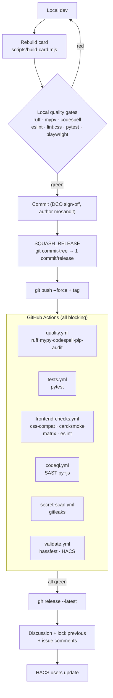
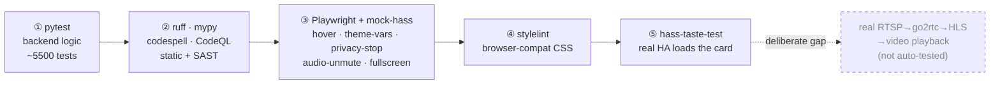

# CI/CD Pipeline

How this repository is tested, gated, and released. Everything runs on GitHub
Actions; the local quality gates mirror CI 1:1 so green-locally means green-in-CI.

## Pipeline at a glance

### Test layers (cheapest → most realistic)

## Test layers

The suite is layered — each level catches what the cheaper one below it cannot.

| Layer | What it covers | How | Where |
|---|---|---|---|
| **1. Backend (Python)** | Coordinator, camera/switch/number/select/stream logic, write-paths, migrations | `pytest` + `pytest-homeassistant-custom-component` (~5500 tests) | `tests/`, CI `tests.yml` |
| **2. Static / types / security (Python)** | Style, types, spelling, dep CVEs, SAST | ruff · mypy --strict · codespell · pip-audit · CodeQL | CI `quality.yml`, `codeql.yml` |
| **3. Card unit + interaction** | Bundle parses, custom-elements register, idle card mounts, **hover / theme-vars / privacy-stop / audio-unmute / fullscreen single-owner** — driven by a **mock `hass`** + Playwright real-browser events | Playwright (chromium/firefox/webkit) | `test/e2e/card-smoke.spec.mjs`, CI `frontend-checks.yml` |
| **4. Card CSS cross-browser** | Unsupported CSS per browser/OS | `stylelint` + `stylelint-browser-compat` on extracted `<style>` blocks | `npm run lint:css`, CI `frontend-checks.yml` |
| **5. Full E2E (real HA)** | The card loaded by a **real Home Assistant** frontend — resource registration, custom-element upgrade in HA's card picker, real WebSocket `hass`, real services | [hass-taste-test](https://github.com/rianadon/hass-taste-test) (spins up a real HA Core venv, asserts on the rendered shadow DOM — no pixel snapshots) | `test/taste/`, `npm run test:taste` |

**Deliberate gap — real video playback.** RTSP → go2rtc → HLS/WebRTC → `<video>`
is not auto-tested: our stream path goes through the Bosch cloud + TLS proxy
+ auth, so a faithful "fake camera" E2E would need the `captures/*.mitm`
fixtures as a mock cloud + an FFmpeg test-pattern RTSP source. Built only if a
stream-specific bug escapes layers 1–5.

### Layer 5 notes (hass-taste-test)

- **Linux / CI job** (`.github/workflows/e2e-taste.yml`, ubuntu). It launches a
  real HA Core (`default_config`) so onboarding/auth/websocket all work.
- **Does not run on macOS dev**: `default_config`'s dhcp/network discovery imports
  `pyroute2` (Linux-only netlink) → HA startup crashes on macOS+Python 3.14. A
  trimmed config that drops discovery instead stalls onboarding/auth. This is an
  HA-core / `aiodiscover` limitation, not our code — so layer 5 lives in CI.
- First run builds a HA venv under the temp dir (slow); CI caches it.
- Functional assertions only (rendered-HTML / element presence), never pixel
  diffs — cross-OS font noise makes screenshots flaky (see FRONTEND_CROSS_OS_CHECKS).

## GitHub Actions workflows

| Workflow | Trigger | Job(s) | Gate? |
|---|---|---|---|
| `quality.yml` | push main · PR · dispatch | `ruff format --check` · `ruff check` · `mypy` · `codespell` · `pip-audit` (manifest deps) | ✅ blocking |
| `tests.yml` | push main · PR · dispatch | `pytest tests/ --timeout=30` | ✅ blocking |
| `frontend-checks.yml` | PR/push touching `src/`,`www/`,`scripts/`,`test/`,card config | css-compat (ubuntu) · **card-smoke matrix** (ubuntu/windows/macos × chromium/firefox/webkit) · eslint (+ tsc advisory) | ✅ blocking (tsc advisory only) |
| `codeql.yml` | push main · PR · weekly cron · dispatch | CodeQL SAST python + javascript-typescript (security-extended) | ✅ blocking |
| `secret-scan.yml` | push main · PR · dispatch | gitleaks full-history (config `.gitleaks.toml`) | ✅ blocking |
| `dependency-review.yml` | PR | dependency-review-action (fail on high) | ✅ blocking (PR) |
| `validate.yml` | push main · PR · daily cron · dispatch | hassfest · HACS validate | ✅ blocking |
| `dco.yml` | PR | Signed-off-by present on every commit | ✅ blocking (PR) |

All workflows pin least-privilege `permissions:` (`contents: read`; `codeql.yml`
adds `security-events: write`). `npm run test:taste` (layer 5) is heavy (HA venv)
and runs on demand / locally rather than per-push.

## Local quality gates (mirror CI)

Before commit/push (HARDEN_QUALITY_GATES):

- **Python touched** → `ruff format --check && ruff check custom_components/ tests/ scripts/ && mypy && codespell custom_components/ scripts/ src/ tests/`
- **Card src touched** → rebuild card → `npm run lint:css && npx eslint src/ scripts/ test/ && npm run test:e2e`
- **shared/const/schema touched** → full `pytest tests/`

Tool versions are **pinned to what was tested** (CI == local), otherwise
`ruff format --check` drifts: `requirements_test.txt` (ruff/mypy/codespell/pip-audit)
+ `package.json` (eslint/stylelint/playwright/…) + `.pre-commit-config.yaml`.
mypy runs with `platform = "linux"` so macOS dev and Linux CI agree on stdlib.

## Release process

Two release trains — see README's [Release Channels](../README.md#release-channels--stable-vs-beta)
section for the user-facing explanation. **Beta** (`vX.Y.Z-beta-N`) ships as soon
as a fix is ready; consecutive fixes for the same upcoming release increment `N`
rather than bumping the patch version. **Stable** (`vX.Y.Z`) is a weekly bundle
of that version's beta iterations, promoted automatically every Friday 18:00
Europe/Berlin by `.github/workflows/promote-beta.yml` (the one deliberate,
narrow exception to this repo's NEVER_AUTO_PUSH policy) — if a week has no open
beta, there's no stable release that week.

1. Bump version in **three** places: `src/bosch-camera-card.js` `CARD_VERSION`,
   `custom_components/bosch_shc_camera/const.py` `CARD_VERSION`, `manifest.json`
   `version` (`vX.Y.Z-beta-N` for a beta, or `vX.Y.Z` for a manually-cut stable —
   Friday's auto-promotion does this step itself for the promoted release).
   (Thomas picks every version — no auto-bump. In-session card iteration uses a
   4th `.X` segment, e.g. `13.4.3.1`, purely to cache-bust the `?v=` resource
   URL; the base never changes.)
2. Rebuild card (`scripts/build-card.mjs` → `www/` + mirror into `custom_components/.../www/`).
3. All local gates green (above).
4. Add/update the `## [vX.Y.Z]` section in `CHANGELOG.md` — mandatory for a
   stable tag (the release job hard-fails without one); optional for a beta
   (falls back to a generic prerelease note).
5. Commit (DCO sign-off, author `mosandlt`), then **squash** all commits since the
   previous tag into one release commit via `git commit-tree` (SQUASH_RELEASE).
6. `git push --force origin main` + push the tag.
7. **Do not** run `gh release create`/`gh release edit` — the tag push triggers
   `.github/workflows/release.yml`, which polls `tests.yml`/`quality.yml`/
   `validate.yml`/`secret-scan.yml` for SUCCESS on that exact commit, then
   creates or edits the GitHub Release itself (title + CHANGELOG-extracted
   notes; `--prerelease`/no-`--latest` for a beta tag, `--latest` for stable —
   detected from whether the tag contains a hyphen). Poll `gh run list --commit
   <sha>` until it concludes; if it fails, fix and redo the squash+push, never
   leave a failed-CI tag in place (CI_DOES_THE_RELEASE).
8. Announce (stable releases only, or beta if user-facing): create a Discussion
   in *HA Announcements* on a MAJOR bump, or a comment on the current major's
   living Discussion for minor/patch. Lock the previous announcement with a
   link to the new one on a MAJOR bump. Comment on the relevant issues (kept
   open until the reporter confirms), update the blog only for user-facing
   features.

## Secret hygiene

- Local pre-push hook + `secret-scan.yml` (gitleaks) both run; the local hook
  holds the exact domain-specific patterns (real MACs/LAN-IPs/cloud-IDs), gitleaks
  catches generic credentials. Scan **all refs** (`git log --all -S`), not just
  HEAD — secrets can hide behind tags (lesson: a backup tag re-exposed scrubbed
  history). `.gitleaks.toml` allowlists only the public, base64-encoded Bosch FCM
  app key + known-fake test fixtures.
